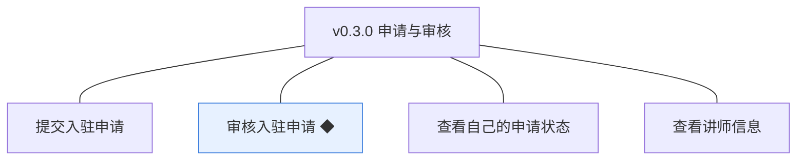
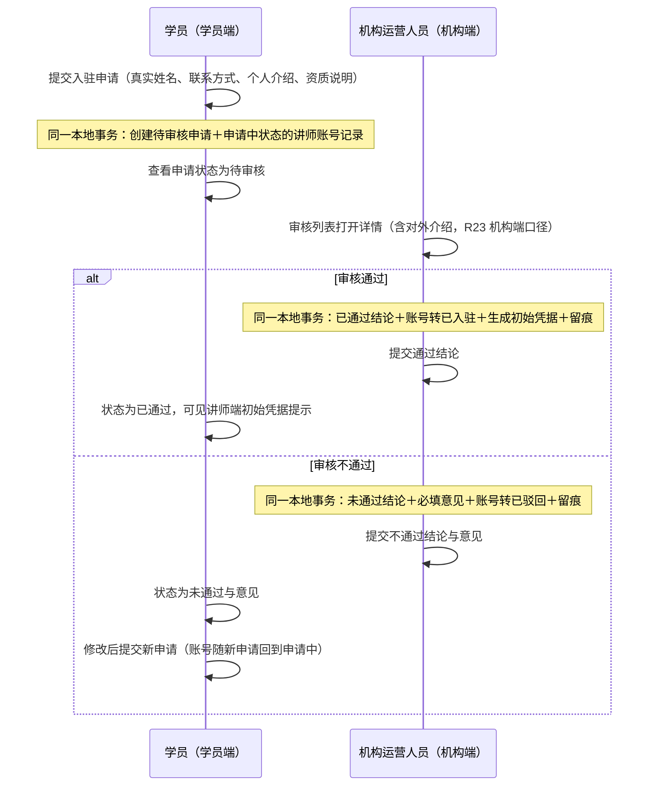
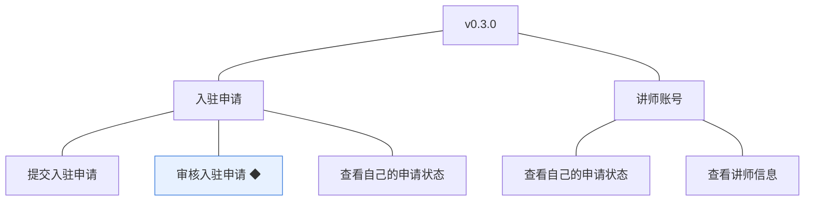

# PRD（小版本）：v0.3.0 申请与审核

> 定位：开发级需求说明书——承接《PRD（大版本）：0.3 讲师入驻版》与《0.3 开发顺序与需求拆解》批次一，认领自需求池（R20～R23，批次一全部待规划，整批采纳）；把每条需求细化到开发与测试拿到即可开工的深度。上游为模拟案例材料，模拟性质保留；本版采用值中属推断／默认者就地标注并汇总于第 6 章。

## 1. 版本概述

**承接与目标**：认领来源＝0.3 大版本 02 批次一「申请与审核」整批（R20～R23）＋需求池实时状态合并。本版可验收形态（沿用上游批次一）：学员提交申请（重复提交被拒）→ 机构运营人员在审核列表查看详情（含对外介绍）→ 一条通过（库中讲师账号转已入驻、初始凭据生成、留痕齐全）＋一条不通过（意见必填、申请人可见并可再提交新申请）。

**范围外声明**：R24～R26（讲师端登录与退出、账号资料与凭据维护、维护讲师信息）随 v0.3.1 交付——本版生成并展示讲师端初始凭据，但登录与修改随下一版生效；课程相关（0.4 起）、学员端讲师信息的界面呈现（随 0.5）不在本版；讲师分级、资质附件上传、机构直接开设讲师账号不做（围栏沿用 0.3 大版本 PRD）。

**条目内顺序与依赖**（沿用上游批内顺序依据）：R20 申请先行为 R21／R22 的数据前提；R23 的机构端查看随申请与通过记录就绪、学员端接口先行；同事务契约——审核结论落库、讲师账号状态流转（含通过时生成初始凭据）与留痕同一本地事务（04C-讲师 3.3）。账号生命周期沿用大版本口径：讲师账号记录随申请提交创建（申请中），结论同事务流转（通过→已入驻；不通过→已驳回）。

## 2. 需求范围与验收锚

| 编号 | 需求名 | 用途 | 验收标准 |
|---|---|---|---|
| R20 | 提交入驻申请 | 学员以本人学员账号申请成为平台讲师，进入机构审核 | 学员登录后提交入驻申请（真实姓名、联系方式、个人介绍、资质说明），提交成功后申请状态为待审核；存在待审核申请时重复提交被拒绝并提示 |
| R22 | 审核入驻申请 ◆ | 机构运营人员审阅入驻申请并作出结论，把住入驻关口 | 机构运营人员对申请作出通过或不通过结论：通过时同事务产生可用状态的讲师账号；不通过时必须填写审核意见；结论一经作出不可改判 |
| R21 | 查看自己的申请状态 | 申请人随时查看入驻申请的审核进展与结论 | 申请人可查看本人申请的状态（待审核／已通过／未通过）与审核意见，无法查看他人申请；已通过状态可见讲师端初始凭据提示 |
| R23 | 查看讲师信息 | 供机构端只读查看讲师（含申请人）的对外介绍，学员端口径接口先行 | 机构端在审核详情与讲师信息中可只读查看对外介绍（不含账号凭据与状态）；学员端以讲师信息接口先行（课程详情中的展示随 0.5 交付） |

锚定说明：上表需求名（含 ◆）、用途、验收标准逐字引自《0.3 开发顺序与需求拆解（大版本）》批次一需求表；本文后续各节只细化不改写，验收以本表为锚。

## 3. 核心用户旅程

旅程承接说明：本版认领段＝大版本旅程「从学员申请到讲师登台」的申请与审核段（学员提交→查看状态→机构审阅与结论→账号流转／意见可见与再申请）；讲师端首登与维护段显式排除（R24～R26，随 v0.3.1）。

### 3.1 旅程：申请与审核（开发级，跨学员端与机构端）

学员以本人身份提交申请（同时创建申请中状态的讲师账号记录），机构运营人员在机构端审阅并作出终态结论：通过则账号同事务转已入驻并生成初始凭据，申请人在学员端看到通过与凭据提示；不通过则意见必填可见，可再次申请。操作步骤：① 学员提交申请 → ② 查看待审核状态 → ③ 运营人员查看详情 → ④ 作出结论（通过／不通过＋意见）→ ⑤ 学员查看状态与意见 → ⑥ 不通过者修改后重新申请。

## 4. 功能需求

### 4.1 功能总览

注：R21 查看自己的申请状态的首要承载对象为入驻申请（状态与意见），已通过态的初始凭据提示读取讲师账号，图中挂入驻申请为主；R22 的结论同时流转两对象（结论落申请、状态流转与凭据生成落讲师账号），条目小节只出现一次（编号沿用上游）。

**对象增删改查矩阵**

| 对象 | 增 | 改 | 删 | 查 |
|---|---|---|---|---|
| 入驻申请 | R20（提交创建） | 不做：申请提交后不可编辑，已驳回后重新申请新建一条（本版拍板） | 不做：申请记录永久保留（审核留痕依据） | R21（本人状态与意见）、R22（机构审阅列表与详情） |
| 讲师账号 | R20（随申请创建申请中记录） | R22（结论同事务流转状态；通过时生成初始凭据） | 不做 | R23（机构端只读＋学员端接口先行）、R21（已通过态凭据提示） |

**主体使用面**

| 主体 | 使用条目 | 说明 |
|---|---|---|
| 学员（申请人） | R20、R21 | 学员端申请页与申请状态页 |
| 机构运营人员 | R22、R23（机构端口径） | 机构端入驻审核（列表＋详情＋结论）与讲师信息（已入驻讲师只读列表） |
| （先行基座）学员端接口 | R23（学员端口径） | 无界面：讲师信息查询接口先行，界面呈现随 0.5 |

### 4.2 R20 提交入驻申请

**功能说明**：学员以本人学员账号申请成为平台讲师，进入机构审核。触发：学员登录后在学员端进入「申请成为讲师」页并提交。

**交互与流程**：操作步骤：① 进入申请页（已是讲师或存在待审核申请时入口按拦截态呈现） → ② 填写真实姓名、联系方式、个人介绍、资质说明 → ③ 提交：校验通过则创建待审核申请并同事务创建申请中状态的讲师账号记录，跳转状态页；不通过停留并逐项提示。

**字段与校验**

| 字段 | 必填 | 业务类型 | 约束与取值 | 失败反馈 |
|---|---|---|---|---|
| 真实姓名 | 是 | 申请信息 | 2～20 个字符 | 「请输入 2～20 个字符的真实姓名」 |
| 联系方式 | 是 | 申请信息 | 11 位手机号格式；可与注册手机号不同（机构联系用） | 「请输入正确的手机号」 |
| 个人介绍 | 是 | 对外介绍基础 | 20～500 字 | 「个人介绍须为 20～500 字」 |
| 资质说明 | 否 | 审核依据 | ≤500 字 | 「资质说明不能超过 500 字」 |

**规则与边界**：① 存在待审核申请时重复提交被拒绝（锚）；② 已通过的申请人（已是讲师）申请入口拦截并提示「您已是讲师」（本版拍板）；③ 已驳回申请人可提交新申请（新申请记录，账号随新申请回到申请中——沿用大版本口径）；④ 提交申请与创建讲师账号记录（申请中、无有效凭据、不可登录）同一本地事务（沿用大版本 5.2 口径）；⑤ 讲师编号（`TC`＋8 位序号）在账号记录创建时生成。

**异常与拦截**：待审核中重复提交→「已有待审核的申请，请等待审核结果」；已是讲师→「您已是讲师」；必填缺失或超限→字段级提示；未登录访问→引导登录。

### 4.3 R22 审核入驻申请 ◆

**功能说明**：机构运营人员审阅入驻申请并作出通过或不通过的终态结论。触发：机构运营人员在机构端「入驻审核」列表打开详情并提交结论。

**交互与流程**：见图 3.1。操作步骤：① 审核列表（待审核优先，含申请人编号与提交时间） → ② 打开详情（四项申请信息＋申请人学员编号，R23 机构端口径只读） → ③ 提交结论：通过（意见选填）或不通过（意见必填） → ④ 结论、账号流转与留痕同事务落库，列表状态更新；已审申请不可再次审核。

**字段与校验**

| 字段 | 必填 | 业务类型 | 约束与取值 | 失败反馈 |
|---|---|---|---|---|
| 审核结论 | 是 | 结论操作 | 二选一：通过／不通过 | 未选择不可提交 |
| 审核意见 | 不通过时必填 | 结论说明 | 5～200 字；通过时选填 ≤200 字 | 「不通过时审核意见须为 5～200 字」 |

**规则与边界**：① 同事务契约：申请结论落库＋讲师账号状态流转（通过→已入驻并生成初始凭据；不通过→已驳回）＋审核留痕（审核人／时间／意见）同一本地事务（04C-讲师 3.3）；② 结论一经作出不可改判，已审申请在列表中只读（锚）；③ 初始凭据为系统生成的 8～20 位随机密码（不可逆加密存储，明文仅在申请人本人的已通过状态页展示一次口径，本版拍板）；④ 审核权限限机构运营人员角色（能力点：讲师入驻审核，本版填充）。

**异常与拦截**：不通过未填意见或字数不足→拦截提交；对已审申请再次提交结论→拒绝「该申请已审核」；非机构运营人员调用→能力点校验拒绝；同一申请并发审核→以先到者为准、后到者拒绝。

### 4.4 R21 查看自己的申请状态

**功能说明**：申请人随时查看本人入驻申请的审核进展与结论。触发：学员登录后进入「我的入驻申请」页。

**交互与流程**：操作步骤：① 进入申请状态页 → ② 查看当前状态（待审核／已通过／未通过）与审核意见 → ③ 未通过时点击「重新申请」预填上次信息修改后提交；已通过时查看讲师端初始凭据提示（登录标识＝注册手机号＋初始密码，注明「首次登录需修改密码，讲师端登录随下一版本开放」——本版拍板）。

**字段与校验**

| 展示项 | 类型 | 展示规则 | 失败反馈 |
|---|---|---|---|
| 申请状态 | 只读展示 | 待审核／已通过／未通过（术语表枚举逐字） | 无 |
| 审核意见 | 只读展示 | 有意见时展示；待审核显示「审核中」 | 无 |
| 初始凭据提示 | 只读展示（仅本人、仅已通过） | 登录标识与初始密码＋首登改密提示 | 无 |

**规则与边界**：① 仅可查看本人申请（身份上下文取数，无他人申请入口，接口按申请人过滤）；② 无申请时页面显示空态「尚未申请，去申请成为讲师」；③ 初始凭据提示仅本人可见（本版拍板）。

**异常与拦截**：请求他人申请→接口拒绝并返回无权限；未登录→引导登录；会话过期→按未登录处理。

### 4.5 R23 查看讲师信息

**功能说明**：供机构端只读查看讲师（含申请人）的对外介绍；学员端口径接口先行。触发：机构运营人员在审核详情或讲师信息列表查看；或系统调用学员端讲师信息接口。

**交互与流程**：操作步骤：① 机构端审核详情：只读查看申请信息（真实姓名、个人介绍——即对外介绍基础，不含账号凭据与状态） → ② 机构端讲师信息列表（已入驻讲师）：讲师编号、姓名、对外介绍，只读 → ③ 学员端接口：按讲师编号返回对外介绍（先行基座，无界面）。

**字段与校验**

| 展示项 | 类型 | 展示规则 | 失败反馈 |
|---|---|---|---|
| 审核详情（机构端） | 只读 | 真实姓名、联系方式、个人介绍、资质说明＋申请人学员编号；不含账号凭据与账号状态 | 无 |
| 讲师信息列表（机构端） | 只读 | 已入驻讲师：讲师编号、姓名（申请真实姓名）、对外介绍（申请个人介绍；维护入口随 v0.3.1） | 无 |
| 讲师信息接口（学员端） | 接口先行 | 按讲师编号返回姓名与对外介绍，不含凭据与状态 | 无 |

**规则与边界**：① 机构端口径不含账号凭据与账号状态（锚）；② 学员端接口为先行基座（界面呈现随 0.5 课程详情）；③ 讲师信息查看面向机构管理员与机构运营人员（能力点：讲师入驻审核与讲师信息查看，本版填充）。

**异常与拦截**：查询不存在或已驳回的讲师编号（学员端接口）→返回不存在；非授权角色调用机构端接口→能力点校验拒绝；会话过期→按未登录处理。

## 5. 业务对象与数据字段

**数据主体清单**

| 业务对象 | 落库名 | 定位与关系 |
|---|---|---|
| 入驻申请 | `teacher_apply`（术语表已登记） | 讲师入驻请求与审核结论；由学员账号提交，通过后关联讲师账号 |
| 讲师账号 | `teacher_account`（术语表已登记） | 随申请提交创建（申请中），结论同事务流转（沿用大版本 5.2 口径）；本版新增「结论流转与初始凭据」路径 |

**入驻申请（`teacher_apply`）字段表**

| 字段 | 必填 | 业务类型 | 落库字段名 | 约束与取值 |
|---|---|---|---|---|
| 申请人 | 是 | 关联 | `student_id` | 指向学员账号 `id` |
| 真实姓名 | 是 | 申请信息 | `real_name` | 2～20 个字符 |
| 联系方式 | 是 | 申请信息 | `contact_mobile` | 11 位手机号，可与注册手机不同 |
| 个人介绍 | 是 | 对外介绍基础 | `intro` | 20～500 字 |
| 资质说明 | 否 | 审核依据 | `qualification` | ≤500 字 |
| 申请状态 | 是 | 状态枚举 | `status` | 取值见术语表：待审核（`pending`）／已通过（`approved`）／未通过（`rejected`）；提交即 `pending`，结论终态 |
| 审核人／审核时间／审核意见 | 结论时必填（意见不通过必填） | 审核留痕 | `audit_admin_id`／`audited_at`／`audit_remark` | 术语表通用审核字段；随结论同事务写入 |
| 创建时间／更新时间 | 是 | 审计字段 | `created_at`／`updated_at` | 术语表通用字段 |

**讲师账号（`teacher_account`）字段表（本版涉及部分）**

| 字段 | 必填 | 业务类型 | 落库字段名 | 约束与取值 |
|---|---|---|---|---|
| 讲师编号 | 是 | 业务编码 | `no` | `TC`＋8 位序号，账号记录创建时生成 |
| 手机号 | 是 | 登录标识 | `mobile` | 沿用申请人学员账号手机号（本版拍板）；讲师端登录随 v0.3.1 |
| 登录密码 | 通过时生成 | 登录凭据 | `password` | 系统生成 8～20 位随机密码，不可逆加密存储；明文仅在本人已通过状态页展示 |
| 姓名 | 是 | 讲师信息 | `name` | 初始＝申请真实姓名 |
| 对外介绍 | 是 | 讲师信息 | `intro` | 初始＝申请个人介绍；维护入口随 v0.3.1 |
| 账号状态 | 是 | 状态枚举 | `status` | 取值见术语表：申请中（`applying`）／已入驻（`joined`）／已驳回（`rejected`）；随申请创建为 `applying`，结论同事务流转 |

列类型、主键、索引与建表 DDL 归开发阶段（开发规范与技术文档）。

## 6. 待议与建议

**本版采用的推断与默认值汇总**

| 采用值 | 来源状态 | 影响与待确认 |
|---|---|---|
| 申请字段必填口径：真实姓名／联系方式／个人介绍必填，资质说明选填；字数边界如 4.2 表 | 本版拍板（行业惯例默认） | 资质说明若业务要求必填，改 5～200 字 |
| 申请提交后不可编辑（重新申请新建一条） | 本版拍板 | 已驳回申请的修改后重提体验随后续版本评估 |
| 已是讲师后申请入口拦截「您已是讲师」 | 本版拍板 | — |
| 初始凭据：系统生成 8～20 位随机密码，明文仅本人已通过状态页可见；登录标识＝注册手机号 | 本版拍板（沿用 0.1 统一凭据机制方向） | 更安全的凭据下发方式（如短信通道）随后续版本评估 |
| 讲师信息列表（机构端）为只读轻量视图（编号／姓名／介绍） | 本版拍板 | 讲师管理完整能力（搜索、停用处置）随后续版本 |
| 能力点填充：讲师入驻审核、讲师信息查看（机构管理员＋机构运营人员） | 本版拍板（0.1 预置为空口径的落定续） | — |

**建议回池的新想法**：无。

**术语表待登记行（随文档回报，由主流程合入术语表）**：入驻申请（teacher_apply）新增字段 `student_id`（申请人，指向学员账号）、`real_name`（真实姓名）、`contact_mobile`（联系方式，可与注册手机不同）、`intro`（个人介绍，20～500 字）、`qualification`（资质说明，选填）；讲师账号（teacher_account）适用字段 `mobile`／`password`／`name`／`intro`／`status`（name／intro 为讲师账号讲师信息字段、状态枚举沿用术语表）。
