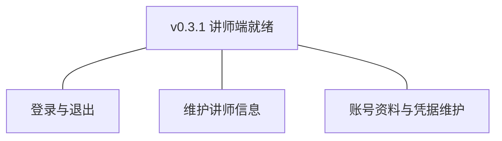
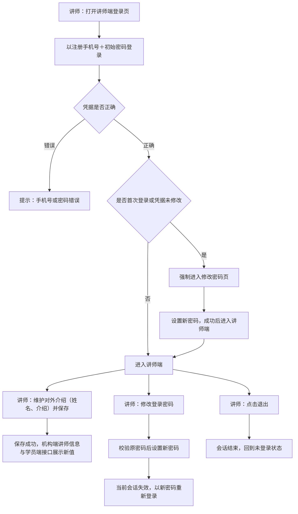
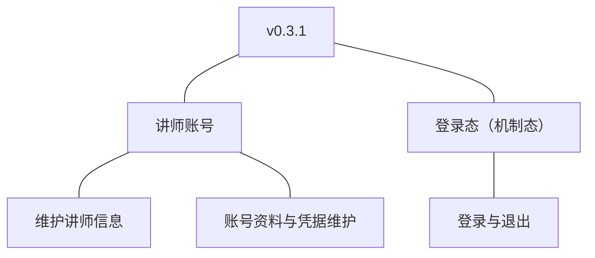

# PRD（小版本）：v0.3.1 讲师端就绪

> 定位：开发级需求说明书——承接《PRD（大版本）：0.3 讲师入驻版》与《0.3 开发顺序与需求拆解》批次二，认领自需求池（R24～R26，v0.3.0 发布后批次二全部待规划，整批采纳）；把每条需求细化到开发与测试拿到即可开工的深度。上游为模拟案例材料，模拟性质保留；本版采用值中属推断／默认者就地标注并汇总于第 6 章。

## 1. 版本概述

**承接与目标**：认领来源＝0.3 大版本 02 批次二「讲师端就绪」整批（R24～R26）＋需求池实时状态合并。本版可验收形态（沿用上游批次二）：通过者以初始凭据首登（强制修改）→ 进入讲师端 → 维护对外介绍与账号资料 → 修改凭据后重新登录；讲师登录态访问学员端／机构端接口被拒。

**范围外声明**：课程创作全部能力（课程、课时、附件，0.4）不在本版——讲师端工作台首页为空态先行（课程功能入口随 0.4 开放）；学员端讲师信息的界面呈现随 0.5（v0.3.0 已交付接口先行）；讲师停用的机构侧处置随后续版本；讲师端不启用机构端式单会话登录控制（04C-账号与权限留版本级口径，本版拍板为不启用）。

**条目内顺序与依赖**（沿用上游批内顺序依据）：R24 登录与退出为讲师端一切功能的前提；R26、R25 依赖 R24（登录后方可自助维护）；同链路依赖——登录态 `side` 取值扩展 `teacher`（沿用 v0.1.0 登录态机制）；初始凭据与首登强制改密沿用 v0.3.0 生成口径与 0.1 统一凭据机制。

## 2. 需求范围与验收锚

| 编号 | 需求名 | 用途 | 验收标准 |
|---|---|---|---|
| R24 | 登录与退出 | 讲师建立与结束讲师端会话，作为使用讲师端功能的前提 | 讲师以讲师账号凭据登录讲师端成功进入；凭据错误登录失败并提示；退出后会话结束；讲师登录态与学员端、机构端互不通用 |
| R26 | 维护讲师信息 | 讲师维护对外展示的介绍信息，只对本人开放 | 讲师登录后可修改自己的对外介绍信息，保存后再次查看为更新后内容；无法查看或修改其他讲师的信息 |
| R25 | 账号资料与凭据维护 | 讲师端的个人中心，维护自身账号资料与登录凭据 | 讲师登录后可修改自己的账号资料与登录凭据；修改凭据后既有会话失效、需以新凭据重新登录；无法访问他人资料 |

锚定说明：上表需求名、用途、验收标准逐字引自《0.3 开发顺序与需求拆解（大版本）》批次二需求表；本文后续各节只细化不改写，验收以本表为锚。

## 3. 核心用户旅程

旅程承接说明：本版认领段＝大版本旅程「从学员申请到讲师登台」的讲师端段（首登强制改密→进入讲师端→维护信息→自助资料与凭据）；申请与审核段已随 v0.3.0 交付，不在本版。

### 3.1 旅程：讲师首登与自助维护（开发级）

讲师以 v0.3.0 审核通过时生成的初始凭据首登：首次登录被强制修改密码后方可使用讲师端；此后可维护对外介绍（机构端与学员端接口即时可见新值）、修改登录密码（改密后会话失效需重新登录）、退出登录。操作步骤：① 首登强制改密 → ② 进入讲师端 → ③ 维护讲师信息 → ④ 修改密码并重新登录 → ⑤ 退出。

## 4. 功能需求

### 4.1 功能总览

**对象增删改查矩阵**

| 对象 | 增 | 改 | 删 | 查 |
|---|---|---|---|---|
| 讲师账号 | 不做：随 v0.3.0 申请创建（沿用大版本口径） | R26（姓名、对外介绍）、R25（登录凭据） | 不做 | R26／R25（本人信息与资料查看） |
| 登录态（机制态） | R24（登录建立会话，`side=teacher`） | 不做 | R24（退出）、R25（改密使既有会话失效） | 沿用 R5 鉴权机制（讲师端取值） |

**主体使用面**

| 主体 | 使用条目 | 说明 |
|---|---|---|
| 讲师 | R24、R26、R25 | 讲师端操作面：登录页、强制改密页、工作台首页（空态先行）、个人中心（讲师信息＋资料与密码） |
| （机制）三端请求入口 | R24 的按端隔离部分 | 无独立界面：跨端访问被拒的表现为接口拦截（见 4.2 异常） |

### 4.2 R24 登录与退出

**功能说明**：讲师以讲师账号凭据建立与结束讲师端会话，作为使用讲师端功能的前提。触发：讲师在讲师端登录页提交登录；或登录后点击退出。

**交互与流程**：见图 3.1 登录段。操作步骤：① 打开讲师端登录页 → ② 输入手机号与密码提交 → ③ 凭据正确：首次登录（初始密码未修改）先强制进入修改密码页，改密后进入讲师端；非首登直接进入 → ④ 凭据错误：提示并累计失败 → ⑤ 退出：会话结束回到未登录状态。

**字段与校验**

| 字段 | 必填 | 业务类型 | 约束与取值 | 失败反馈 |
|---|---|---|---|---|
| 手机号 | 是 | 登录标识 | 11 位手机号格式（沿用申请人学员手机号） | 「请输入正确的手机号」 |
| 密码 | 是 | 登录凭据 | 按凭据规则 | 「手机号或密码错误」（不区分哪项错误，沿用安全惯例） |
| 新密码（强制改密页） | 是 | 凭据初设 | 8～20 位，须同时包含字母和数字；不得与初始密码相同（本版拍板） | 「密码须为 8～20 位且同时包含字母和数字」／「新密码不能与原密码相同」 |
| 确认新密码 | 是 | 凭据复核 | 须与新密码一致 | 「两次输入的密码不一致」 |

**规则与边界**：① 会话默认有效期 7 天、连续失败 5 次锁定 15 分钟（沿用 0.1 大版本 PRD 默认值，锁定按账号维度、成功清零）；② 仅已入驻状态可登录，申请中／已驳回账号登录被拒；③ 首次登录（初始密码未修改）强制改密，改密前不可访问讲师端其他功能；④ 登录态 `side=teacher`，与学员端、机构端互不通用（D5，沿用 R5 机制）；⑤ 讲师端不启用单会话登录控制（04C-账号与权限留版本级口径，本版拍板为不启用——登录控制仅机构端）。

**异常与拦截**：凭据错误→统一提示并累计失败；锁定→「尝试次数过多，请 15 分钟后再试」；申请中／已驳回账号登录→「账号不可用」（不暴露具体状态，本版拍板）；携带讲师登录态访问学员端或机构端接口→拒绝并提示无权限（按端隔离）；会话过期→按未登录处理引导登录。

### 4.3 R26 维护讲师信息

**功能说明**：讲师维护对外展示的介绍信息（姓名、对外介绍），保存后即时生效并对机构端与学员端接口可见。触发：讲师登录后进入个人中心「讲师信息」页修改并保存。

**交互与流程**：操作步骤：① 进入讲师信息页（当前值展示） → ② 修改姓名或对外介绍 → ③ 保存：校验通过即生效并提示成功，再次查看为新值；机构端讲师信息列表与学员端接口返回新值。

**字段与校验**

| 字段 | 必填 | 业务类型 | 约束与取值 | 失败反馈 |
|---|---|---|---|---|
| 姓名 | 是 | 讲师信息 | 2～20 个字符（初始＝申请真实姓名） | 「请输入 2～20 个字符的姓名」 |
| 对外介绍 | 是 | 讲师信息 | 20～500 字（初始＝申请个人介绍） | 「介绍须为 20～500 字」 |

**规则与边界**：① 仅本人可改（身份上下文取数，无他人信息入口，接口按本人过滤）；② 保存即时生效、无审核环节（讲师信息属讲师自身对外形象，机构把关在入驻环节已完成，D4 的先审后发针对课程与入驻，本版拍板）；③ 手机号只读展示、不可修改（沿用既有口径）。

**异常与拦截**：姓名或介绍校验失败→字段级提示；请求修改他人讲师信息→接口拒绝并返回无权限；会话过期→按未登录处理。

### 4.4 R25 账号资料与凭据维护

**功能说明**：讲师端的个人中心，维护自身账号资料与登录凭据。触发：讲师登录后进入个人中心「账号资料」页查看或修改密码。

**交互与流程**：操作步骤：① 进入账号资料页（姓名只读同讲师信息页、手机号只读、讲师编号只读） → ② 修改密码：输入原密码＋新密码＋确认新密码 → ③ 提交：原密码正确且新密码合规即修改成功，当前会话失效跳转登录页 → ④ 以新密码重新登录。

**字段与校验**

| 字段 | 必填 | 业务类型 | 约束与取值 | 失败反馈 |
|---|---|---|---|---|
| 手机号／讲师编号 | ——（只读） | 标识展示 | 手机号沿用申请人手机号不可改；讲师编号（`TC`＋8 位）创建时生成 | 无修改入口 |
| 原密码 | 是 | 凭据复核 | 须与当前密码一致 | 「原密码不正确」 |
| 新密码 | 是 | 登录凭据 | 8～20 位，须同时包含字母和数字；不得与原密码相同 | 「密码须为 8～20 位且同时包含字母和数字」／「新密码不能与原密码相同」 |
| 确认新密码 | 是 | 凭据复核 | 须与新密码一致 | 「两次输入的密码不一致」 |

**规则与边界**：① 修改成功后该账号全部既有会话失效（锚），须以新密码重新登录；② 原密码错误不累计登录锁定计数（沿用既有口径）；③ 新密码不可逆加密存储（开发规范）；④ 资料仅限本人（无他人资料入口）。

**异常与拦截**：原密码错误→提示且不修改；新密码与原密码相同→拦截；强度不足或不一致→字段级提示；请求他人资料→接口拒绝；会话过期→按未登录处理。

## 5. 业务对象与数据字段

**数据主体清单**

| 业务对象 | 落库名 | 定位与关系 |
|---|---|---|
| 讲师账号 | `teacher_account`（术语表已登记） | 讲师端身份；本版交付登录生效（首登强制改密）与自助维护（姓名／对外介绍／凭据）路径，沿用 v0.3.0 创建与流转口径 |
| 登录态（会话） | 沿用机制态（服务端会话存储，不建关系表） | 本版扩展：`side` 新增取值 `teacher`（讲师端）；其余机制（有效期、按端隔离）沿用 |

**讲师账号（`teacher_account`）本版涉及字段**（沿用 v0.3.0 登记的字段与约束，本版无新增字段）

| 字段 | 必填 | 业务类型 | 落库字段名 | 约束与取值 |
|---|---|---|---|---|
| 讲师编号 | 是 | 业务编码 | `no` | `TC`＋8 位序号（只读） |
| 手机号 | 是 | 登录标识 | `mobile` | 沿用申请人学员手机号（只读，本版不可改） |
| 登录密码 | 是 | 登录凭据 | `password` | 首登强制修改后为讲师自设；8～20 位字母＋数字、不可逆加密 |
| 姓名 | 是 | 讲师信息 | `name` | 2～20 个字符（R26 可改） |
| 对外介绍 | 是 | 讲师信息 | `intro` | 20～500 字（R26 可改；机构端与学员端接口读取） |
| 账号状态 | 是 | 状态枚举 | `status` | 已入驻（`joined`）可登录；申请中／已驳回登录被拒 |
| 创建时间／更新时间 | 是 | 审计字段 | `created_at`／`updated_at` | 术语表通用字段 |

**登录态（会话，机制态）本版扩展**：`side` 取值新增 `teacher`（与 `student`／`admin` 并列，D5）；会话有效期 7 天；讲师端不启用会话占用标记（`session_occupation` 仅机构端）。

列类型、主键、索引与建表 DDL 归开发阶段（开发规范与技术文档）。

## 6. 待议与建议

**本版采用的推断与默认值汇总**

| 采用值 | 来源状态 | 影响与待确认 |
|---|---|---|
| 首登强制改密的新密码不得与初始密码相同；改密前不可访问其他功能 | 本版拍板（沿用 0.1 统一机制） | — |
| 讲师端不启用单会话登录控制 | 本版拍板（04C-账号与权限留版本级口径的落定） | 如需讲师端防共号，随后续版本启用 |
| 申请中／已驳回账号登录统一提示「账号不可用」 | 本版拍板（不暴露状态） | — |
| 讲师信息（姓名、介绍）修改即时生效、无审核 | 本版拍板（机构把关在入驻环节；课程先审后发为 D4 范围） | 若业务要求信息变更审核，回池评估 |
| 姓名／介绍修改字数边界沿用申请口径（2～20／20～500） | 本版拍板 | — |
| 手机号本版不可修改（只读） | 本版拍板（沿用学员端口径） | 改绑随后续版本评估 |

**建议回池的新想法**：无。

**术语表待登记行（随文档回报，由主流程合入术语表）**：登录态（会话）`side` 取值扩展 `teacher`（讲师端，与 student／admin 并列；讲师端不启用 session_occupation）；讲师账号无新增字段（沿用 v0.3.0 登记）。
