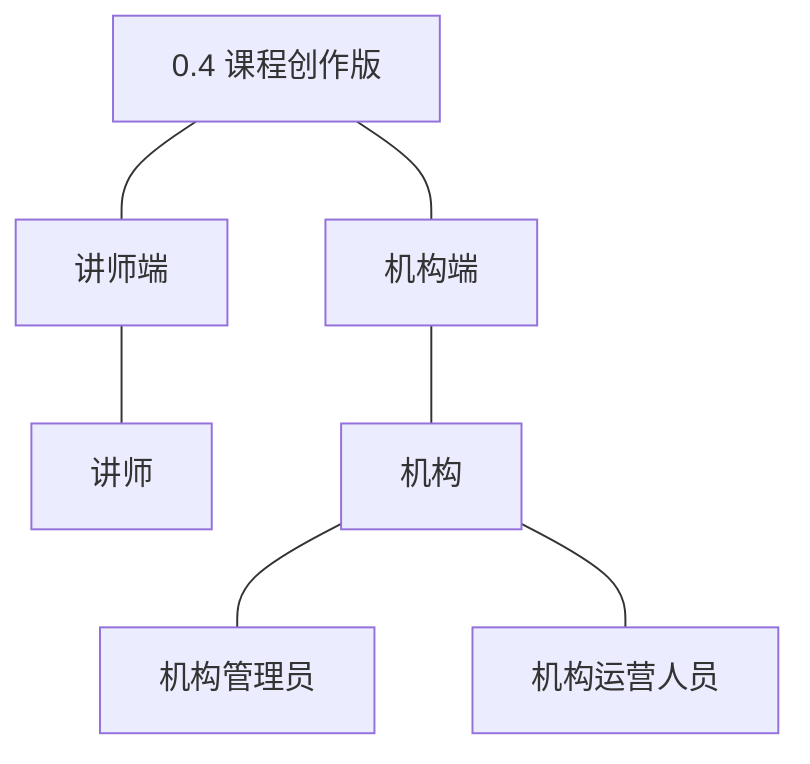
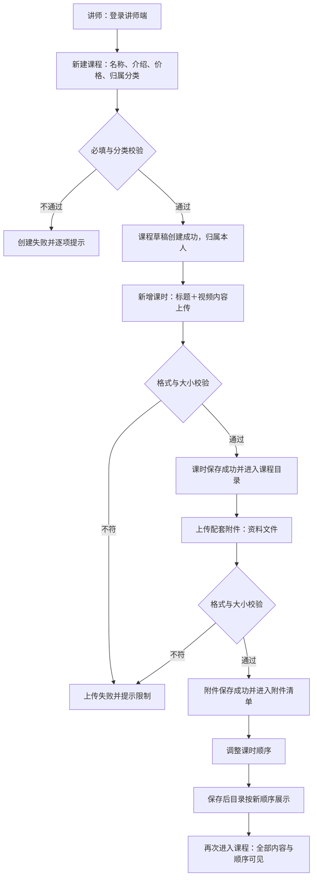
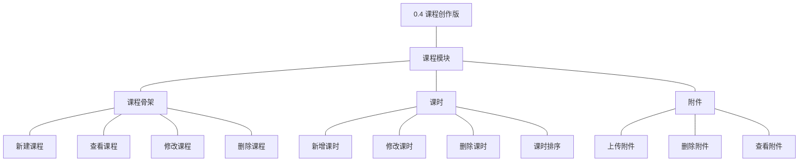
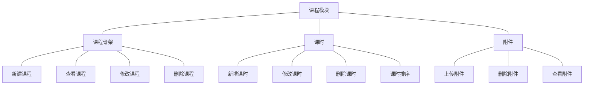
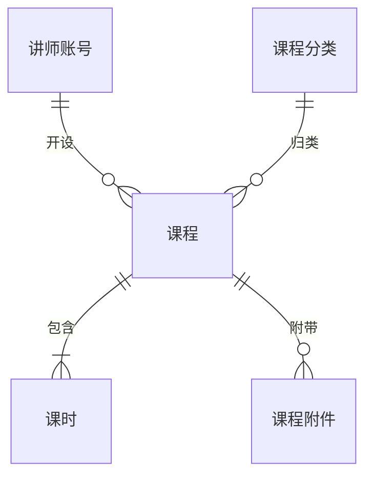
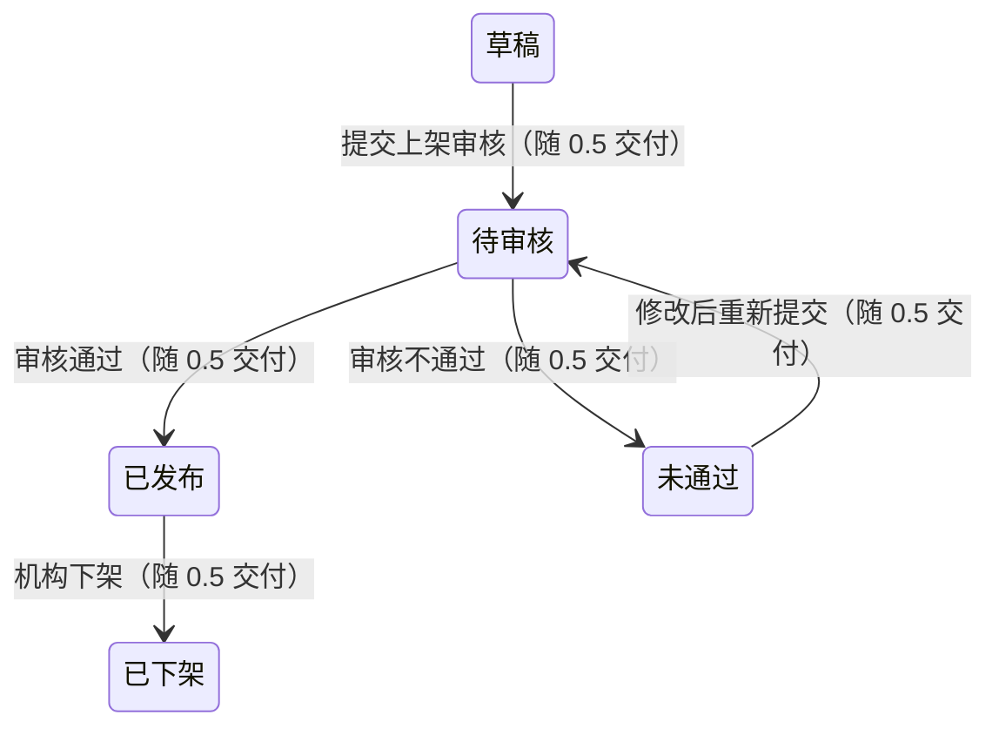
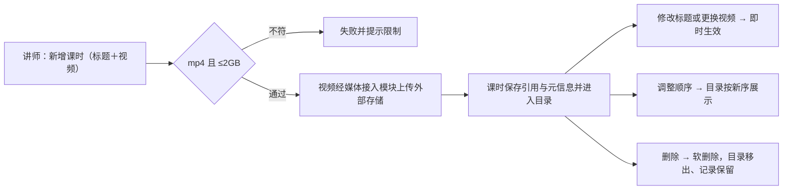
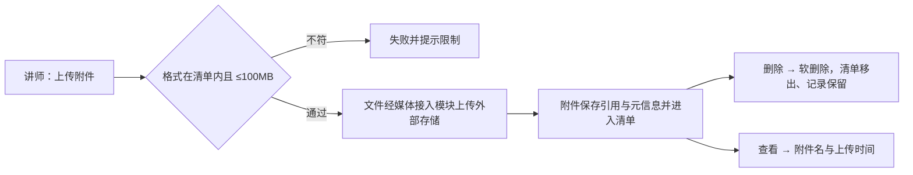

# PRD（大版本）：0.4 课程创作版

> 定位：本版立项说明书——承接《产品路线图（项目）》0.4 课程创作版条目与项目级基线，界定本版做什么、每个功能做到什么程度算完成，供需求拆解与小版本规划直接开工。上游为模拟案例材料，模拟性质保留；版本级默认值就地标注来源状态。

## 1. 版本概述

**承接与目标**：讲师能把自己的课在系统里做出来——课程、课时与配套资料齐备（路线图 0.4 目标）。本版交付课程模块的创作侧能力：课程骨架（新建、修改、删除、查看）与内容成型（课时增删改排、附件上传删除查看）；课程停留在草稿形态，提交上架与审核随 0.5。

**成功标准与量化口径**：① 课程内容制作全程讲师自助（新建→建课时→传附件→排序，本版无机构代录入口，自助完成判定线 100%，低于按创作链路异常排查）；② 内容归属与隔离准确（判定线 100%——课程归属唯一讲师账号，非本人账号不可见不可改，任何越权按归属链路异常排查）；③ 完成标志可判定：讲师建成一门含至少一个课时与一个附件的课程草稿，再次进入全部内容与顺序可见。

**范围一句话**：做——课程骨架四项（新建、修改、删除、查看）＋课时四项（新增、修改、删除、排序）＋附件三项（上传、删除、查看）；不做——直播与实时课堂、课件在线编辑、大文件断点续传以外的上传增强（围栏沿用路线图）；封面图上传本版不做（课程基本信息为文字项，封面能力回池评估，本版拍板）；无能力真空期过渡（课程创作本版启用、送审随 0.5，尚无已发生业务）。**待定决策落定（路线图 0.4 依赖行）**：课程字段定案为名称（2～50 字）、介绍（20～2000 字）、价格（非负整数金额，以最小货币单位计，0 表示免费，本版拍板）＋归属分类；视频课时限 mp4 单文件不超过 2GB，附件限 pdf／zip／doc／docx／xls／xlsx／ppt／pptx／png／jpg 单文件不超过 100MB（本版拍板，行业惯例默认）；分类层级深度沿用 0.2 定案（2 级）。

**沿用与前置**：前置＝0.3 讲师入驻版（讲师账号——课程归属前提）与 0.2 站点与分类版（课程分类——归属骨架；对接参数——内容上传的外部服务前提，服务商已定案就绪）；登录态 `side=teacher` 与鉴权机制沿用。沿用对象无新增路径。

## 2. 主体与角色

| 主体／角色 | 端 | 怎么用系统 |
|---|---|---|
| 讲师 | 讲师端 | 新建课程草稿并归属本人，维护课时与附件，调整顺序，查看本人课程与内容清单 |
| 机构管理员 | 机构端 | 删除异常课程（软删除，与讲师同等拦截规则） |
| 机构运营人员 | 机构端 | 查看全部课程（含当前状态），掌握创作进展（审核操作随 0.5） |

**裁剪说明**：学员主体不上场（课程对外可见随 0.5）；机构端本版仅查看与删除处置，审核与发布随 0.5；讲师为创作主角，全部写操作限本人课程。

## 3. 核心业务流程

### 3.1 旅程：课程内容成型（讲师端）

讲师从课程草稿开始：先建骨架（名称、介绍、价格、分类），再逐个添加课时（视频经媒体接入模块上传外部存储、课程只存引用），上传配套资料附件，最后调整课时顺序形成完整目录。操作步骤：① 新建课程 → ② 新增课时并上传视频 → ③ 上传附件 → ④ 调整课时顺序 → ⑤ 保存核对。内容本体存外部存储、接入参数取自站点配置（D7、K5）；删除与单项修改属管理操作，由验收标准覆盖、不进旅程。

## 4. 功能需求

### 4.1 课程模块

**课程骨架组**：课程的创建与维护；课程编号（`CR`＋8 位序号）创建时生成（编码沿用术语表）。

| 功能 | 用途 | 验收标准 |
|---|---|---|
| 新建课程 | 讲师建立课程草稿，作为课程内容的容器与后续送审的对象 | 讲师提交课程名称、介绍、价格与归属分类后课程草稿创建成功并归属本人讲师账号，在本人课程列表可见；必填缺失、格式不符或分类不存在时创建失败并提示 |
| 查看课程 | 讲师管理本人课程，机构端掌握全部课程状态 | 讲师可查看本人课程列表与详情（含当前状态）；机构端可查看全部课程（含当前状态）；讲师无法查看他人课程 |
| 修改课程 | 讲师调整课程的基本信息、价格与归属分类 | 讲师修改课程信息保存后即时生效，再次查看为更新后内容；非本人课程无法修改 |
| 删除课程 | 讲师与机构管理员清理不再使用或异常的课程 | 讲师或机构管理员删除未被引用的课程后课程从对应列表消失、记录保留（软删除）；被订单或学习记录引用的课程删除被拦截并提示（引用随 0.6 产生，本版规则就绪） |

**课时组**：课程目录的视频学习单元；内容本体存外部存储（D7、K5）。

| 功能 | 用途 | 验收标准 |
|---|---|---|
| 新增课时 | 讲师为本人课程添加视频学习单元 | 讲师为本人课程提交课时标题与视频文件后课时创建成功并出现在课程目录中；视频不符格式或大小限制时创建失败并提示；非本人课程无法新增课时 |
| 修改课时 | 讲师调整课时标题或更换视频内容 | 讲师修改课时保存后即时生效；非本人课程的课时无法修改 |
| 删除课时 | 讲师清理不再使用的课时 | 讲师删除本人课程的课时后该课时从课程目录消失、记录保留（软删除）；非本人课程课时无法删除 |
| 课时排序 | 讲师调整课时的学习顺序 | 讲师调整课时顺序保存后课程目录按新顺序展示；非本人课程无法调整 |

**附件组**：课程配套资料；文件本体存外部存储（D7、K5）。

| 功能 | 用途 | 验收标准 |
|---|---|---|
| 上传附件 | 讲师为本人课程上传配套资料并保存引用 | 讲师为本人课程上传符合大小与格式限制的资料文件后附件保存成功并出现在附件清单；超限或格式不符时上传失败并提示 |
| 删除附件 | 讲师清理不再使用的附件 | 讲师删除本人课程的附件后从附件清单消失、记录保留（软删除）；非本人课程附件无法删除 |
| 查看附件 | 讲师核对课程配套资料清单 | 讲师可查看本人课程的附件清单（附件名与上传时间）；无法查看他人课程的附件 |

## 5. 业务对象

### 5.1 课程

定位：可被购买与学习的教学单元，本版承载草稿形态的创作（落库名沿用术语表 `course`）。

说明：本版课程停留于「草稿」——新建即草稿，后续流转随 0.5 送审交付（状态枚举沿用术语表，字段就绪）；归属唯一讲师账号与一个未删除分类；价格以最小货币单位整数存储、0 表示免费（本版拍板）；被订单或学习记录引用时不可删除的规则本版就绪（引用随 0.6 产生，本版内删除恒为未引用路径）。

### 5.2 课时

定位：课程内的视频学习单元，课程目录的组成项（落库名沿用术语表 `course_lesson`）。

说明：无状态流转（课时随课程生命周期，可用与否以软删除表达）；排序为同课程内顺序号；内容引用指向外部存储对象，替换视频即换引用。

### 5.3 课程附件

定位：课程配套的资料文件，与课时一起构成课程内容（落库名沿用术语表 `course_attachment`）。

说明：无状态流转（软删除表达可用与否）；附件名取上传文件名；内容引用指向外部存储对象（接入参数取站点配置，D7、K5）。
