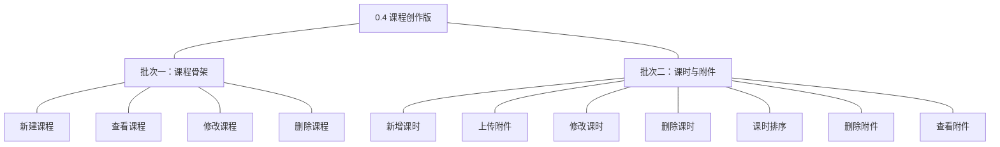
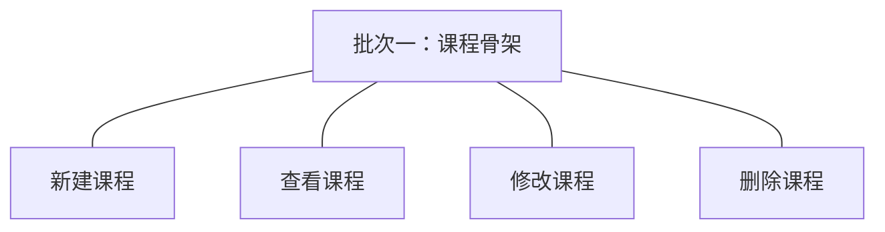
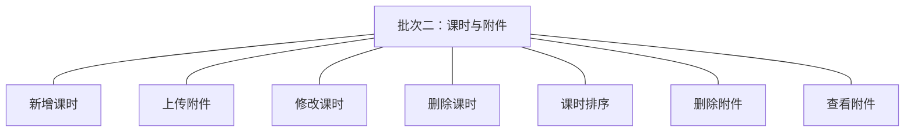

# 开发顺序与需求拆解（大版本）：0.4 课程创作版

> 定位：把《PRD（大版本）：0.4 课程创作版》转换为开发批次＋功能级需求条目；本文即该版本的完整需求清单，需求池据此直接入池、不另生成版本快照。上游为模拟案例材料，模拟性质保留。

## 1. 拆解说明

- **一一同构粒度口径**：一条需求（R 编号）＝一项 PRD 功能，需求名即 PRD 功能名；需求表的用途与验收标准**逐字引自 PRD 功能清单原文**，不压缩、不改写。按钮、字段、跳转级的原子拆解归小版本 PRD，不进本文。
- **本文即需求清单**：需求池批量入池直接读本文各批次需求表；池侧不生成版本快照，验收标准回溯本文（R 编号与 PRD 锚点随行可查）。
- **多入口口径**：本文是需求池的主入口但不是唯一入口——会议、沟通、临时反馈产生的需求从其他角度直接进入需求池（M01 起编号），不经本文；两类条目并存互不覆盖。
- **小版本规划的输入**＝本文开发顺序（批次建议，素材而非锁定）＋需求池实时状态，两者合并；唯一硬约束是本文声明的依赖与同事务契约不回退。

## 2. 开发顺序

**前置版本沿用面**：0.3 讲师入驻版（讲师账号与讲师端登录——课程归属与操作前提）、0.2 站点与分类版（课程分类骨架、对接参数与媒体接入——归属与内容上传前提）；外部依赖——视频与存储服务商配置已就绪（0.2 定案并收口）。

**顺序依据与同事务契约**：课程骨架先于内容（课时与附件挂在课程下，R27 先行）；课时与附件同批——两者都经媒体接入模块对接外部存储（同一联调面），且「建课时→传附件→排序」是一条可一次演示的创作链；同事务契约——课时与附件的元信息保存与外部存储上传结果回写同链路（上传成功才落引用，失败不产生半记录，04C-课程）；无独立外部联调批次（媒体接入为已就绪能力的消费，非新对接）。

### 2.1 批次一：课程骨架

- **目标**：讲师能新建并维护课程草稿（名称、介绍、价格、分类），本人与机构端各自可见所需范围。
- **依赖**：0.3（讲师账号）、0.2（分类骨架）。
- **可验收形态**：讲师新建一门课程草稿（含名称／介绍／价格／分类）→ 本人列表与详情可见 → 修改信息即时生效 → 删除一门未引用课程（软删除）；另一讲师账号无法看到该草稿；机构端可见全部课程与状态。
- **判断注记**：四项并为一批——「建→看→改→删」为同一对象的完整骨架管理、一次演示成链；删除的引用拦截规则就绪（引用随 0.6 产生）。

条目与 PRD 4.1 功能清单一一同构，用途与验收标准逐字引自原文：

| 编号 | 需求名 | 用途 | 验收标准 |
|---|---|---|---|
| R27 | 新建课程 | 讲师建立课程草稿，作为课程内容的容器与后续送审的对象 | 讲师提交课程名称、介绍、价格与归属分类后课程草稿创建成功并归属本人讲师账号，在本人课程列表可见；必填缺失、格式不符或分类不存在时创建失败并提示 |
| R30 | 查看课程 | 讲师管理本人课程，机构端掌握全部课程状态 | 讲师可查看本人课程列表与详情（含当前状态）；机构端可查看全部课程（含当前状态）；讲师无法查看他人课程 |
| R28 | 修改课程 | 讲师调整课程的基本信息、价格与归属分类 | 讲师修改课程信息保存后即时生效，再次查看为更新后内容；非本人课程无法修改 |
| R29 | 删除课程 | 讲师与机构管理员清理不再使用或异常的课程 | 讲师或机构管理员删除未被引用的课程后课程从对应列表消失、记录保留（软删除）；被订单或学习记录引用的课程删除被拦截并提示（引用随 0.6 产生，本版规则就绪） |

### 2.2 批次二：课时与附件

- **目标**：讲师能在课程草稿内建成完整内容——视频课时目录＋配套附件清单，顺序可调。
- **依赖**：批次一（课程草稿容器）；0.2 对接参数与媒体接入模块（外部存储上传）。
- **可验收形态**：讲师为一门草稿新增多个课时（mp4 视频上传成功、超限被拒）→ 上传多类附件（格式与大小限制生效）→ 调整课时顺序目录随之更新 → 删除一个课时与一个附件（软删除）→ 附件清单核对；非本人课程全部操作被拒——此批完成即路线图 0.4 完成标志（含至少一个课时与一个附件的草稿可见可复入）。
- **判断注记**：课时与附件并批——同一外部存储联调面（视频与资料上传共用媒体接入），且创作链一次演示；上传校验限制（mp4 ≤2GB、附件清单格式 ≤100MB）为 PRD 已定案值，批次内不再拆分。

条目与 PRD 4.1 功能清单一一同构，用途与验收标准逐字引自原文：

| 编号 | 需求名 | 用途 | 验收标准 |
|---|---|---|---|
| R31 | 新增课时 | 讲师为本人课程添加视频学习单元 | 讲师为本人课程提交课时标题与视频文件后课时创建成功并出现在课程目录中；视频不符格式或大小限制时创建失败并提示；非本人课程无法新增课时 |
| R35 | 上传附件 | 讲师为本人课程上传配套资料并保存引用 | 讲师为本人课程上传符合大小与格式限制的资料文件后附件保存成功并出现在附件清单；超限或格式不符时上传失败并提示 |
| R32 | 修改课时 | 讲师调整课时标题或更换视频内容 | 讲师修改课时保存后即时生效；非本人课程的课时无法修改 |
| R33 | 删除课时 | 讲师清理不再使用的课时 | 讲师删除本人课程的课时后该课时从课程目录消失、记录保留（软删除）；非本人课程课时无法删除 |
| R34 | 课时排序 | 讲师调整课时的学习顺序 | 讲师调整课时顺序保存后课程目录按新顺序展示；非本人课程无法调整 |
| R36 | 删除附件 | 讲师清理不再使用的附件 | 讲师删除本人课程的附件后从附件清单消失、记录保留（软删除）；非本人课程附件无法删除 |
| R37 | 查看附件 | 讲师核对课程配套资料清单 | 讲师可查看本人课程的附件清单（附件名与上传时间）；无法查看他人课程的附件 |

**批次判断与边界取舍**：两批已是最少批次——课程骨架与内容成型分批因后者依赖前者的容器且内容批带外部存储联调面；批次二内课时与附件不拆（同一联调面、一次演示创作链）；11 条不逐功能拆批；上传增强（断点续传等）在围栏外、不入批。

**版本级验收安排**：按 PRD 1 的成功标准与量化口径验收（三条判定线）；灰度属上线安排不占开发批次——本版无资金流转与对外发布风险面（课程停留草稿、学员端不可见），路线图 0.4 完成标志即验收锚。

## 3. 条目与 PRD 对应核对

- **一一同构声明**：条目数＝PRD 功能数＝11（R27～R37），逐行对应、无归并、无路径拆分、无 PRD 外内容。
- **批次构成**：批次一 4 条（课程骨架组）；批次二 7 条（课时组 4＋附件组 3）。
- **◆ 清点**：0 个——本版无复杂功能条目（上传与排序的机制复杂度由媒体接入模块与同链路契约承载，功能级无 ◆ 标注，与 PRD 功能全景总图一致）。
- **过渡支撑清点**：0 个——本版无过渡支撑能力（课程草稿为正式形态，送审为 0.5 新增而非替代）。

## 4. 与需求池和小版本规划的衔接

- **入池路径**：需求池按「批量入池」直读本文第 2 章各批次需求表，条目编号沿用 R27～R37、批次随本文继承。
- **多入口口径**：会议、沟通、临时反馈类需求不经本文，直接单条入池（M01 起编号），与本批条目并存互不覆盖。
- **小版本规划的合并输入**：批次是建议而非锁定——确认小版本时以本文开发顺序＋需求池实时状态合并定范围；本文声明的依赖与同事务契约（0.2／0.3 前置、课时与附件上传同链路、批次二依赖批次一容器）不回退。
- **认领与细化原则**：每条凭随行验收标准即可独立认领与验收；开发级细化（交互、字段、边界、用例）归小版本 PRD，本文任何位置不低于 PRD 功能级粒度。
