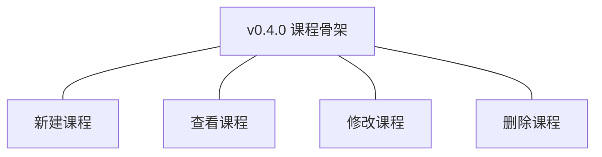
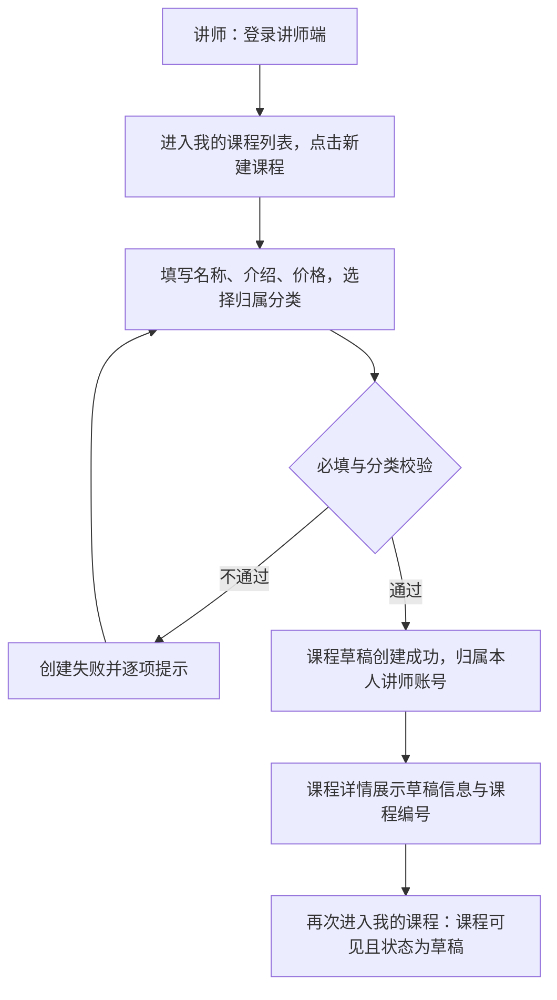
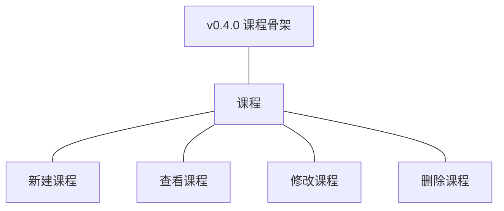
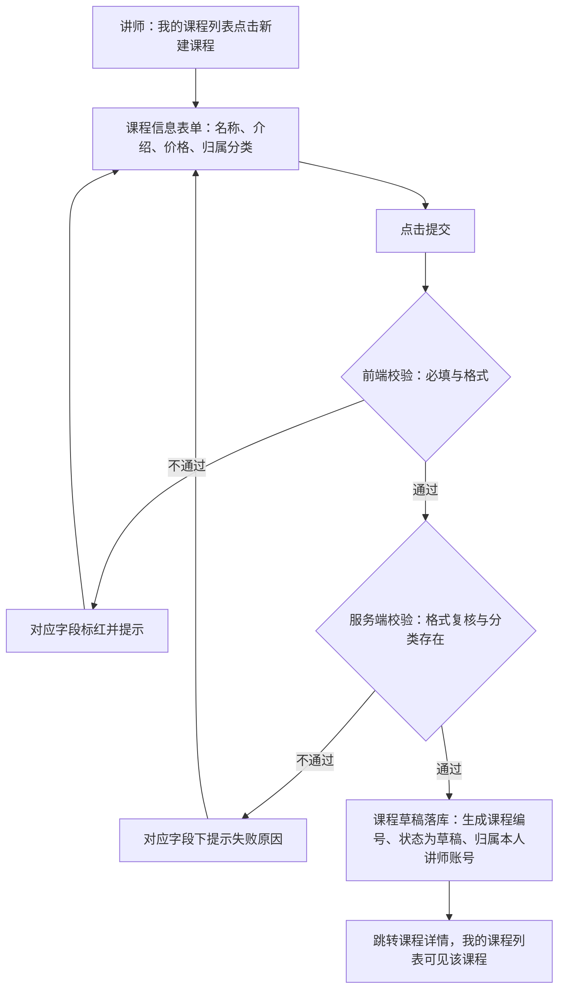
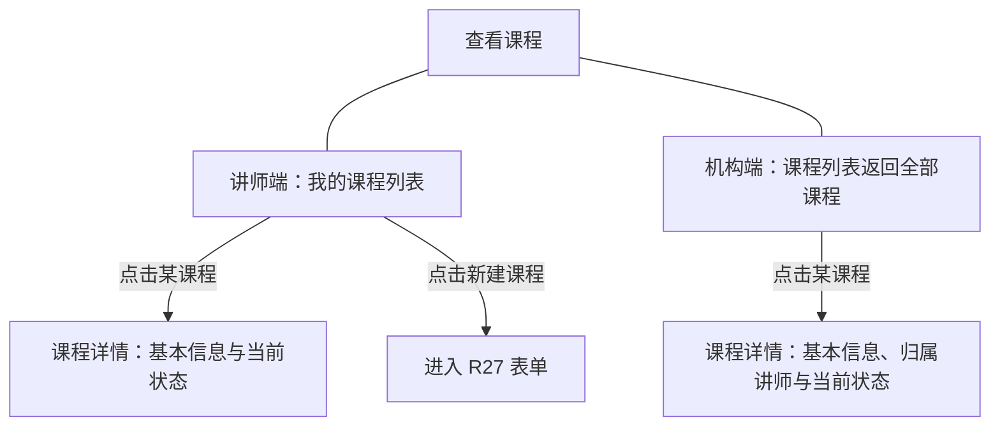
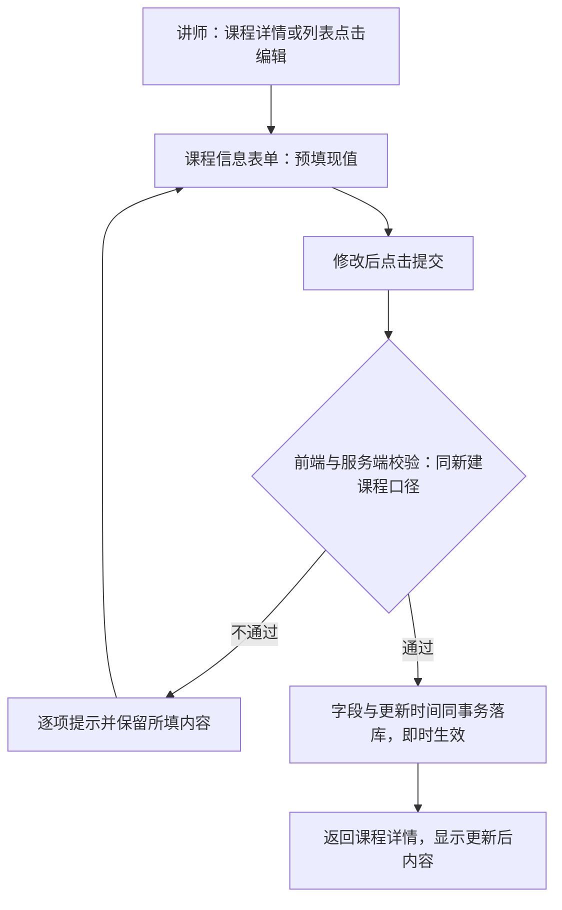
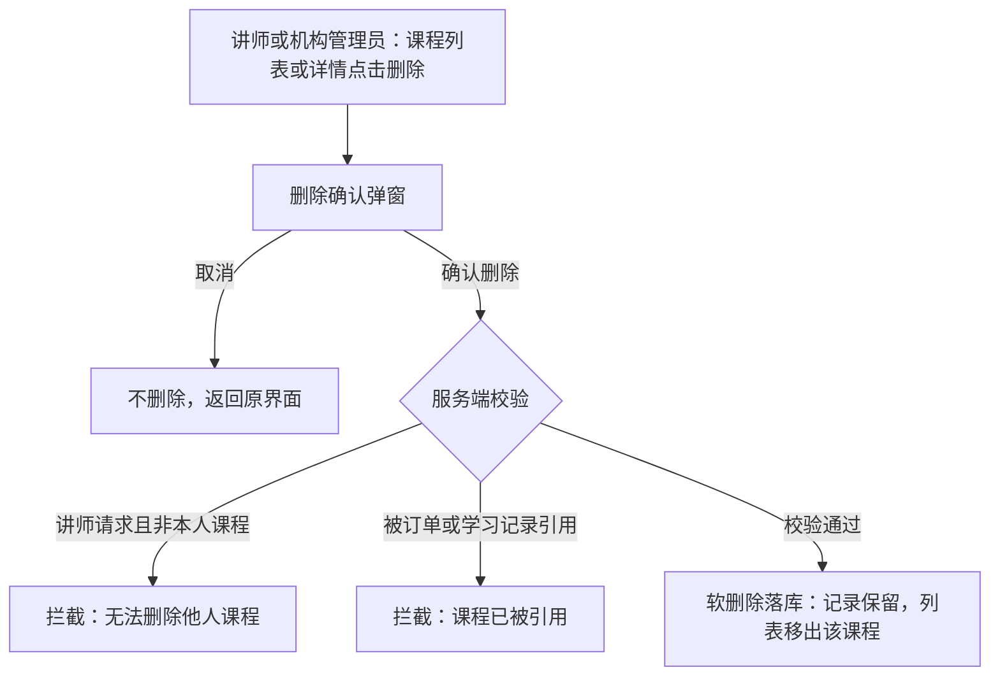

# PRD（小版本）：v0.4.0 课程骨架

> 定位：开发级需求说明书——承接《PRD（大版本）：0.4 课程创作版》与《02-开发顺序与需求拆解（大版本）》批次一「课程骨架」，认领自需求池（R27～R30）；把四条功能级条目细化到交互、字段、规则、异常与落库字段，开发与测试凭本文即可开工。上游为模拟案例材料，模拟性质保留。

## 1. 版本概述

**承接与目标**：本版认领 0.4 批次一「课程骨架」整批（R27～R30）——02 批次建议与需求池实时状态合并采纳（批次一 4 条当时全部待规划，无拆批必要）。可验收形态：讲师新建一门课程草稿（含名称／介绍／价格／分类）→ 本人列表与详情可见 → 修改信息即时生效 → 删除一门未引用课程（软删除）；另一讲师账号无法看到该草稿；机构端可见全部课程与状态。课程停留「草稿」形态，送审与状态流转随 0.5。

**范围外声明**：课时与附件全部条目（R31～R37，随 v0.4.1 批次二「课时与附件」）；课程提交上架审核与状态流转、机构端审核操作（随 0.5）；封面图上传（大版本 PRD 拍板本版不做、能力回池评估）；订单与学习记录对课程的真实引用拦截场景（引用对象随 0.6 产生，本版仅规则就绪，本版内删除恒走未引用路径）。

**条目内顺序与依赖**：建→看→改→删（R27→R30→R28→R29）——同一对象的完整骨架管理、一次演示成链（沿用上游批内判断注记）；R28／R29 依赖 R27 产生的课程草稿与 R30 的查看路径。

**关键口径与来源状态**：课程名称 2～50 字、介绍 20～2000 字、价格非负整数（最小货币单位计，0 表示免费）＋归属分类＝大版本本版拍板；分类层级深度 2 级＝0.2 定案沿用；课程编号 `CR`＋8 位序号＝术语表编码契约；讲师登录态 `side=teacher`＝v0.3.1 登记沿用；列表必须分页＝开发规范沿用。

## 2. 需求范围与验收锚

条目总览树（与上游批次一分支图同名同构）：

认领条目表（需求名／用途／验收标准逐字引自《02-开发顺序与需求拆解（大版本）》批次一需求表）：

| 编号 | 需求名 | 用途 | 验收标准 |
|---|---|---|---|
| R27 | 新建课程 | 讲师建立课程草稿，作为课程内容的容器与后续送审的对象 | 讲师提交课程名称、介绍、价格与归属分类后课程草稿创建成功并归属本人讲师账号，在本人课程列表可见；必填缺失、格式不符或分类不存在时创建失败并提示 |
| R30 | 查看课程 | 讲师管理本人课程，机构端掌握全部课程状态 | 讲师可查看本人课程列表与详情（含当前状态）；机构端可查看全部课程（含当前状态）；讲师无法查看他人课程 |
| R28 | 修改课程 | 讲师调整课程的基本信息、价格与归属分类 | 讲师修改课程信息保存后即时生效，再次查看为更新后内容；非本人课程无法修改 |
| R29 | 删除课程 | 讲师与机构管理员清理不再使用或异常的课程 | 讲师或机构管理员删除未被引用的课程后课程从对应列表消失、记录保留（软删除）；被订单或学习记录引用的课程删除被拦截并提示（引用随 0.6 产生，本版规则就绪） |

**锚定说明**：上表三要素逐字锚定上游，细化只加深行为描述、不收窄不放宽；本版无 ◆ 复杂条目（沿用大版本「◆ 清点：0 个」声明）；细化中发现的新想法按第 6 章回池，不进正文。

## 3. 核心用户旅程

旅程承接说明：承接上游大版本 PRD「课程内容成型（讲师端）」旅程落在本版认领范围内的链路段＝「新建课程」（上游①）及其延伸（草稿可见与核对）；排除段＝新增课时（②）、上传附件（③）、调整课时顺序（④）——随 v0.4.1 批次二交付，不在本版旅程内；删除与单项修改属管理操作、由验收标准覆盖，不进旅程（沿用上游口径）。本版无跨主体、跨端交接链路（机构端查看为独立只读视图，不与讲师交互），故旅程为讲师端单端单主体流程图；「旅程：课程骨架建立」一条如下。

### 3.1 旅程：课程骨架建立（讲师端）

讲师从自己的工作台进入「我的课程」，把课程骨架立起来：填写四项基本信息提交，系统校验通过后创建草稿并归属本人，详情页与列表立即可见可核对；校验不通过时逐项提示、停留表单。操作步骤清单：

1. 讲师以讲师账号登录讲师端（登录态 `side=teacher`），进入「我的课程」列表；
2. 点击「新建课程」进入课程信息表单；
3. 填写课程名称、课程介绍、价格，选择归属分类；
4. 点击「提交」，校验不通过时按字段提示修正后重提；
5. 创建成功后系统跳转课程详情（展示课程编号与草稿状态）；
6. 返回「我的课程」列表核对：新课程在列、状态为「草稿」。

## 4. 功能需求

### 4.1 功能总览

对象归组树（版本→对象→条目）：

对象增删改查矩阵（本版认领条目以编号落位、随后续小版本承接的标注去向、版本围栏标「不做」并注依据）：

| 业务对象 | 增 | 改 | 删 | 查 |
|---|---|---|---|---|
| 课程 | R27 | R28 | R29 | R30 |
| 课时 | 随批次二（v0.4.1，R31） | 随批次二（v0.4.1，R32） | 随批次二（v0.4.1，R33） | 随批次二（v0.4.1，目录随排序 R34 呈现） |
| 课程附件 | 随批次二（v0.4.1，R35） | 不做（上游拆解仅上传／删除／查看，无修改条目） | 随批次二（v0.4.1，R36） | 随批次二（v0.4.1，R37） |
| 课程分类 | 不做（0.2 已交付，本版只作归属数据源） | 不做（同左） | 不做（同左） | 只读引用（0.2 交付的查看分类） |

主体使用面：

| 主体／角色 | 端 | 使用条目 | 说明 |
|---|---|---|---|
| 讲师 | 讲师端 | R27、R30、R28、R29 | 本人课程的建、看、改、删；R28／R29 服务端限本人课程 |
| 机构管理员 | 机构端 | R30、R29 | 全部课程查看；删除异常课程（与讲师同等引用拦截规则） |
| 机构运营人员 | 机构端 | R30 | 全部课程查看（审核操作随 0.5，本版无写操作面） |

本版无机制条目（四条均有人工操作面，无「仅系统内部触发」条目）；学员主体不上场（课程对外可见随 0.5）。

### 4.2 R27 新建课程

**功能说明**：讲师为自己的课程内容立起容器——课程草稿的创建入口，后续课时、附件与送审都挂在这个容器上。触发：讲师在讲师端「我的课程」列表点击「新建课程」。

**交互与流程**：

操作步骤清单：

1. 讲师在「我的课程」列表点击「新建课程」，进入课程信息表单；
2. 填写课程名称、课程介绍、价格（以元为单位、最多两位小数，0 元表示免费），从下拉选择归属分类（数据源为未删除的课程分类，展示层级路径）；
3. 点击「提交」：前端先校验必填与格式，未通过逐项标红提示并停留表单（已填内容保留）；
4. 服务端复核格式并校验归属分类存在且未删除，未通过返回对应字段失败提示；
5. 通过后课程草稿创建成功：生成课程编号（`CR`＋8 位序号）、状态＝草稿、归属＝本人讲师账号；
6. 系统跳转课程详情页；「我的课程」列表同步出现该课程。

**字段与校验**：

| 信息项 | 必填 | 业务类型 | 约束与取值 | 失败反馈 |
|---|---|---|---|---|
| 课程名称 | 是 | 文本 | 2～50 字（大版本拍板） | 「课程名称需 2～50 字」 |
| 课程介绍 | 是 | 长文本 | 20～2000 字（大版本拍板） | 「课程介绍需 20～2000 字」 |
| 价格 | 是 | 金额 | 非负金额、界面以元录入最多两位小数；存储以最小货币单位（分）整数换算，0 表示免费（大版本拍板，界面层细化） | 「价格需为不小于 0 的金额，最多两位小数」 |
| 归属分类 | 是 | 选择 | 下拉选择未删除的课程分类（一级或二级均可，本版拍板）；分类层级上限 2 级（0.2 定案沿用） | 未选：「请选择归属分类」；分类无效：「所属分类不存在或已删除」 |

**规则与边界**：

1. 课程编号在创建成功时生成（`CR`＋8 位序号，编码沿用术语表），生成后不变、不回收复用；
2. 创建即状态＝「草稿」，本版不存在其他状态入口（状态流转随 0.5）；
3. 归属讲师＝当前登录的讲师账号（服务端从登录态取，不接受表单传入），创建后归属不变；
4. 课程名称不做唯一性校验（上游未要求，同名课程以课程编号区分，本版拍板）；
5. 价格存储为非负整数（分）；界面展示时 0 元显示为「免费」（展示口径沿用大版本「0 表示免费」）；
6. 讲师创建课程数量不设上限（上游无限制要求，本版拍板）；
7. 提交频率与重复创建：同一讲师可连续创建多门课程，系统不做间隔限制（本版拍板）。

**异常与拦截**：

| 异常场景 | 系统行为 | 用户看到 |
|---|---|---|
| 任一必填项缺失 | 拦截提交，逐项标红 | 「请填写课程名称／课程介绍／价格」「请选择归属分类」 |
| 名称／介绍字数越界 | 拦截提交 | 「课程名称需 2～50 字」「课程介绍需 20～2000 字」 |
| 价格非数字、为负或超两位小数 | 拦截提交 | 「价格需为不小于 0 的金额，最多两位小数」 |
| 归属分类不存在或已软删除 | 服务端拦截 | 「所属分类不存在或已删除」 |
| 会话缺失或非讲师端登录态 | 拦截并引导 | 跳转讲师端登录页 |

### 4.3 R30 查看课程

**功能说明**：讲师管理本人课程、机构端掌握全部课程状态的只读视图——两端各自的列表与详情。触发：讲师在讲师端进入「我的课程」；机构运营人员或机构管理员在机构端进入课程列表。

**交互与流程**：

操作步骤清单：

1. 讲师端：讲师进入「我的课程」，列表按创建时间倒序展示本人未删除课程（课程编号、名称、归属分类、价格、状态、创建时间、操作「编辑／删除」），默认 10 条／页（可选 10／20／50，本版拍板）；
2. 点击某课程进入详情：展示课程编号、名称、介绍、价格（0 元显示「免费」）、归属分类（含层级路径）、状态（本版恒为「草稿」）、创建时间与更新时间；课时目录与附件清单区块本版为空态（「暂无课时」「暂无附件」，内容能力随 v0.4.1 交付）；
3. 机构端：机构运营人员或机构管理员进入课程列表，展示全部未删除课程（课程编号、名称、归属讲师、归属分类、价格、状态、创建时间；删除操作仅机构管理员可见），分页与排序口径同讲师端；
4. 机构端点击某课程进入详情：在讲师端详情字段基础上增加归属讲师信息；
5. 两端详情均为只读，无本版写操作（编辑与删除入口按端与角色显隐）。

**字段与校验**：

| 信息项 | 说明 |
|---|---|
| 列表（讲师端） | 课程编号、课程名称、归属分类、价格、状态、创建时间、操作（编辑／删除） |
| 列表（机构端） | 课程编号、课程名称、归属讲师、归属分类、价格、状态、创建时间、操作（删除——仅机构管理员） |
| 详情（两端） | 课程编号、名称、介绍、价格（0＝「免费」）、归属分类层级路径、状态、创建时间、更新时间；机构端另示归属讲师 |
| 查询与分页 | 列表分页必选（默认 10 条／页，可选 10／20／50，本版拍板）；默认排序创建时间倒序（本版拍板）；本版不提供筛选条件（筛选随后续需要回池） |

**规则与边界**：

1. 归属过滤：讲师端列表与详情仅返回 `teacher_id`＝本人讲师账号的未删除课程；机构端返回全部未删除课程（含各讲师）；
2. 讲师访问他人课程详情被拒绝（无法查看他人课程——验收锚）；访问不存在或已软删除的课程详情按「课程不存在」返回；
3. 软删除课程不出现在两端列表与详情（删除后移出，记录保留在库）；
4. 状态列本版只出现「草稿」一个取值（状态枚举沿用术语表，其余值随 0.5 起用）；
5. 机构运营人员与机构管理员看到相同的课程范围，差异仅在删除操作显隐（能力点控制，前端隐藏不作为安全边界——开发规范）。

**异常与拦截**：

| 异常场景 | 系统行为 | 用户看到 |
|---|---|---|
| 讲师请求他人课程详情 | 服务端归属校验拒绝 | 「课程不存在或无权查看」 |
| 列表为空（讲师尚无课程） | 返回空态 | 空态插图与「还没有课程，点击新建课程开始创作」引导 |
| 列表为空（机构端尚无任何课程） | 返回空态 | 「暂无课程」空态 |
| 访问已删除或不存在的课程 | 按「课程不存在」返回 | 「课程不存在」提示页 |

### 4.4 R28 修改课程

**功能说明**：讲师对本人课程基本信息的调整入口——名称、介绍、价格与归属分类就地更新。触发：讲师在本人课程详情页或「我的课程」列表点击「编辑」。

**交互与流程**：

操作步骤清单：

1. 讲师在本人课程的详情页或列表行点击「编辑」，进入课程信息表单（四项字段预填现值）；
2. 修改需要调整的字段（名称、介绍、价格、归属分类任一或多项）；
3. 点击「提交」：校验口径与新建课程完全一致（第 4.2 节字段与校验表），未通过逐项提示且保留所填内容；
4. 通过后保存即时生效：更新字段与 `updated_at` 同事务落库；
5. 返回课程详情，再次查看为更新后内容；列表同步刷新。

**字段与校验**：与第 4.2 节新建课程的字段与校验表完全一致（名称 2～50 字、介绍 20～2000 字、价格非负两位小数、归属分类未删除），全部字段可修改；无本条目独有的新增字段。

**规则与边界**：

1. 编辑入口仅对本人课程开放（列表与详情按归属过滤显隐）；
2. 服务端保存前再校验归属（`teacher_id`＝当前登录讲师），防越权直调接口（非本人课程无法修改——验收锚）；
3. 本版课程恒为「草稿」态、无状态门槛（已发布课程修改是否强制重新送审为 0.5 待定决策，本版不触及）；
4. 归属分类可改换为其他未删除分类（含跨一级分类调整），换绑后列表与详情即时体现；
5. 归属讲师不可通过编辑变更（创建时锁定，机构直接转移课程归属不在本期范围）；
6. 课程编号不可修改（创建时生成、终身不变）。

**异常与拦截**：

| 异常场景 | 系统行为 | 用户看到 |
|---|---|---|
| 修改他人课程（越权请求） | 服务端归属校验拒绝 | 「课程不存在或无权操作」 |
| 字段校验不通过 | 拦截保存 | 同第 4.2 节各字段失败反馈 |
| 归属分类已失效 | 服务端拦截 | 「所属分类不存在或已删除」 |
| 课程已被软删除后提交修改 | 按「课程不存在」拒绝 | 「课程不存在」提示 |

### 4.5 R29 删除课程

**功能说明**：不再使用或异常课程的清理出口——软删除、记录保留，被引用课程受拦截规则保护。触发：讲师在本人课程列表或详情点击「删除」；机构管理员在机构端课程列表点击「删除」。

**交互与流程**：

操作步骤清单：

1. 讲师在本人课程（或机构管理员在机构端任意课程）的列表行或详情页点击「删除」；
2. 系统弹出二次确认：「删除后课程将从列表消失，记录将保留」，提供「确认删除」「取消」；
3. 取消则返回原界面、无任何变更；
4. 确认后服务端校验：操作者身份（讲师限本人课程；机构管理员放行至引用校验）与引用状态（订单、学习记录是否引用该课程）；
5. 校验通过即软删除（`deleted_at` 落值），操作者所在列表即时移出该课程，记录保留在库；
6. 拦截时提示原因、不产生任何数据变更。

**字段与校验**：无——删除为确认型操作，无表单输入字段（唯一交互是二次确认弹窗）。

**规则与边界**：

1. 使用方＝讲师（限本人课程）与机构管理员（任意课程）；机构运营人员无删除操作面（入口不显隐由能力点控制，服务端同样校验角色）；
2. 删除为软删除（`deleted_at` 落值），课程记录与关联留痕保留（验收锚「记录保留」）；
3. 引用拦截规则本版就绪：删除前查询订单（`course_order`）与学习记录（`study_record`）对该课程的引用，存在即拦截（引用随 0.6 产生，本版两表尚无数据、删除恒走未引用路径——规则可测、场景不触发）；
4. 已软删除课程不可再次删除、不可编辑（按「课程不存在」口径返回）；
5. 删除后课程编号不回收复用（编码契约沿用）；
6. 机构管理员删除与讲师删除走同一拦截规则（与讲师同等引用拦截——大版本主体表口径）。

**异常与拦截**：

| 异常场景 | 系统行为 | 用户看到 |
|---|---|---|
| 讲师请求删除他人课程 | 服务端归属校验拒绝 | 「课程不存在或无权操作」 |
| 课程被订单或学习记录引用 | 拦截删除、数据不变（本版内不触发，规则就绪） | 「课程已被订单或学习记录引用，无法删除」 |
| 机构运营人员发起删除请求 | 服务端角色校验拒绝 | 「无删除权限」 |
| 重复删除（课程已软删除） | 按「课程不存在」返回 | 「课程不存在」提示 |

## 5. 业务对象与数据字段

数据主体清单：

| 业务对象 | 落库名 | 定位与关系 |
|---|---|---|
| 课程 | `course` | 本版新增数据对象：可被购买与学习的教学单元，本版承载草稿形态创作；归属唯一讲师账号（`teacher_id`）与一个未删除课程分类（`category_id`）；后续被课时、课程附件、订单、学习记录引用 |
| 讲师账号 | `teacher_account` | 沿用对象（0.3 交付）：课程归属外键的目标，本版只读引用 |
| 课程分类 | `course_category` | 沿用对象（0.2 交付）：归属分类外键的目标，本版只读引用 |
| 课时 | `course_lesson` | 随批次二（v0.4.1）新增，本版不建 |
| 课程附件 | `course_attachment` | 随批次二（v0.4.1）新增，本版不建 |
| 登录态（会话） | 会话存储（机制态） | 沿用 v0.3.1 登记（`side=teacher`），本版无新增机制态对象 |

课程（`course`）字段表（业务级字段定义＋落库命名对照；列类型、主键、索引与建表 DDL 归开发阶段）：

| 字段 | 必填 | 业务类型 | 落库字段名 | 约束与取值 |
|---|---|---|---|---|
| 主键 | — | 标识 | `id` | 通用字段（术语表第 7 节） |
| 课程编号 | 是 | 编码 | `no` | `CR`＋8 位序号，创建时生成、唯一、不回收 |
| 课程名称 | 是 | 文本 | `name` | 2～50 字；不做唯一校验（本版拍板） |
| 课程介绍 | 是 | 长文本 | `intro` | 20～2000 字 |
| 价格 | 是 | 金额 | `price` | 非负整数、最小货币单位（分），0＝免费；界面以元两位小数录入换算 |
| 归属分类 | 是 | 外键 | `category_id` | 指向 `course_category.id`，须为未删除分类（`deleted_at` 为空），一级或二级均可（本版拍板） |
| 归属讲师 | 是 | 外键 | `teacher_id` | 指向 `teacher_account.id`，创建时取当前登录讲师、此后不变 |
| 状态 | 是 | 枚举 | `status` | 本版恒为草稿（`draft`）；待审核／未通过／已发布／已下架随 0.5 起用（枚举沿用术语表） |
| 审核人／审核时间／审核意见 | 否 | 留痕 | `audit_admin_id`／`audited_at`／`audit_remark` | 通用审核字段（术语表已登记适用对象含课程），本版为空、随 0.5 起用 |
| 创建时间／更新时间 | 是 | 时间 | `created_at`／`updated_at` | 通用字段；编辑保存同事务更新 `updated_at` |
| 软删除时间 | 否 | 时间 | `deleted_at` | 空＝未删除；删除课程时落值，删除后不出现在两端列表与详情 |

机制态对象：本版无新增（登录态沿用既有登记）；课程与分类的归属关系为普通外键、无独立关系表。

## 6. 待议与建议

**本版采用的推断与默认值汇总**：

1. 课程名称不做全站唯一校验——上游未要求同名唯一，同名课程以课程编号区分（本版拍板）；
2. 归属分类可选未删除的一级或二级分类、不强制二级叶子——分类为归属骨架，上游仅定层级 2 级（本版拍板，待确认：若业务要求课程必须挂叶子分类，改此处与下拉过滤即可，不影响对象结构）；
3. 价格界面以元为单位录入（最多两位小数）、存储以分（最小货币单位）整数换算——大版本「最小货币单位」拍板的界面层落地（待确认：若业务要求直接以整数金额录入可去掉换算）；
4. 列表分页默认 10 条／页、可选 10／20／50，默认排序创建时间倒序——开发规范「列表必须分页」的具体化（本版拍板）；
5. 讲师创建课程数量与频率不设上限（上游无限制要求，本版拍板）；
6. 课时目录与附件清单在课程详情页以空态占位（「暂无课时」「暂无附件」）——内容能力随 v0.4.1 交付后的自然填充位（本版拍板）。

**建议回池与术语表待登记**：

- 建议回池：封面图上传能力——大版本 PRD 已拍板「本版不做、封面能力回池评估」，建议按单条入池（M01 起编号）登记，随批次二或后续版本评估；课程列表筛选条件（按状态、分类、时间）本版未做，建议一并回池评估（一句话指引）。
- 术语表待登记行（随本文档回报、由主流程合入）：课程（`course`）新增落库字段 `price`、`category_id`、`teacher_id`；`name`、`intro`、`deleted_at` 适用对象扩展至课程；`no`、`status`、`created_at`／`updated_at`、审核三字段按通用字段与既有登记沿用、无需新增。
