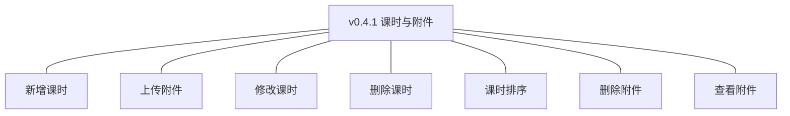
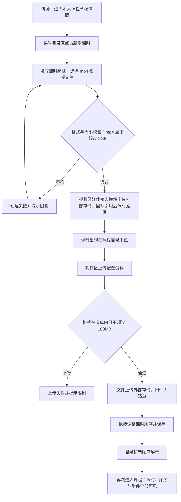
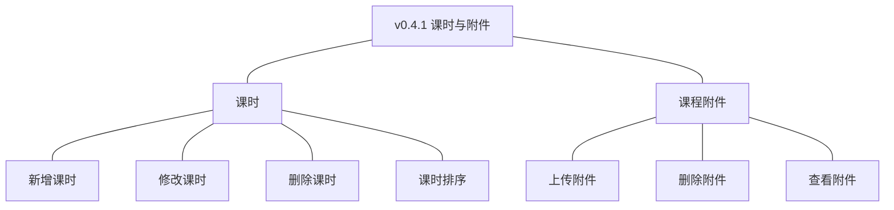
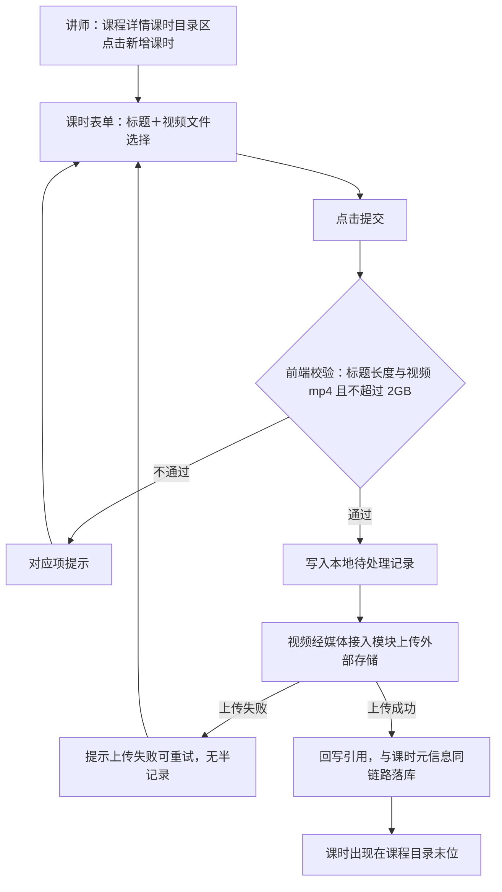
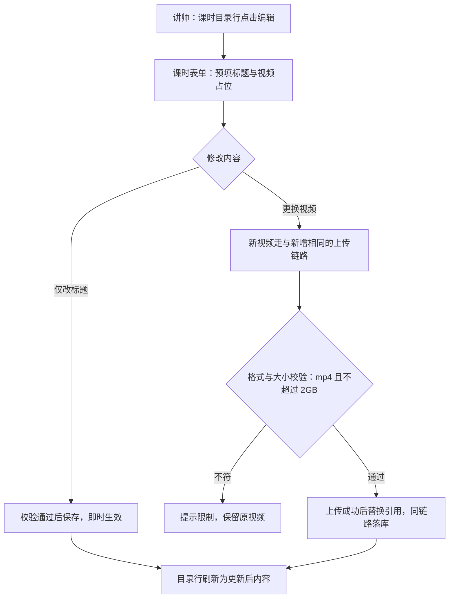
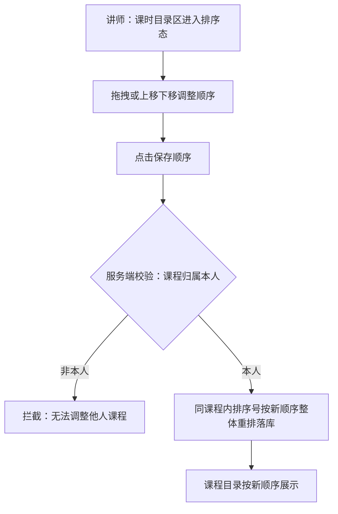
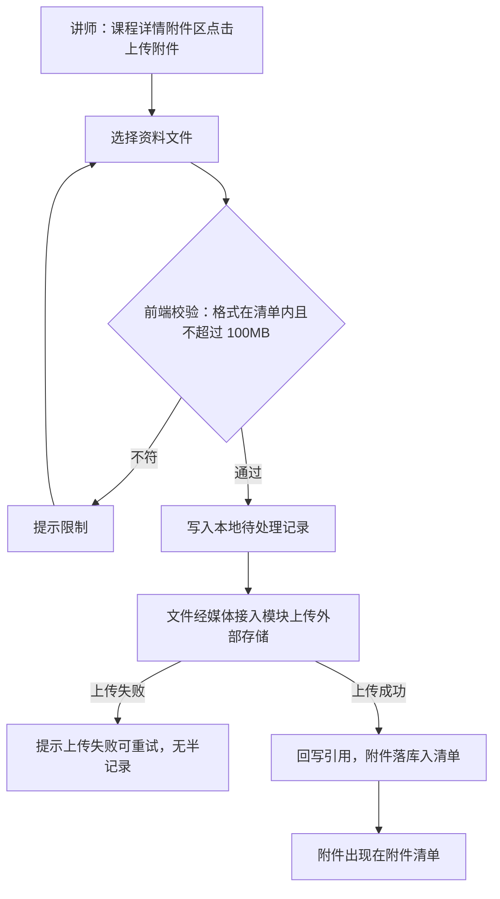
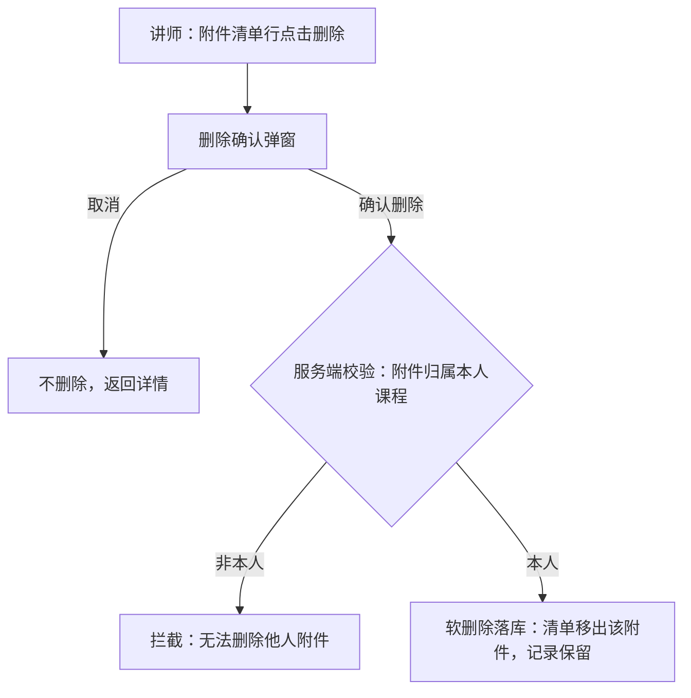
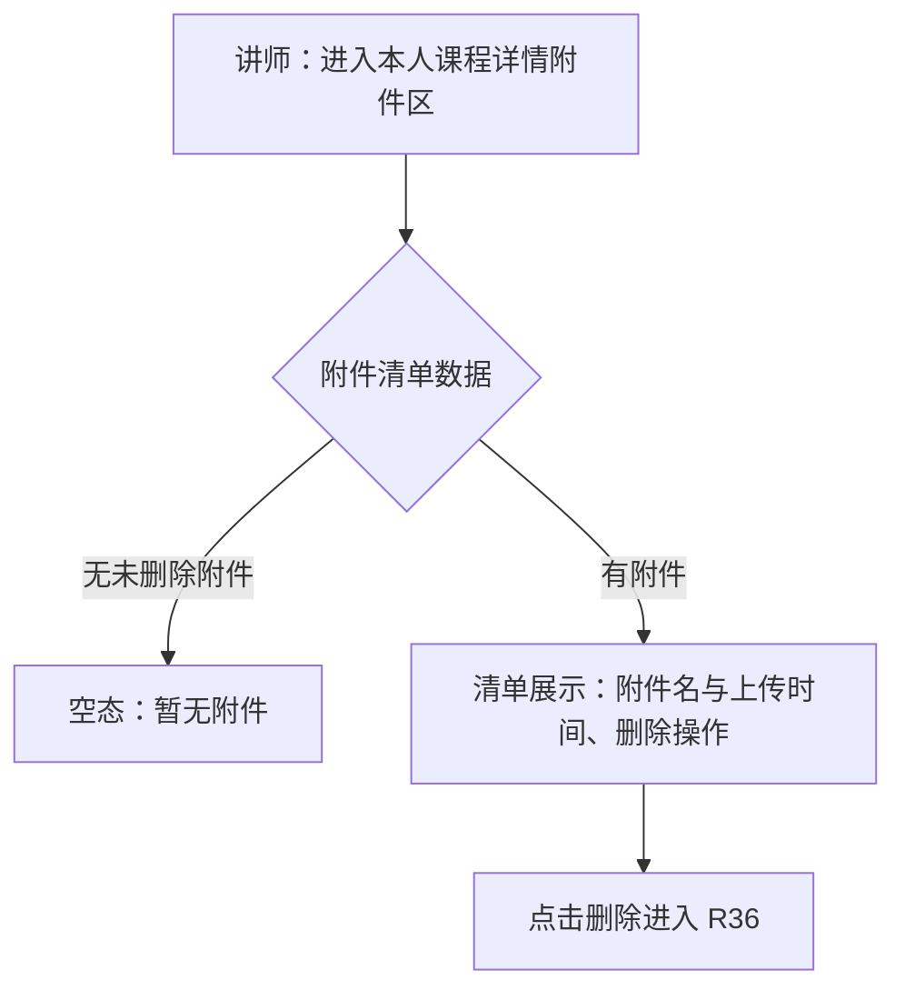

# PRD（小版本）：v0.4.1 课时与附件

> 定位：开发级需求说明书——承接《PRD（大版本）：0.4 课程创作版》与《02-开发顺序与需求拆解（大版本）》批次二「课时与附件」，认领自需求池（R31～R37）；把七条功能级条目细化到交互、字段、规则、异常与落库字段，开发与测试凭本文即可开工。上游为模拟案例材料，模拟性质保留。

## 1. 版本概述

**承接与目标**：本版认领 0.4 批次二「课时与附件」整批（R31～R37）——02 批次建议与需求池实时状态合并采纳（v0.4.0 发布后批次二 7 条全部待规划，无拆批必要）。可验收形态：讲师为一门草稿新增多个课时（mp4 视频上传成功、超限被拒）→ 上传多类附件（格式与大小限制生效）→ 调整课时顺序目录随之更新 → 删除一个课时与一个附件（软删除）→ 附件清单核对；非本人课程全部操作被拒——此批完成即路线图 0.4 完成标志（含至少一个课时与一个附件的草稿可见可复入）。

**范围外声明**：课程提交上架审核与状态流转、机构端审核操作（随 0.5）；学员端课时播放与附件获取（随 0.6）；封面图上传（大版本拍板不做、能力回池评估）；断点续传等上传增强（02 批次判断「在围栏外、不入批」，建议回池）；机构代录课程内容（本版无机构端写操作面）。

**条目内顺序与依赖**：课时组先行（R31 新增→R32 修改→R33 删除→R34 排序，目录先成型）、附件组随后（R35 上传→R36 删除→R37 查看），两组共用同一外部存储联调面、可并行开发；前置＝v0.4.0 课程骨架（课程草稿容器）与 0.2 对接参数（媒体接入）；同事务契约不回退——课时与附件的元信息保存与外部存储上传结果回写同链路，上传成功才落引用、失败不产生半记录（沿用上游批次判断）。

**关键口径与来源状态**：视频课时限 mp4 单文件不超过 2GB、附件限 pdf／zip／doc／docx／xls／xlsx／ppt／pptx／png／jpg 单文件不超过 100MB＝大版本本版拍板（行业惯例默认）；内容本体存外部存储、本模块只保存引用与元信息＝D7、K5；接入参数取自站点配置模块（0.2 交付）；外部服务写操作先写本地待处理记录、回写以该记录为幂等依据＝开发规范（技术文档 K5）；课时排序沿用同课程内顺序号口径。

## 2. 需求范围与验收锚

条目总览树（与上游批次二分支图同名同构）：

认领条目表（需求名／用途／验收标准逐字引自《02-开发顺序与需求拆解（大版本）》批次二需求表）：

| 编号 | 需求名 | 用途 | 验收标准 |
|---|---|---|---|
| R31 | 新增课时 | 讲师为本人课程添加视频学习单元 | 讲师为本人课程提交课时标题与视频文件后课时创建成功并出现在课程目录中；视频不符格式或大小限制时创建失败并提示；非本人课程无法新增课时 |
| R32 | 修改课时 | 讲师调整课时标题或更换视频内容 | 讲师修改课时保存后即时生效；非本人课程的课时无法修改 |
| R33 | 删除课时 | 讲师清理不再使用的课时 | 讲师删除本人课程的课时后该课时从课程目录消失、记录保留（软删除）；非本人课程课时无法删除 |
| R34 | 课时排序 | 讲师调整课时的学习顺序 | 讲师调整课时顺序保存后课程目录按新顺序展示；非本人课程无法调整 |
| R35 | 上传附件 | 讲师为本人课程上传配套资料并保存引用 | 讲师为本人课程上传符合大小与格式限制的资料文件后附件保存成功并出现在附件清单；超限或格式不符时上传失败并提示 |
| R36 | 删除附件 | 讲师清理不再使用的附件 | 讲师删除本人课程的附件后从附件清单消失、记录保留（软删除）；非本人课程附件无法删除 |
| R37 | 查看附件 | 讲师核对课程配套资料清单 | 讲师可查看本人课程的附件清单（附件名与上传时间）；无法查看他人课程的附件 |

**锚定说明**：上表三要素逐字锚定上游，细化只加深行为描述、不收窄不放宽；本版无 ◆ 复杂条目（沿用大版本「◆ 清点：0 个」声明——上传与排序的机制复杂度由媒体接入模块与同链路契约承载）；细化中发现的新想法按第 6 章回池，不进正文。

## 3. 核心用户旅程

旅程承接说明：承接上游大版本 PRD「课程内容成型（讲师端）」旅程落在本版认领范围内的链路段＝新增课时（上游②）→ 上传附件（③）→ 调整课时顺序（④）→ 保存核对（⑤，本版细化为目录与清单的复入核对）；排除段＝新建课程（①，v0.4.0 已交付）；删除与单项修改属管理操作、由验收标准覆盖，不进旅程（沿用上游口径）。本版无跨主体、跨端交接链路（内容创作全程讲师端），旅程为讲师端单端单主体流程图；「旅程：课程内容成型」一条如下。

### 3.1 旅程：课程内容成型（讲师端·批次二段）

讲师在 v0.4.0 建好的课程草稿里把内容做实：逐个添加视频课时、上传配套资料附件、调整目录顺序，最后复入核对——至此课程内容成型、达到路线图 0.4 完成标志。操作步骤清单：

1. 讲师登录讲师端，进入本人课程草稿的详情页（课时目录区与附件清单区就位，v0.4.0 空态）；
2. 点击「新增课时」，填写课时标题、选择视频文件，提交后校验通过即上传落库，课时出现在目录末位；重复添加多个课时；
3. 在附件区点击「上传附件」，选择资料文件，校验通过即上传入清单；重复上传多类附件；
4. 在课时目录区拖拽（或上移／下移）调整顺序，保存后目录按新顺序展示；
5. 再次进入课程详情核对：全部课时、顺序与附件清单可见可复入（0.4 完成标志口径）。

## 4. 功能需求

### 4.1 功能总览

对象归组树（版本→对象→条目）：

对象增删改查矩阵（本版认领条目以编号落位、前置版本已交付的标注来源、版本围栏标「不做」并注依据）：

| 业务对象 | 增 | 改 | 删 | 查 |
|---|---|---|---|---|
| 课时 | R31 | R32 | R33 | 目录呈现（课程详情，v0.4.0 交付的详情位＋R34 排序后的顺序展示） |
| 课程附件 | R35 | 不做（上游拆解仅上传／删除／查看，无修改条目） | R36 | R37 |
| 课程 | 已交付（v0.4.0 R27～R30） | 已交付（同左） | 已交付（同左） | 已交付（同左） |
| 外部存储对象 | 随 R31／R35 写入 | 随 R32 换视频替换 | 不做（软删除只移引用，本体保留策略归开发与运维） | 不做（播放与获取随 0.6） |

主体使用面：

| 主体／角色 | 端 | 使用条目 | 说明 |
|---|---|---|---|
| 讲师 | 讲师端 | R31～R37 全部七条 | 本人课程的课时与附件的建、改、删、排、传、看；全部写操作服务端限本人课程 |

本版无独立机制条目——外部存储上传链路（先写本地待处理记录→媒体接入模块上传→回写引用）为 R31／R32／R35 的条目内机制，随条目交互描述，无单独无界面条目；机构端与学员端本版无操作面（机构不代录、学员不可见）。

### 4.2 R31 新增课时

**功能说明**：讲师为本人课程添加视频学习单元——课程目录的组成项，视频本体存外部存储、课程只保存引用与元信息。触发：讲师在本人课程详情页的课时目录区点击「新增课时」。

**交互与流程**：

操作步骤清单：

1. 讲师在本人课程详情页课时目录区点击「新增课时」，进入课时表单；
2. 填写课时标题，选择视频文件（仅 mp4、单文件不超过 2GB）；
3. 点击「提交」：前端校验标题长度与视频格式、大小，未通过逐项提示并停留表单；
4. 通过后系统先写本地待处理记录，再经媒体接入模块把视频上传至外部存储（视频点播服务，接入参数取自站点配置）；
5. 上传成功后回写内容引用，与课时元信息（标题、排序）同链路落库——上传成功才落引用，失败不产生半记录；
6. 课时创建成功并出现在课程目录末位；重复操作添加多个课时。

**字段与校验**：

| 信息项 | 必填 | 业务类型 | 约束与取值 | 失败反馈 |
|---|---|---|---|---|
| 课时标题 | 是 | 文本 | 2～50 字（本版拍板，与课程名称同级约束） | 「课时标题需 2～50 字」 |
| 视频文件 | 是 | 文件 | 格式 mp4、单文件不超过 2GB（大版本拍板） | 「视频仅支持 mp4 格式」「视频大小不能超过 2GB」 |

**规则与边界**：

1. 新增课时仅对本人课程开放（服务端校验课程归属，非本人课程无法新增——验收锚）；
2. 新课时默认追加到课程目录末位（排序号＝当前最大排序号＋1，本版拍板）；顺序调整归 R34；
3. 视频本体存外部存储，课时落库只保存引用与元信息（D7、K5）；替换视频即换引用（随 R32）；
4. 上传链路执行同事务契约：先写本地待处理记录、上传结果回写以该记录为幂等依据，重复回写不产生重复课时（开发规范，技术文档 K5）；
5. 课时数量不设上限（上游无限制要求，本版拍板）；
6. 课时随课程生命周期、无独立状态流转（软删除表达可用与否，沿用大版本说明）。

**异常与拦截**：

| 异常场景 | 系统行为 | 用户看到 |
|---|---|---|
| 标题缺失或越界 | 拦截提交 | 「课时标题需 2～50 字」 |
| 视频非 mp4 或超过 2GB | 拦截提交 | 「视频仅支持 mp4 格式」「视频大小不能超过 2GB」 |
| 上传中断或外部存储失败 | 待处理记录不回写、不落课时 | 「视频上传失败，请重试」；重试后成功则正常落库 |
| 非本人课程发起新增 | 服务端归属校验拒绝 | 「课程不存在或无权操作」 |
| 课程已软删除 | 按「课程不存在」拒绝 | 「课程不存在」提示 |

### 4.3 R32 修改课时

**功能说明**：讲师对本人课时的标题与视频内容的调整入口——改标题或更换视频（替换即换引用）。触发：讲师在课程详情页课时目录行点击「编辑」。

**交互与流程**：

操作步骤清单：

1. 讲师在课时目录行点击「编辑」，表单预填现标题，视频项显示「已上传」占位（不回显本体，只显示引用状态）；
2a. 仅改标题：修改后提交，校验（2～50 字）通过即保存即时生效；
2b. 更换视频：选择新文件，走与 R31 相同的校验与上传链路，成功后替换该课时的视频引用、原引用随之失效；
3. 保存后目录行刷新为更新后内容，再次查看为更新后状态。

**字段与校验**：与 R31 一致（课时标题 2～50 字、视频 mp4 不超过 2GB）；两项均可独立修改、互不影响。

**规则与边界**：

1. 编辑仅对本人课程的课时开放（服务端校验课时→课程→讲师归属链，非本人课程的课时无法修改——验收锚）；
2. 换视频＝换引用：新视频上传成功后才替换引用，失败保留原视频与原引用（不产生半记录）；
3. 修改不影响排序（顺序调整归 R34）、不影响创建时间（`updated_at` 刷新）；
4. 修改标题与更换视频可一次提交（标题改动与视频替换同链路落库）。

**异常与拦截**：

| 异常场景 | 系统行为 | 用户看到 |
|---|---|---|
| 修改他人课程课时（越权请求） | 服务端归属校验拒绝 | 「课程不存在或无权操作」 |
| 标题校验不通过 | 拦截保存 | 「课时标题需 2～50 字」 |
| 新视频不符格式或超限 | 拦截替换、保留原视频 | 「视频仅支持 mp4 格式」「视频大小不能超过 2GB」 |
| 新视频上传失败 | 不替换引用、课时保持原状 | 「视频上传失败，请重试」 |
| 课时已软删除后提交修改 | 按「课时不存在」拒绝 | 「课时不存在」提示 |

### 4.4 R33 删除课时

**功能说明**：讲师清理本人课程不再使用的课时——软删除、目录移出、记录保留。触发：讲师在课时目录行点击「删除」。

**交互与流程**：

操作步骤清单：

1. 讲师在课时目录行点击「删除」，系统弹出二次确认（提示「删除后课时将从目录消失，记录将保留」）；
2. 取消则返回详情、无变更；
3. 确认后服务端校验归属，通过即软删除（`deleted_at` 落值），目录即时移出该课时，记录保留在库；
4. 删除后其余课时顺序保持不变（排序号不重排，本版拍板——避免删除导致目录跳动）。

**字段与校验**：无——删除为确认型操作，无表单输入字段（唯一交互是二次确认弹窗）。

**规则与边界**：

1. 删除仅对本人课程的课时开放（非本人课程课时无法删除——验收锚）；
2. 软删除（`deleted_at` 落值），课时记录保留（验收锚「记录保留」），外部存储中的视频本体不随删除清理（本体保留策略归开发与运维，软删除只解除目录呈现）；
3. 删除不触发其余课时排序号重排（本版拍板）；
4. 已软删除课时不可再次删除、不可编辑（按「课时不存在」口径返回）。

**异常与拦截**：

| 异常场景 | 系统行为 | 用户看到 |
|---|---|---|
| 删除他人课程课时（越权请求） | 服务端归属校验拒绝 | 「课程不存在或无权操作」 |
| 重复删除（课时已软删除） | 按「课时不存在」返回 | 「课时不存在」提示 |
| 课时所属课程已软删除 | 按「课程不存在」返回 | 「课程不存在」提示 |

### 4.5 R34 课时排序

**功能说明**：讲师调整课时的学习顺序——课程目录的呈现顺序就位。触发：讲师在课程详情页课时目录区进入排序态（拖拽或上移／下移）后保存。

**交互与流程**：

操作步骤清单：

1. 讲师在本人课程详情页课时目录区进入排序态（目录行出现拖拽把手与上移／下移按钮）；
2. 拖拽（或逐步上移／下移）把课时调整到目标位置，可连续调整多个；
3. 点击「保存顺序」：服务端校验课程归属，通过后同课程内排序号按新顺序整体重排（1 起连续编号）落库；
4. 课程目录立即按新顺序展示；再次进入课程仍为新顺序（可复入，0.4 完成标志口径）。

**字段与校验**：

| 信息项 | 说明 |
|---|---|
| 课时顺序 | 同课程内位置序列；保存时整体重排为 1 起连续排序号（沿用分类排序号 1～999 口径，本版拍板） |

**规则与边界**：

1. 排序仅对本人课程开放（非本人课程无法调整——验收锚）；
2. 排序号为同课程内顺序（跨课程互不影响），保存后整体重排为连续值；
3. 软删除课时不参与排序（已从目录移出）；
4. 并发保存以最后保存为准，先保存方收到目录已更新提示并刷新（本版拍板：单人创作场景、不做乐观锁）。

**异常与拦截**：

| 异常场景 | 系统行为 | 用户看到 |
|---|---|---|
| 调整他人课程顺序（越权请求） | 服务端归属校验拒绝 | 「课程不存在或无权操作」 |
| 并发保存冲突 | 后保存覆盖、先保存方提示刷新 | 「目录已被更新，已为你刷新为最新顺序」 |
| 课程下仅 0 或 1 个课时时保存排序 | 无顺序变化，正常返回 | 无感知（或保存按钮置灰，本版拍板：置灰） |

### 4.6 R35 上传附件

**功能说明**：讲师为本人课程上传配套资料并保存引用——附件本体存外部存储、清单只登记附件名与上传时间。触发：讲师在本人课程详情页附件区点击「上传附件」。

**交互与流程**：

操作步骤清单：

1. 讲师在本人课程详情页附件区点击「上传附件」，选择资料文件；
2. 前端校验格式与大小（pdf／zip／doc／docx／xls／xlsx／ppt／pptx／png／jpg、单文件不超过 100MB），不符逐项提示；
3. 通过后先写本地待处理记录，再经媒体接入模块上传至外部存储（对象存储，接入参数取自站点配置）；
4. 上传成功回写引用、附件落库（附件名取上传文件名、记录上传时间），清单即时出现该附件；失败不产生半记录、可重试；
5. 重复上传多类附件。

**字段与校验**：

| 信息项 | 必填 | 业务类型 | 约束与取值 | 失败反馈 |
|---|---|---|---|---|
| 附件文件 | 是 | 文件 | 格式限 pdf／zip／doc／docx／xls／xlsx／ppt／pptx／png／jpg、单文件不超过 100MB（大版本拍板） | 「附件仅支持 pdf、zip、doc、docx、xls、xlsx、ppt、pptx、png、jpg 格式」「附件大小不能超过 100MB」 |

**规则与边界**：

1. 上传仅对本人课程开放（服务端校验课程归属）；
2. 附件名取上传文件名（沿用大版本说明）；同课程内允许同名附件（以记录与上传时间区分，本版拍板）；
3. 附件本体存外部存储、落库只保存引用与元信息（附件名、上传时间）（D7、K5）；
4. 上传链路同事务契约与 R31 相同（先写待处理记录、回写幂等，失败无半记录）；
5. 附件数量与总容量不设上限（上游无限制要求，本版拍板）；
6. 附件无状态流转（软删除表达可用与否）。

**异常与拦截**：

| 异常场景 | 系统行为 | 用户看到 |
|---|---|---|
| 格式不在清单内 | 拦截上传 | 「附件仅支持 pdf、zip、doc、docx、xls、xlsx、ppt、pptx、png、jpg 格式」 |
| 超过 100MB | 拦截上传 | 「附件大小不能超过 100MB」 |
| 上传中断或外部存储失败 | 待处理记录不回写、不落附件 | 「附件上传失败，请重试」 |
| 非本人课程发起上传 | 服务端归属校验拒绝 | 「课程不存在或无权操作」 |
| 课程已软删除 | 按「课程不存在」拒绝 | 「课程不存在」提示 |

### 4.7 R36 删除附件

**功能说明**：讲师清理本人课程不再使用的附件——软删除、清单移出、记录保留。触发：讲师在附件清单行点击「删除」。

**交互与流程**：

操作步骤清单：

1. 讲师在附件清单行点击「删除」，系统弹出二次确认；
2. 取消则返回、无变更；
3. 确认后服务端校验归属（附件→课程→讲师），通过即软删除（`deleted_at` 落值），清单即时移出该附件，记录保留在库。

**字段与校验**：无——删除为确认型操作，无表单输入字段（唯一交互是二次确认弹窗）。

**规则与边界**：

1. 删除仅对本人课程的附件开放（非本人课程附件无法删除——验收锚）；
2. 软删除、记录保留（验收锚「记录保留」）；外部存储中的文件本体不随删除清理（软删除只解除清单呈现）；
3. 同名附件删除其一不影响其余同名附件（按记录逐条删除）。

**异常与拦截**：

| 异常场景 | 系统行为 | 用户看到 |
|---|---|---|
| 删除他人课程附件（越权请求） | 服务端归属校验拒绝 | 「课程不存在或无权操作」 |
| 重复删除（附件已软删除） | 按「附件不存在」返回 | 「附件不存在」提示 |

### 4.8 R37 查看附件

**功能说明**：讲师核对课程配套资料清单的只读视图——附件名与上传时间。触发：讲师进入本人课程详情页的附件区。

**交互与流程**：

操作步骤清单：

1. 讲师进入本人课程详情页，附件区按上传时间倒序展示未删除附件（附件名、上传时间、删除操作）；
2. 无附件时显示空态（v0.4.0 交付的「暂无附件」占位）；
3. 清单为只读核对视图，写操作仅「删除」（R36）；附件内容获取（下载／预览）随 0.6 学员端交付，本版不提供。

**字段与校验**：

| 信息项 | 说明 |
|---|---|
| 附件清单列 | 附件名（取上传文件名）、上传时间；行内操作「删除」（本版拍板：默认上传时间倒序） |

**规则与边界**：

1. 清单仅返回本人课程未删除附件（`deleted_at` 为空），无法查看他人课程的附件（验收锚）；
2. 附件名与上传时间为验收锚指定展示项，本版不追加其他列（大小、格式列建议随回池项评估）。

**异常与拦截**：

| 异常场景 | 系统行为 | 用户看到 |
|---|---|---|
| 访问他人课程的附件清单 | 服务端归属校验拒绝 | 「课程不存在或无权查看」 |
| 课程无附件 | 返回空态 | 「暂无附件」 |

## 5. 业务对象与数据字段

数据主体清单：

| 业务对象 | 落库名 | 定位与关系 |
|---|---|---|
| 课时 | `course_lesson` | 本版新增数据对象：课程内的视频学习单元、课程目录组成项；归属唯一课程（`course_id`）；无状态流转（软删除表达可用与否） |
| 课程附件 | `course_attachment` | 本版新增数据对象：课程配套的资料文件；归属唯一课程（`course_id`）；无状态流转（软删除表达可用与否） |
| 课程 | `course` | 沿用对象（v0.4.0 交付）：课时与附件的归属容器，本版被两对象引用 |
| 外部存储对象 | 不落业务库（机制态） | 视频与附件的内容本体，存于视频点播与对象存储服务（经媒体接入模块，接入参数取站点配置）；业务库只保存引用（`video_ref`／`file_ref`）；实现形态由开发阶段定 |
| 上传待处理记录 | 本地待处理记录（机制态） | 外部服务写操作的幂等依据（先写记录→上传→回写），实现形态由开发阶段定（开发规范，技术文档 K5） |

课时（`course_lesson`）字段表（业务级字段定义＋落库命名对照；列类型、主键、索引与建表 DDL 归开发阶段）：

| 字段 | 必填 | 业务类型 | 落库字段名 | 约束与取值 |
|---|---|---|---|---|
| 主键 | — | 标识 | `id` | 通用字段（术语表第 7 节） |
| 所属课程 | 是 | 外键 | `course_id` | 指向 `course.id`，须为未删除课程 |
| 课时标题 | 是 | 文本 | `title` | 2～50 字（本版拍板） |
| 视频内容引用 | 是 | 引用 | `video_ref` | 指向外部存储对象键；更换视频即换引用（本版新登记） |
| 排序号 | 是 | 整数 | `sort_order` | 同课程内顺序，1～999、小者在前；排序保存时整体重排为连续值 |
| 创建时间／更新时间 | 是 | 时间 | `created_at`／`updated_at` | 通用字段 |
| 软删除时间 | 否 | 时间 | `deleted_at` | 空＝未删除；删除课时时落值，目录随之移出 |

课程附件（`course_attachment`）字段表：

| 字段 | 必填 | 业务类型 | 落库字段名 | 约束与取值 |
|---|---|---|---|---|
| 主键 | — | 标识 | `id` | 通用字段（术语表第 7 节） |
| 所属课程 | 是 | 外键 | `course_id` | 指向 `course.id`，须为未删除课程 |
| 附件名 | 是 | 文本 | `file_name` | 取上传文件名，1～200 字符（本版新登记；同课程内允许同名） |
| 文件内容引用 | 是 | 引用 | `file_ref` | 指向外部存储对象键（本版新登记） |
| 创建时间／更新时间 | 是 | 时间 | `created_at`／`updated_at` | 通用字段；上传时间即 `created_at`（清单展示口径） |
| 软删除时间 | 否 | 时间 | `deleted_at` | 空＝未删除；删除附件时落值，清单随之移出 |

机制态对象：外部存储对象与上传待处理记录均为机制态（不落业务库或实现形态由开发阶段定）；本版无新增需登记的机制态业务对象（登录态沿用）。

## 6. 待议与建议

**本版采用的推断与默认值汇总**：

1. 课时标题 2～50 字（上游仅说「课时标题」，按课程名称同级约束拍板，本版拍板）；
2. 新课时默认追加课程目录末位（排序号＝当前最大＋1，本版拍板）；
3. 删除课时不触发其余课时排序号重排（避免目录跳动，本版拍板）；
4. 排序保存时同课程内整体重排为 1 起连续排序号（沿用分类排序 1～999 口径，本版拍板）；
5. 并发保存排序以最后保存为准、先保存方提示刷新（单人创作场景不做乐观锁，本版拍板）；
6. 同课程内允许同名附件（以记录与上传时间区分，本版拍板）；附件清单默认上传时间倒序（本版拍板）；
7. 仅 0 或 1 个课时时排序保存按钮置灰（本版拍板）；
8. 课时与附件数量、附件总容量不设上限（上游无限制要求，本版拍板）。

**建议回池与术语表待登记**：

- 建议回池：大文件断点续传（02 已声明「在围栏外、不入批」，建议单条入池登记后随后续版本评估）；附件清单追加大小／格式列（R37 验收锚仅要求附件名与上传时间，扩充展示随需求确认）；封面图上传能力（大版本已拍板回池评估，v0.4.0 已建议、仍待登记）。
- 术语表待登记行（随本文档回报、由主流程合入）：课时（`course_lesson`）新增 `title`、`video_ref`；课程附件（`course_attachment`）新增 `file_name`、`file_ref`；`course_id` 适用对象扩展至课时、课程附件（外键约定沿用）；`sort_order`、`deleted_at` 适用对象扩展至课时（`deleted_at` 同时扩展至课程附件）。
