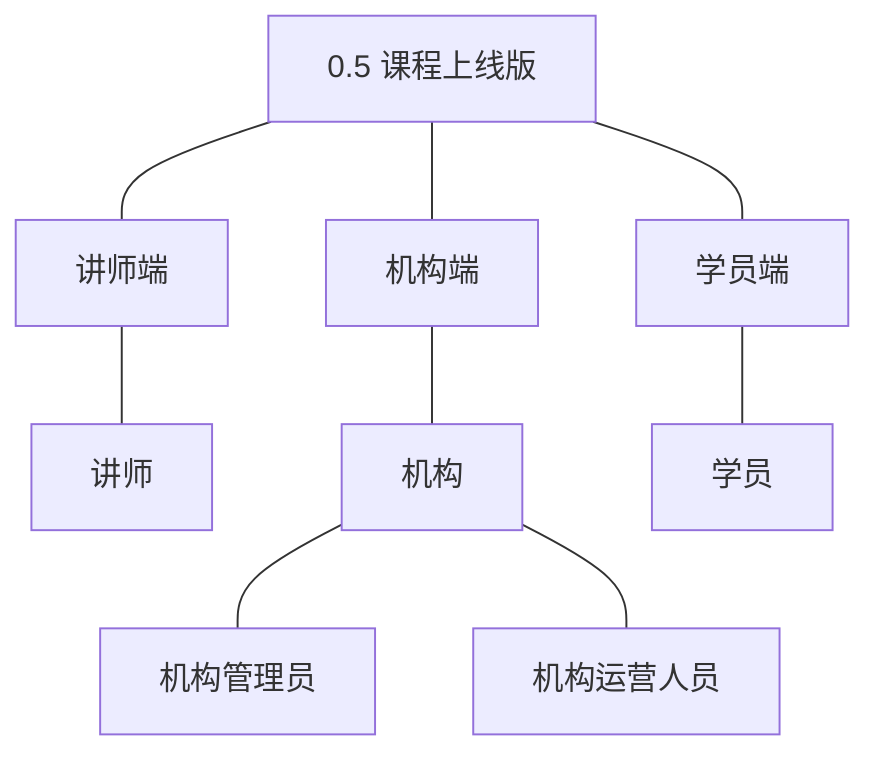
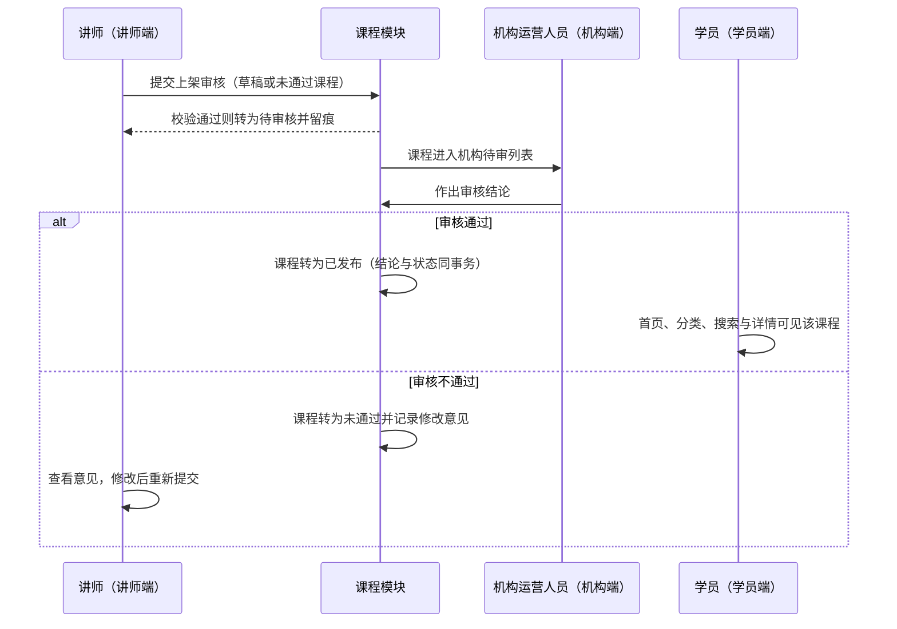
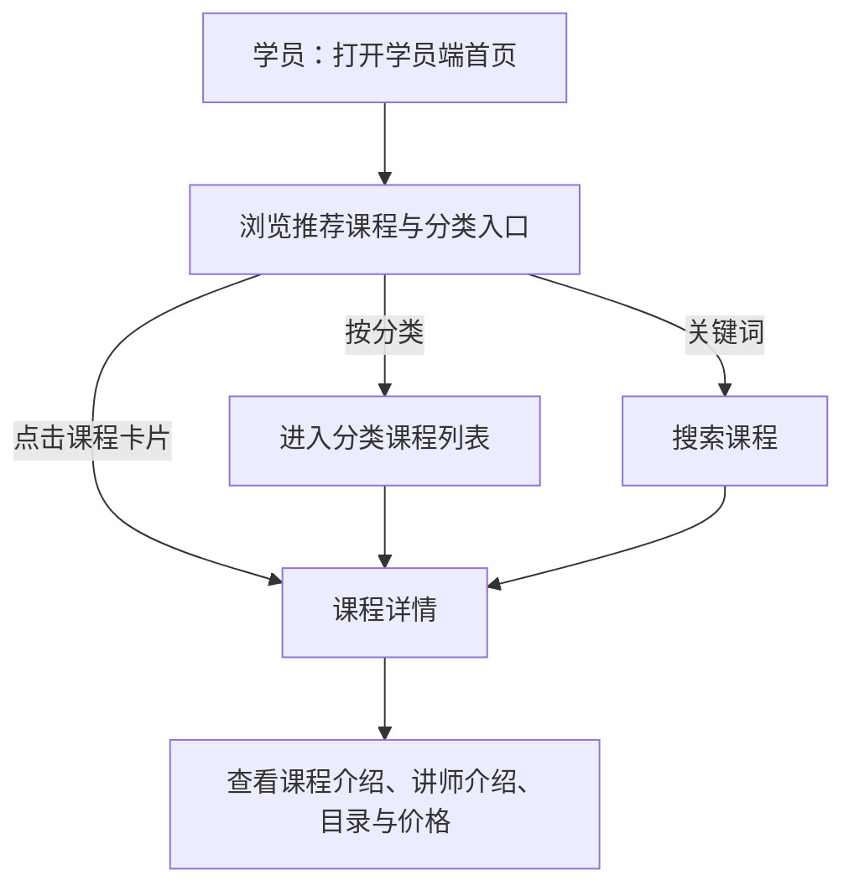
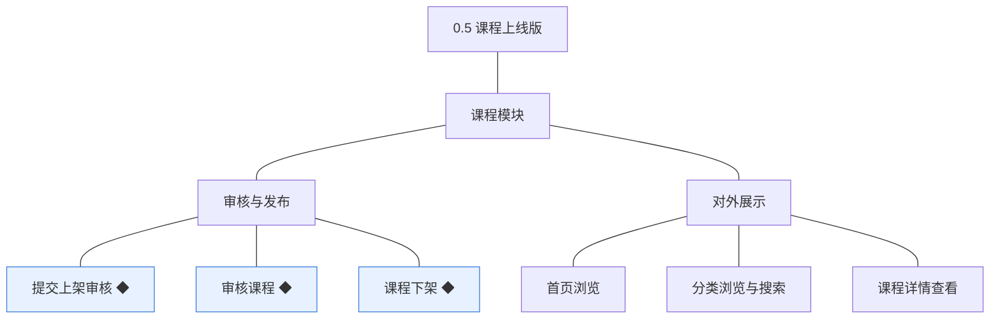
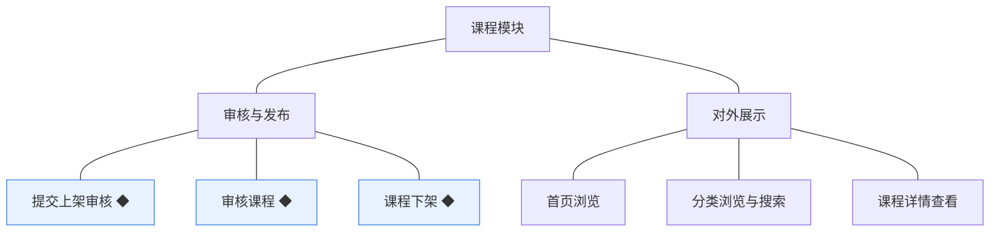
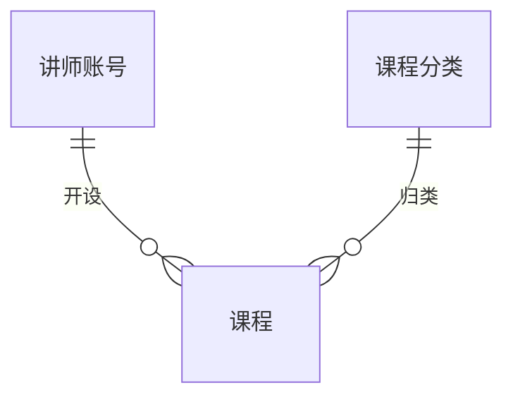
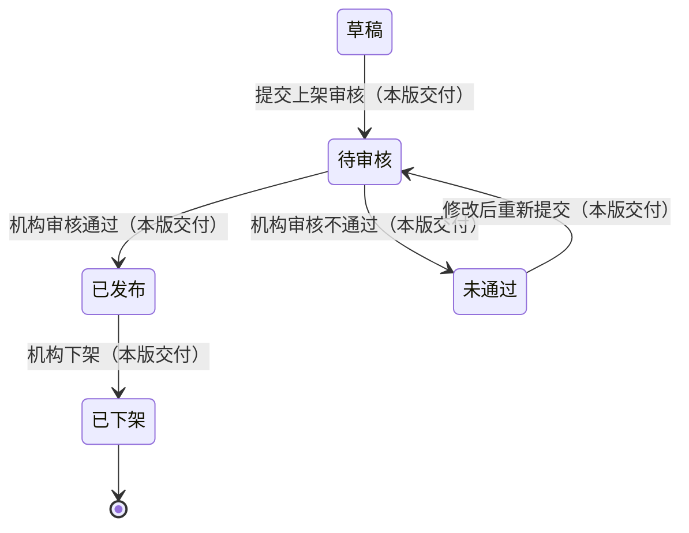

# PRD（大版本）：0.5 课程上线版

> 定位：本版立项说明书——承接《产品路线图（项目）》0.5 课程上线版条目与项目级基线，界定本版做什么、每个功能做到什么程度算完成，供需求拆解与小版本规划直接开工。上游为模拟案例材料，模拟性质保留；版本级默认值就地标注来源状态。

## 1. 版本概述

**承接与目标**：课程从机构侧把关后对外可见——学员端能浏览、搜索与查看课程详情（路线图 0.5 目标）。本版交付课程模块的审核与发布侧能力（提交上架审核、审核课程、课程下架）与学员端对外展示能力（首页浏览、分类浏览与搜索、课程详情查看）；课程从草稿走向已发布并进入学员端可见范围，先审后发的把关机制落地（D4）。

**成功标准与量化口径**：① 学员端可见范围以课程状态为唯一依据——首页、分类浏览、搜索结果与课程详情四个入口只返回已发布课程，判定线 100%（本版系统不存在学员端其他课程入口，任何未发布课程出现在任一入口即按可见性链路异常排查）；② 审核把关闭环可判定（路线图完成标志）——一门课程经讲师送审、机构审核通过后出现在学员端首页、分类浏览与搜索结果中，且详情页可见讲师介绍、课程目录与价格；审核不通过的课程不出现在学员端任何入口（判定线 100%，同上机制性成立）；③ 审核不通过必须留修改意见且讲师端可见（判定线 100%）；④ 验证假设（数据积累类、不阻塞立项）：先审后发不是讲师上架的主要阻碍且学员端呈现足以支撑购买判断，判定方式为审核一次通过率与讲师平均送审轮次，由机构在首轮课程上线后确认是否可接受。

**范围一句话**：做——审核与发布三项（提交上架审核 ◆、审核课程 ◆、课程下架 ◆）＋对外展示三项（首页浏览、分类浏览与搜索、课程详情查看）；不做——人工推荐位配置（推荐取自动规则，PRD 备忘落于暂缓清单）、课程评价与问答、试看（挂 0.6 依赖行待定决策）、退款售后与发票（暂缓清单）；无能力真空期过渡（本版尚无已发生交易，下架对学习资格的保留为规则就绪、引用随 0.6 产生）。**待定决策落定（路线图 0.5 依赖行）**：已发布课程的修改强制重新送审——已发布课程被讲师修改保存后不直接生效于学员端，课程回到草稿并需重新送审，审核通过后再次发布（本版拍板，承接 04C 关联评审建议；影响：修改期间学员端不可见，讲师端有明确状态提示）；**留版本级细化项随小版本立项定案**——列表与详情的展示字段、学员端可见状态与空态处理。

**沿用与前置**：前置＝0.4 课程创作版（课程、课时与附件——送审校验与展示的内容来源）与 0.2 站点与分类版（课程分类——分类浏览的骨架；站点信息——门户呈现）；沿用＝0.1 学员账号（学员端访客与登录态口径）、0.3 讲师账号（课程详情的讲师介绍来源）。课程状态枚举、审核留痕字段（审核人／审核时间／审核意见）沿用术语表既有登记（0.4 已就绪、本版起用）。

## 2. 主体与角色

| 主体／角色 | 端 | 怎么用系统 |
|---|---|---|
| 讲师 | 讲师端 | 把内容完整的课程提交上架审核，查看审核结论与修改意见，修改后重提；查看本人课程的下架状态与原因 |
| 机构运营人员 | 机构端 | 审核课程（通过即发布、不通过给修改意见）；执行课程下架 |
| 机构管理员 | 机构端 | 执行课程下架（收口对外可见性） |
| 学员 | 学员端 | 浏览首页推荐、按分类浏览与关键词搜索课程、查看课程详情（含未登录访客，注册引导随展示位呈现） |

**裁剪说明**：学员端本版首次上场且仅浏览（下单与学习随 0.6）；机构端本版新增审核与下架操作面（课程查看沿用 0.4）；讲师端沿用 0.4 的课程管理面并新增送审与结论查看路径；学员账号注册登录沿用 0.1（首页与详情对未登录访客可见，购买引导随 0.6）。

## 3. 核心业务流程

### 3.1 旅程：课程送审与发布（讲师→机构→学员端）

课程从讲师案头走向门户的把关链路：讲师把内容完整的课程送审，机构运营人员审阅并作出结论——通过即发布、学员端四个入口立即可见；不通过则退回修改意见，讲师完善后重新送审。操作步骤：① 讲师在本人课程（草稿或未通过）点「提交上架审核」→ ② 系统校验基本信息完整与至少一个课时，通过则课程转待审核并留痕 → ③ 机构运营人员在待审列表审阅课程内容 → ④ 通过：课程转已发布（结论与状态同事务落库）、学员端可见；不通过：课程转未通过、必须填写修改意见 → ⑤ 讲师在讲师端查看结论与意见，不通过者修改后重提（回到①）。

### 3.2 旅程：学员端发现课程（学员端）

学员在门户发现课程的三条路径汇于详情页：首页推荐与分类入口、分类列表、关键词搜索，最终在课程详情页看到判断购买所需的全部信息（介绍、讲师介绍、目录、价格）；全部入口只呈现已发布课程。操作步骤：① 打开学员端首页，浏览推荐课程卡片与分类入口 → ② 或按分类进入课程列表、或用关键词搜索 → ③ 点击课程卡片进入详情 → ④ 查看课程介绍、讲师介绍、课程目录（课时清单）与价格。

## 4. 功能需求

### 4.1 课程模块

**审核与发布组**：课程状态机的把关与收口侧；审核结论与课程状态同事务落库并留痕（D4、04C-课程 3.7～3.9）。

| 功能 | 用途 | 验收标准 |
|---|---|---|
| 提交上架审核 ◆ | 讲师把内容完整的课程送机构审核，进入待审队列 | 讲师对草稿或未通过状态的本人课程提交上架审核，基本信息完整且至少含一个课时时课程转为待审核并进入机构待审列表；状态不允许、信息不完整或无课时时提交失败并逐项提示；非本人课程无法提交 |
| 审核课程 ◆ | 机构把关课程质量，通过即对外发布 | 机构运营人员对待审核课程作出结论：通过则课程转为已发布并即时进入学员端可见范围；不通过则课程转为未通过并必须填写修改意见，讲师端可见修改意见；审核结论与课程状态同事务落库并留痕 |
| 课程下架 ◆ | 机构收口对外可见性，处置不再对外销售的课程 | 机构管理员或机构运营人员对已发布课程执行下架，课程转为已下架并留痕记录原因，学员端各入口不再展示该课程；既有学习资格与学习记录保留（引用随 0.6 产生，本版规则就绪）；非已发布状态执行下架被拒绝并提示 |

**对外展示组**：学员端门户的呈现侧；可见范围以课程状态＝已发布为唯一依据（开发规范）。

| 功能 | 用途 | 验收标准 |
|---|---|---|
| 首页浏览 | 学员在门户首页发现课程 | 学员端首页展示由已发布课程构成的推荐内容与分类入口；未发布课程（草稿、待审核、未通过、已下架）不出现在首页任何位置 |
| 分类浏览与搜索 | 学员按分类或关键词找到目标课程 | 学员按分类浏览或用关键词检索课程时，结果只返回已发布课程；无匹配结果时返回空结果与提示 |
| 课程详情查看 | 学员查看课程全貌以支撑购买判断 | 学员可查看已发布课程的详情，展示课程介绍、讲师介绍、课程目录与价格；未发布课程的详情页不可访问（提示课程不存在） |

**版本级默认值就地内联**：首页推荐取自动规则——按最新发布时间倒序取已发布课程（人工推荐位配置不做，暂缓清单；排序口径为本版拍板）；分类浏览沿用分类层级（2 级）与学员端可用分类口径（0.2 定案）；详情页目录展示课时清单（附件清单随 0.6 学员获取能力呈现，本版详情不展示附件，本版拍板）；搜索为课程名称关键词的包含匹配（本版拍板，字段级检索随列表与搜索的筛选与排序留版本级细化）。

## 5. 业务对象

### 5.1 课程

定位：可被购买与学习的教学单元，本版交付状态机全流转——从草稿经审核走向已发布、经下架走向终态（落库名沿用术语表 `course`）。

说明：状态枚举沿用术语表；审核人／审核时间／审核意见（`audit_admin_id`／`audited_at`／`audit_remark`）随审核结论同事务起用（0.4 建字段、本版写入）；送审留痕（提交人与提交时间）随提交动作写入（开发规范留痕要求）。**已发布课程的修改定案**：讲师修改已发布课程保存后课程回到草稿并需重新送审（不直接生效于学员端），审核通过后再次发布（本版拍板，承接 04C 关联评审建议）。已下架为终态（重新上架按重新送审处理）。下架不影响既有学习资格与学习记录（规则就绪，引用对象随 0.6 产生）。

### 5.2 课程分类

定位：课程的组织骨架（落库名沿用术语表 `course_category`，0.2 交付）。

说明：沿用 0.2 交付的分类管理，本版新增学员端只读路径——只呈现可用分类（未删除），层级上限 2 级（0.2 定案沿用）；机构端分类管理路径不变。

### 5.3 讲师账号

定位：课程供给方身份（落库名沿用术语表 `teacher_account`，0.3 交付）。

说明：沿用 0.3 交付的讲师信息（对外介绍），本版新增学员端只读呈现路径——详情页展示归属讲师的对外介绍；讲师维护路径不变（讲师端个人中心）。
