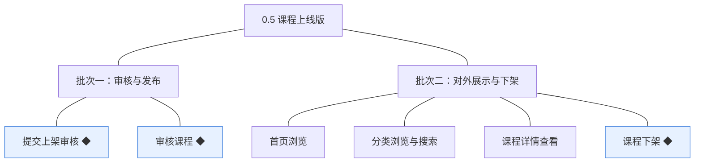
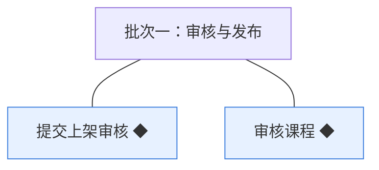
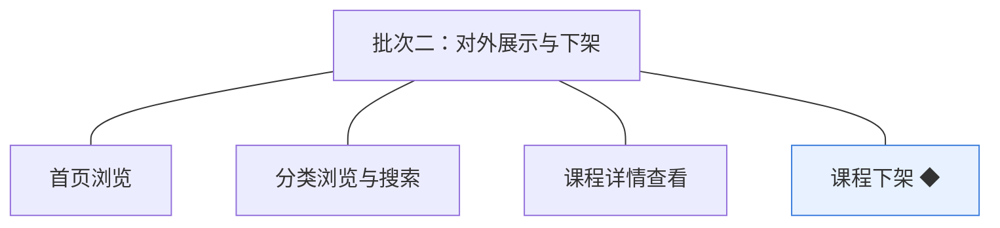

# 开发顺序与需求拆解（大版本）：0.5 课程上线版

> 定位：把《PRD（大版本）：0.5 课程上线版》转换为开发批次＋功能级需求条目；本文即该版本的完整需求清单，需求池据此直接入池、不另生成版本快照。上游为模拟案例材料，模拟性质保留。

## 1. 拆解说明

- **一一同构粒度口径**：一条需求（R 编号）＝一项 PRD 功能，需求名即 PRD 功能名；需求表的用途与验收标准**逐字引自 PRD 功能清单原文**，不压缩、不改写。按钮、字段、跳转级的原子拆解归小版本 PRD，不进本文。
- **本文即需求清单**：需求池批量入池直接读本文各批次需求表；池侧不生成版本快照，验收标准回溯本文（R 编号与 PRD 锚点随行可查）。
- **多入口口径**：本文是需求池的主入口但不是唯一入口——会议、沟通、临时反馈产生的需求从其他角度直接进入需求池（M01 起编号），不经本文；两类条目并存互不覆盖。
- **小版本规划的输入**＝本文开发顺序（批次建议，素材而非锁定）＋需求池实时状态，两者合并；唯一硬约束是本文声明的依赖与同事务契约不回退。

## 2. 开发顺序

**前置版本沿用面**：0.4 课程创作版（课程、课时与附件——送审校验的内容来源与展示对象）、0.2 站点与分类版（课程分类骨架——分类浏览入口；站点信息——门户呈现）、0.1 学员账号（学员端访客与登录态口径）、0.3 讲师入驻版（讲师账号——详情页讲师介绍来源）；无新增外部依赖（推荐取自动规则，不依赖人工推荐位）。

**顺序依据与同事务契约**：先审后展——学员端四个入口的可见范围以课程状态＝已发布为唯一依据，发布状态由批次一的审核链路产生，展示与下架都消费该状态；同事务契约——审核结论与课程状态同事务落库并写入审核留痕（04C-课程 3.8）、送审动作与状态变更同事务并留痕（04C-课程 3.7）、下架动作与状态变更同事务并记录原因（04C-课程 3.9），三条契约均不回退；下架与展示同批——都消费已发布状态且共同演示「可见→收口」闭环；无独立外部联调批次。

### 2.1 批次一：审核与发布

- **目标**：课程状态机把关侧就绪——讲师能送审、机构能审并使课程到达已发布（或带意见退回）。
- **依赖**：0.4（课程与课时——完整性校验来源）；0.1（机构端审核权限——账号与权限模块判定）。
- **可验收形态**：讲师对一门含课时的草稿提交上架审核 → 课程转待审核并出现在机构待审列表 → 机构运营人员审核通过 → 课程转已发布并留痕；另对一门课程审核不通过 → 课程转未通过、讲师端可见修改意见、修改后可重提。
- **判断注记**：送审与审核并为一批——两者构成一条可一次演示的把关链路（送审→结论），拆开则任一半都无可见终态；课程状态机全流转随本批实现（已下架路径的触发动作在批次二，状态字段本批就绪）。

条目与 PRD 4.1 功能清单一一同构，用途与验收标准逐字引自原文：

| 编号 | 需求名 | 用途 | 验收标准 |
|---|---|---|---|
| R38 | 提交上架审核 ◆ | 讲师把内容完整的课程送机构审核，进入待审队列 | 讲师对草稿或未通过状态的本人课程提交上架审核，基本信息完整且至少含一个课时时课程转为待审核并进入机构待审列表；状态不允许、信息不完整或无课时时提交失败并逐项提示；非本人课程无法提交 |
| R39 | 审核课程 ◆ | 机构把关课程质量，通过即对外发布 | 机构运营人员对待审核课程作出结论：通过则课程转为已发布并即时进入学员端可见范围；不通过则课程转为未通过并必须填写修改意见，讲师端可见修改意见；审核结论与课程状态同事务落库并留痕 |

### 2.2 批次二：对外展示与下架

- **目标**：学员端门户可见——四个入口只呈现已发布课程；机构可下架收口，可见性闭环。
- **依赖**：批次一（已发布状态与审核留痕）；0.2（分类骨架与站点信息）；0.3（讲师介绍来源）。
- **可验收形态**：已发布课程出现在学员端首页推荐、分类浏览与搜索结果中，详情页可见课程介绍、讲师介绍、课程目录与价格；草稿／待审核／未通过／已下架课程不出现在任何入口；机构对已发布课程执行下架后各入口即时不再展示——此批完成即路线图 0.5 完成标志。
- **判断注记**：展示三项与下架并为一批——四者共同消费「已发布」这一唯一可见性依据，合并演示「可见→收口」闭环；下架的留痕与原因记录随条目落地（学习资格保留为规则就绪，引用随 0.6 产生）。

条目与 PRD 4.1 功能清单一一同构，用途与验收标准逐字引自原文：

| 编号 | 需求名 | 用途 | 验收标准 |
|---|---|---|---|
| R40 | 首页浏览 | 学员在门户首页发现课程 | 学员端首页展示由已发布课程构成的推荐内容与分类入口；未发布课程（草稿、待审核、未通过、已下架）不出现在首页任何位置 |
| R41 | 分类浏览与搜索 | 学员按分类或关键词找到目标课程 | 学员按分类浏览或用关键词检索课程时，结果只返回已发布课程；无匹配结果时返回空结果与提示 |
| R42 | 课程详情查看 | 学员查看课程全貌以支撑购买判断 | 学员可查看已发布课程的详情，展示课程介绍、讲师介绍、课程目录与价格；未发布课程的详情页不可访问（提示课程不存在） |
| R43 | 课程下架 ◆ | 机构收口对外可见性，处置不再对外销售的课程 | 机构管理员或机构运营人员对已发布课程执行下架，课程转为已下架并留痕记录原因，学员端各入口不再展示该课程；既有学习资格与学习记录保留（引用随 0.6 产生，本版规则就绪）；非已发布状态执行下架被拒绝并提示 |

**批次判断与边界取舍**：两批已是最少批次——把关侧（状态产生）与呈现侧（状态消费）分批因后者依赖前者产生的已发布状态；展示三项不逐项拆批（同一可见性依据、一次演示门户全貌）；下架不单列（与展示同消费面、并入呈现批次演示闭环）；6 条不逐功能拆批；人工推荐位、试看、评价问答在围栏外、不入批。

**版本级验收安排**：按 PRD 1 的成功标准与量化口径验收（四条判定线）；灰度属上线安排不占开发批次——本版无资金流转风险面（学员端仅浏览，购买随 0.6），路线图 0.5 完成标志即验收锚。

## 3. 条目与 PRD 对应核对

- **一一同构声明**：条目数＝PRD 功能数＝6（R38～R43），逐行对应、无归并、无路径拆分、无 PRD 外内容。
- **批次构成**：批次一 2 条（审核与发布组）；批次二 4 条（对外展示组 3＋下架 1）。
- **◆ 清点**：3 个——R38 提交上架审核、R39 审核课程、R43 课程下架（与 PRD 功能全景总图 ◆ 标注一致，D4 先审后发决策承载）。
- **过渡支撑清点**：0 个——本版无过渡支撑能力（对外展示为正式形态，购买引导随 0.6 属后续新增而非替代）。

## 4. 与需求池和小版本规划的衔接

- **入池路径**：需求池按「批量入池」直读本文第 2 章各批次需求表，条目编号沿用 R38～R43、批次随本文继承。
- **多入口口径**：会议、沟通、临时反馈类需求不经本文，直接单条入池（M01 起编号），与本批条目并存互不覆盖。
- **小版本规划的合并输入**：批次是建议而非锁定——确认小版本时以本文开发顺序＋需求池实时状态合并定范围；本文声明的依赖与同事务契约（0.4／0.2／0.3 前置、审核结论与状态同事务、先审后展）不回退。
- **认领与细化原则**：每条凭随行验收标准即可独立认领与验收；开发级细化（交互、字段、边界、用例）归小版本 PRD，本文任何位置不低于 PRD 功能级粒度。
