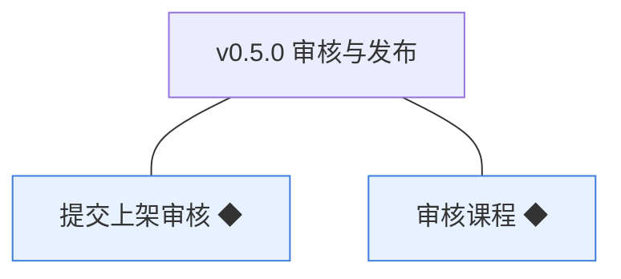
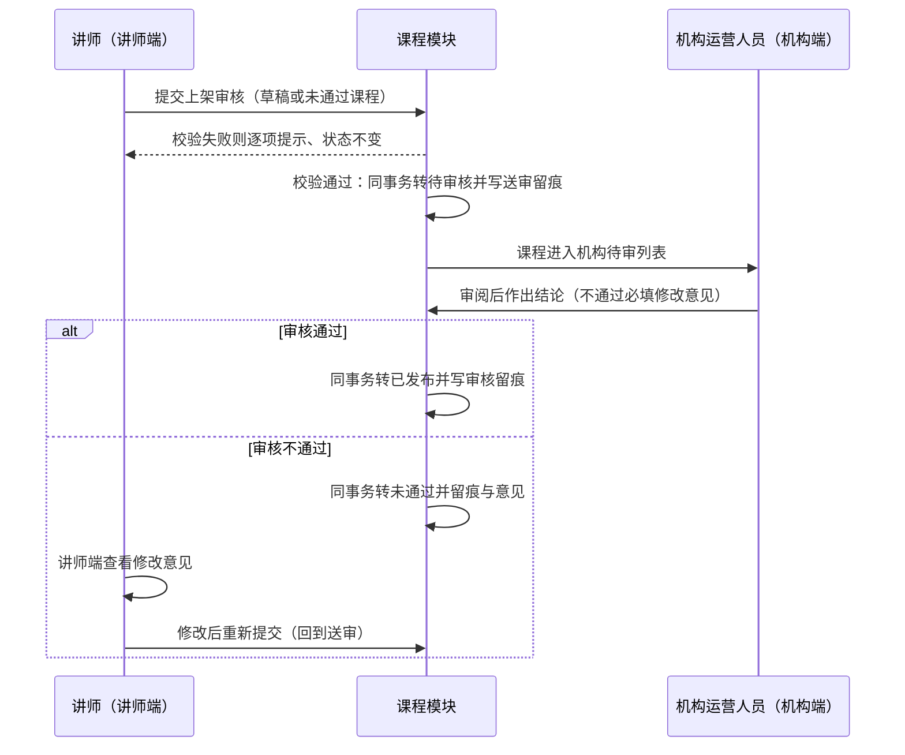
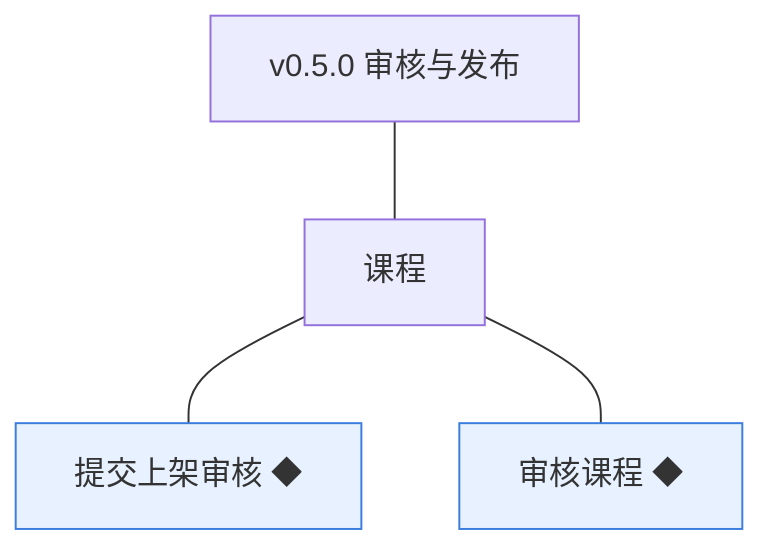
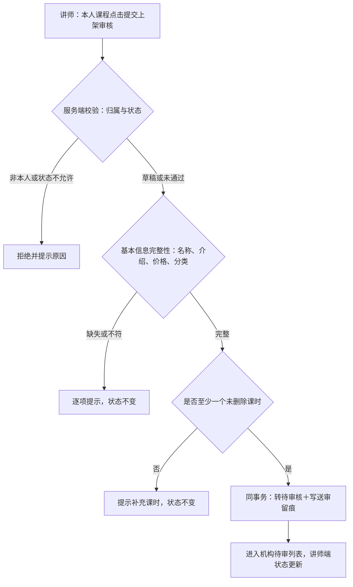
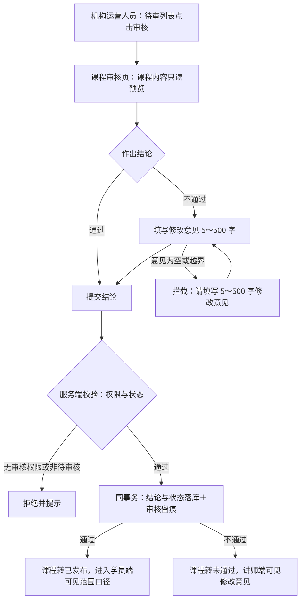

# PRD（小版本）：v0.5.0 审核与发布

> 定位：开发级需求说明书——承接《PRD（大版本）：0.5 课程上线版》与《02-开发顺序与需求拆解（大版本）》批次一「审核与发布」，认领自需求池（R38～R39）；把两条功能级条目细化到交互、字段、规则、异常与落库字段，开发与测试凭本文即可开工。上游为模拟案例材料，模拟性质保留。

## 1. 版本概述

**承接与目标**：本版认领 0.5 批次一「审核与发布」整批（R38～R39）——02 批次建议与需求池实时状态合并采纳（批次一 2 条全部待规划）。可验收形态：讲师对一门含课时的草稿提交上架审核 → 课程转待审核并出现在机构待审列表 → 机构运营人员审核通过 → 课程转已发布并留痕；另对一门课程审核不通过 → 课程转未通过、讲师端可见修改意见、修改后可重提。

**范围外声明**：学员端四个展示入口（首页浏览、分类浏览与搜索、课程详情查看——随 v0.5.1 批次二交付；本版课程转已发布即满足「进入学员端可见范围」的状态与数据口径）；课程下架（R43，随 v0.5.1）；人工推荐位配置、试看、课程评价与问答（大版本围栏）；「进入学员端可见范围」在本版的判定＝课程状态到达已发布（可见性以状态为唯一依据，门户界面随批次二）。

**条目内顺序与依赖**：R38 先于 R39——送审产生待审核实例，审核消费之；两条构成一次演示的把关链路。前置＝0.4 课程与课时（送审完整性校验来源）、0.1 机构端账号与能力点（审核人权限判定）。同事务契约不回退：送审动作与状态变更同事务并留痕、审核结论与课程状态同事务落库并写审核留痕。

**关键口径与来源状态**：课程状态枚举与流转沿用术语表（本版起用待审核／已发布／未通过三值与已发布→已下架路径字段）；审核留痕三字段沿用术语表登记（0.4 建字段、本版起用）；送审留痕字段为本版新登记（见第 5 章）；已发布课程的修改回草稿并重新送审＝大版本本版拍板（承接 04C 关联评审建议），随本版课程状态机一并落地；审核不通过意见长度 5～500 字（本版拍板）。

## 2. 需求范围与验收锚

条目总览树（与上游批次一分支图同名同构）：

认领条目表（需求名／用途／验收标准逐字引自《02-开发顺序与需求拆解（大版本）》批次一需求表）：

| 编号 | 需求名 | 用途 | 验收标准 |
|---|---|---|---|
| R38 | 提交上架审核 ◆ | 讲师把内容完整的课程送机构审核，进入待审队列 | 讲师对草稿或未通过状态的本人课程提交上架审核，基本信息完整且至少含一个课时时课程转为待审核并进入机构待审列表；状态不允许、信息不完整或无课时时提交失败并逐项提示；非本人课程无法提交 |
| R39 | 审核课程 ◆ | 机构把关课程质量，通过即对外发布 | 机构运营人员对待审核课程作出结论：通过则课程转为已发布并即时进入学员端可见范围；不通过则课程转为未通过并必须填写修改意见，讲师端可见修改意见；审核结论与课程状态同事务落库并留痕 |

**锚定说明**：上表三要素逐字锚定上游，细化只加深行为描述、不收窄不放宽；本版 2 条均为 ◆ 复杂条目（沿用大版本声明）；细化中发现的新想法按第 6 章回池，不进正文。

## 3. 核心用户旅程

旅程承接说明：承接上游大版本 PRD「课程送审与发布（讲师→机构→学员端）」旅程落在本版认领范围内的链路段＝讲师送审（上游①②）＋机构审核（③④）；排除段＝学员端可见（「学员端四个入口立即可见」）——门户界面随 v0.5.1 批次二交付，本版到达「课程转已发布」的状态与数据口径；审核不通过退回分支（⑤）在本版内闭环（讲师查看意见、修改后重提）。本版有跨主体、跨端交接（讲师端→课程模块→机构端），旅程用时序图；「旅程：课程送审与机构审核」一条如下。

### 3.1 旅程：课程送审与机构审核（讲师端→机构端）

讲师把内容做实的课程送进机构把关队列，机构运营人员审阅并作出结论：通过则课程状态到达已发布（学员端可见范围的数据口径就绪）；不通过则带意见退回，讲师完善后重提。操作步骤清单：

1. 讲师在讲师端「我的课程」对本人课程（草稿或未通过状态）点击「提交上架审核」；
2. 系统校验归属与状态、基本信息完整性（名称、介绍、价格、分类）与至少一个未删除课时，未通过逐项提示且课程状态不变；
3. 校验通过：课程转「待审核」并写送审留痕（提交人与提交时间），课程进入机构待审列表；
4. 机构运营人员在机构端待审列表打开课程审核页，预览课程内容（基本信息、课时目录、附件清单只读）；
5. 作出结论——通过：课程转「已发布」、写审核留痕；不通过：必须填写修改意见（5～500 字）、课程转「未通过」、写审核留痕；
6. 不通过时讲师在讲师端课程详情查看修改意见与审核时间，修改课程后重新提交（回到第 1 步）。

## 4. 功能需求

### 4.1 功能总览

对象归组树（版本→对象→条目）：

对象增删改查矩阵（本版认领条目以编号落位、已交付与随后续承接的标注去向）：

| 业务对象 | 增 | 改 | 删 | 查 |
|---|---|---|---|---|
| 课程 | 已交付（v0.4.0 R27） | 状态流转：R38（草稿／未通过→待审核）、R39（待审核→已发布／未通过）；已发布修改回草稿随本版状态机落地（修改入口沿用 v0.4.0 R28）；已发布→已下架随批次二（R43） | 已交付（v0.4.0 R29） | R39 操作面（机构待审列表与审核页）；讲师端状态与审核意见查看随 R38／R39 反馈面；课程列表沿用 v0.4.0 R30 |
| 课时／课程附件 | 已交付（v0.4.1） | 已交付（同左） | 已交付（同左） | 已交付（同左）；R39 审核页只读预览 |

主体使用面：

| 主体／角色 | 端 | 使用条目 | 说明 |
|---|---|---|---|
| 讲师 | 讲师端 | R38、R39（反馈面） | 本人课程送审；查看审核结论、修改意见与审核时间 |
| 机构运营人员 | 机构端 | R39 | 待审列表与审核操作（能力点控制，服务端校验） |

本版无机制条目——两条均有人工操作面；机构管理员本版无操作面（课程下架随 v0.5.1）；学员端不上场（展示随 v0.5.1）。

### 4.2 R38 提交上架审核

**功能说明**：讲师把内容完整的课程送进机构审核队列——课程从草稿（或未通过）迈向已发布的第一步。触发：讲师在讲师端「我的课程」列表或课程详情页对本人课程点击「提交上架审核」。

**交互与流程**：

操作步骤清单：

1. 讲师在本人课程（状态为草稿或未通过）的列表行或详情页点击「提交上架审核」；
2. 系统按序校验：课程归属（本人）→ 状态（仅草稿与未通过可送审）→ 基本信息完整性（名称 2～50 字、介绍 20～2000 字、价格非负、归属分类未删除）→ 至少一个未删除课时；
3. 任一校验不通过：提交失败、逐项提示缺失或原因，课程状态不变；
4. 全部通过：课程转「待审核」，同事务写入送审留痕（提交人＝当前讲师、提交时间）；
5. 课程进入机构待审列表（按送审时间正序排列，本版拍板）；讲师端课程状态即时更新为「待审核」，「提交上架审核」按钮隐藏。

**字段与校验**：无表单输入字段——送审为触发型操作（对既有课程的校验链）；校验项与失败提示如下：

| 校验项 | 取值口径 | 失败反馈 |
|---|---|---|
| 课程归属 | `teacher_id`＝当前登录讲师 | 「课程不存在或无权操作」 |
| 课程状态 | 草稿或未通过（待审核、已发布、已下架拒绝） | 「当前状态不支持提交审核」 |
| 基本信息 | 名称 2～50 字、介绍 20～2000 字、价格非负、分类未删除（沿用 v0.4.0 口径） | 逐项：「请补全课程名称／课程介绍／价格／归属分类」 |
| 课时数量 | 该课程未删除课时 ≥1 | 「请先为课程添加至少一个课时」 |

**规则与边界**：

1. 仅草稿与未通过状态可送审；待审核、已发布、已下架状态重复送审一律拒绝（04C-课程 3.7）；
2. 送审动作与状态变更同事务完成并写送审留痕（`submitted_by`／`submitted_at`，开发规范留痕要求）；
3. 未通过课程修改后重提：修改动作沿用 v0.4.0 R28 交付的编辑路径（未通过态修改即时生效），再经本条重新送审；
4. 已发布课程的修改回草稿：讲师对已发布课程保存修改后课程回到草稿并需重新送审（大版本本版拍板）——修改入口沿用 v0.4.0 R28 路径、回草稿行为随本版状态机落地，回草稿后学员端可见性中断直至再次审核通过；
5. 送审后讲师不可编辑待审核课程（待审核状态锁写，本版拍板）；撤回送审不提供（结论必达，拍板理由：把关链路单向、避免审核空转）；
6. 同一课程同一时刻只有一个待审核实例（状态机天然保证）。

**异常与拦截**：

| 异常场景 | 系统行为 | 用户看到 |
|---|---|---|
| 非本人课程发起送审 | 服务端归属校验拒绝 | 「课程不存在或无权操作」 |
| 状态不允许（待审核／已发布／已下架） | 拒绝提交 | 「当前状态不支持提交审核」 |
| 信息不完整或无课时 | 拒绝提交、状态不变 | 「请补全课程名称／课程介绍／价格／归属分类」「请先为课程添加至少一个课时」 |
| 会话缺失或非讲师端登录态 | 拦截并引导 | 跳转讲师端登录页 |

### 4.3 R39 审核课程

**功能说明**：机构运营人员对待审核课程作出把关结论——通过即发布、不通过带意见退回。触发：机构运营人员在机构端「课程审核」待审列表点击「审核」。

**交互与流程**：

操作步骤清单：

1. 机构运营人员登录机构端，进入「课程审核」待审列表（列：课程编号、课程名称、归属讲师、送审时间；按送审时间正序，本版拍板）；
2. 点击某待审核课程进入课程审核页：只读预览课程名称、介绍、价格、归属分类、课时目录与附件清单；
3. 选择结论「通过」或「不通过」；不通过必须填写修改意见（5～500 字），为空或越界拦截提交；
4. 提交结论：服务端校验操作者具备课程审核能力点且课程仍为待审核；
5. 校验通过：结论与课程状态同事务落库并写审核留痕（审核人＝机构端身份上下文、审核时间、审核意见）——通过转「已发布」、不通过转「未通过」；
6. 待审列表移出该课程；讲师端课程详情展示最新结论（状态、修改意见、审核时间）。

**字段与校验**：

| 信息项 | 必填 | 业务类型 | 约束与取值 | 失败反馈 |
|---|---|---|---|---|
| 审核结论 | 是 | 单选 | 通过／不通过（二选一） | 「请选择审核结论」 |
| 修改意见 | 不通过时必填 | 文本 | 5～500 字（本版拍板）；通过时可留空 | 「不通过时必须填写 5～500 字修改意见」 |

**规则与边界**：

1. 审核人必须是具备课程审核能力点的机构端身份，权限由账号与权限模块判定（D6）；前端入口显隐不作为安全边界；
2. 审核结论与课程状态同事务落库，不允许结论与状态不一致（04C-课程 3.8）；审核留痕三字段（`audit_admin_id`／`audited_at`／`audit_remark`）随结论写入；
3. 审核不通过必须填写修改意见，讲师端可见（D4）；
4. 同一课程的同一待审核实例只能被审核一次，重复请求以先到者为准、后到者收到状态已变更提示（04C-课程 3.8）；
5. 通过即课程进入学员端可见范围——本版判定＝状态到达已发布（可见性以状态为唯一依据）；学员端门户四个入口随 v0.5.1 交付；
6. 审核页对课程内容只读——审核人不修改课程内容（修改归讲师）；
7. 待审列表空态：「暂无待审核课程」（本版拍板）。

**异常与拦截**：

| 异常场景 | 系统行为 | 用户看到 |
|---|---|---|
| 无课程审核能力点的机构端账号发起审核 | 服务端能力点校验拒绝 | 「无审核权限」 |
| 课程已非待审核（并发或重复请求） | 拒绝、以后到者为准 | 「课程状态已变更，请刷新列表」 |
| 不通过未填意见或越界 | 拦截提交 | 「不通过时必须填写 5～500 字修改意见」 |
| 未选择结论直接提交 | 拦截提交 | 「请选择审核结论」 |

## 5. 业务对象与数据字段

数据主体清单：

| 业务对象 | 落库名 | 定位与关系 |
|---|---|---|
| 课程 | `course` | 沿用对象（0.4 交付）：本版起用状态机全流转（待审核／已发布／未通过三值写入；已下架路径字段就绪、写入随 v0.5.1）与审核留痕三字段；新增送审留痕两字段（本版新登记） |
| 课时／课程附件 | `course_lesson`／`course_attachment` | 沿用对象（0.4.1 交付）：审核页只读预览，无本版写路径 |
| 讲师账号／机构端账号 | `teacher_account`／`admin_account` | 沿用对象：送审人与审核人的身份来源（审核人取机构端身份上下文，能力点判定） |
| 登录态（会话） | 会话存储（机制态） | 沿用登记（讲师端 `side=teacher`、机构端 `side=admin`），本版无新增机制态对象 |

课程（`course`）本版起用与新增字段对照（其余字段沿用 v0.4.0 登记；列类型、主键、索引与建表 DDL 归开发阶段）：

| 字段 | 必填 | 业务类型 | 落库字段名 | 约束与取值 |
|---|---|---|---|---|
| 状态 | 是 | 枚举 | `status` | 本版写入：草稿（`draft`）、待审核（`pending`）、已发布（`published`）、未通过（`rejected`）；已下架（`offline`）字段就绪、写入随 v0.5.1（枚举沿用术语表） |
| 送审操作人 | 送审后必填 | 留痕 | `submitted_by` | 最近一次提交上架审核的讲师标识（指向 `teacher_account.id`），随送审动作同事务写入（本版新登记） |
| 送审时间 | 送审后必填 | 留痕 | `submitted_at` | 最近一次送审时点，同上（本版新登记） |
| 审核人 | 审核后必填 | 留痕 | `audit_admin_id` | 审核结论作出人（指向 `admin_account.id`），随结论同事务写入（术语表既有登记、本版起用） |
| 审核时间 | 审核后必填 | 留痕 | `audited_at` | 结论作出时点，同上 |
| 审核意见 | 不通过必填 | 文本 | `audit_remark` | 5～500 字（通过可空）；讲师端可见，同上 |

机制态对象：无新增（登录态沿用既有登记）。

## 6. 待议与建议

**本版采用的推断与默认值汇总**：

1. 修改意见长度 5～500 字（上游未定长度，按入驻审核介绍字段同级约束拍板，本版拍板）；
2. 机构待审列表按送审时间正序（先到先审，本版拍板）；列表展示课程编号、名称、归属讲师、送审时间四列（本版拍板）；
3. 待审核状态课程对讲师锁写（不可编辑，结论必达后按结论流转，本版拍板）；不提供送审撤回（把关链路单向，本版拍板）；
4. 已发布课程修改回草稿随本版状态机落地（大版本拍板的实现归位：修改入口沿用 v0.4.0 路径、保存即回草稿，学员端可见性中断直至再次发布——待确认：机构若认为修改期间应保持旧版可见，需回到大版本 PRD 重议定案）；
5. 待审列表空态文案「暂无待审核课程」（本版拍板）。

**建议回池与术语表待登记**：

- 建议回池：待审列表筛选与批量审核（02 于 0.3 已声明留版本级并随路线图挂 0.3 依赖行定案——0.3 已拍板挂载，本版不实现；如需随版本级排期建议单条入池评估）；送审撤回能力（本版拍板不提供，若讲师反馈强烈建议回池）。
- 术语表待登记行（随本文档回报、由主流程合入）：课程（`course`）新增 `submitted_by`／`submitted_at`（送审操作人／送审时间，送审留痕）；其余（状态枚举、审核三字段、各沿用字段）均为既有登记起用，无需新增。
