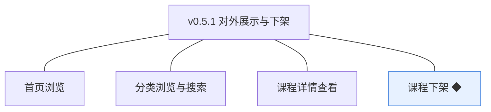
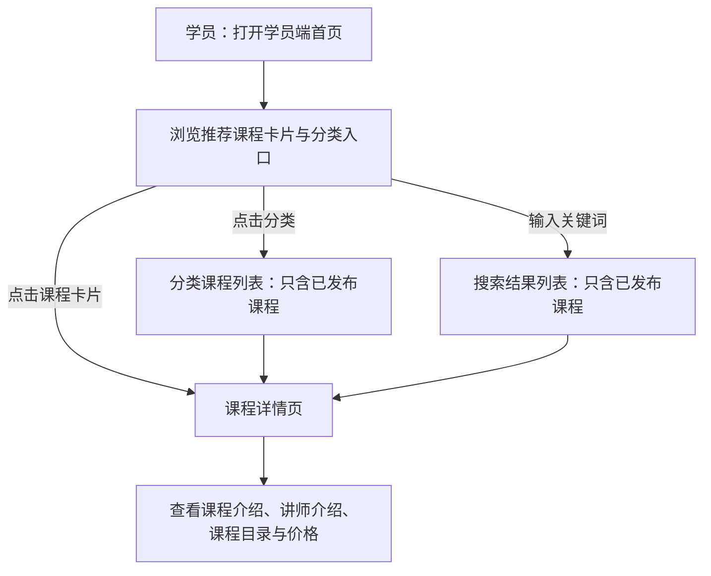
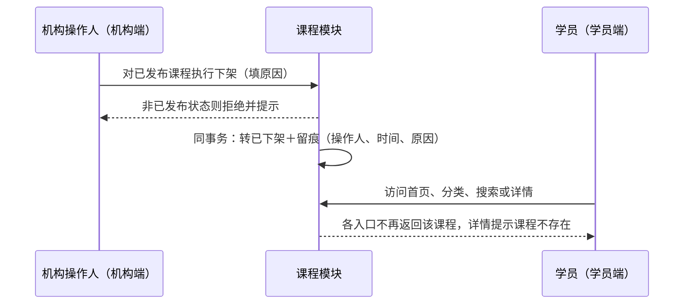
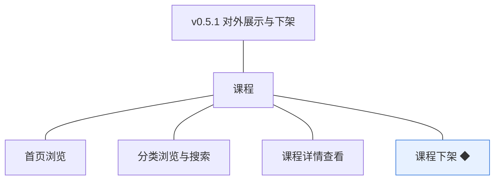
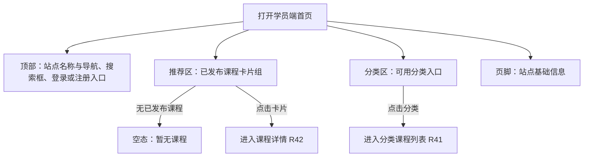
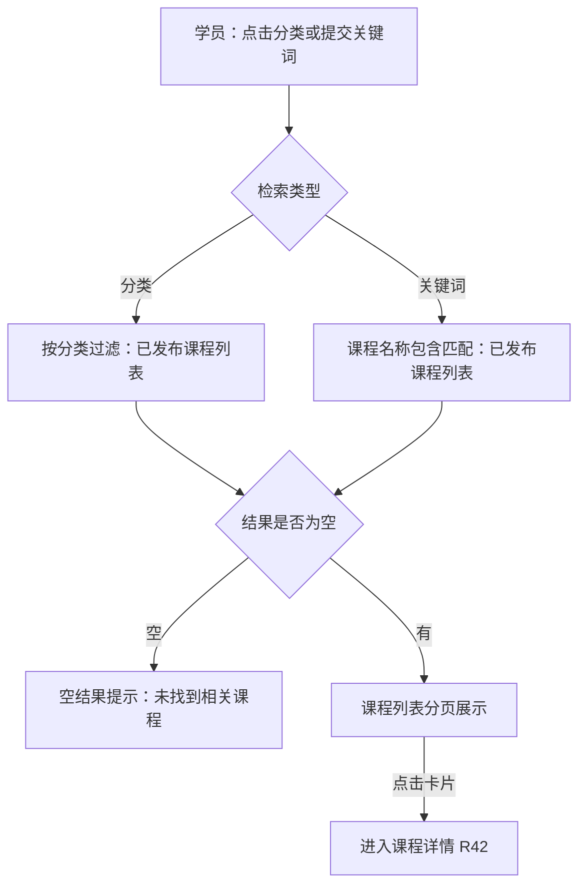
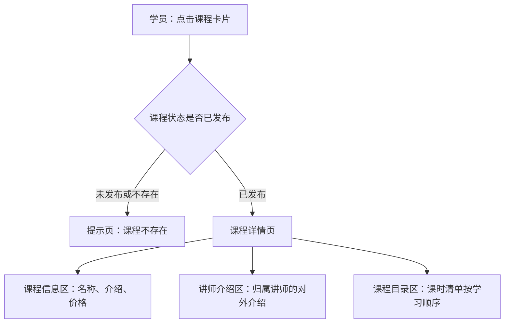
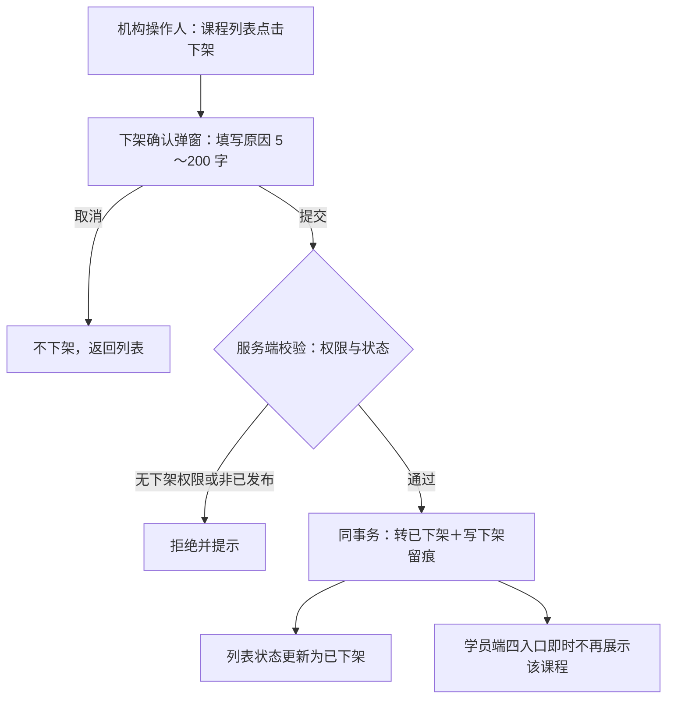

# PRD（小版本）：v0.5.1 对外展示与下架

> 定位：开发级需求说明书——承接《PRD（大版本）：0.5 课程上线版》与《02-开发顺序与需求拆解（大版本）》批次二「对外展示与下架」，认领自需求池（R40～R43）；把四条功能级条目细化到交互、字段、规则、异常与落库字段，开发与测试凭本文即可开工。上游为模拟案例材料，模拟性质保留。

## 1. 版本概述

**承接与目标**：本版认领 0.5 批次二「对外展示与下架」整批（R40～R43）——02 批次建议与需求池实时状态合并采纳（v0.5.0 发布后批次二 4 条全部待规划）。可验收形态：已发布课程出现在学员端首页推荐、分类浏览与搜索结果中，详情页可见课程介绍、讲师介绍、课程目录与价格；草稿／待审核／未通过／已下架课程不出现在任何入口；机构对已发布课程执行下架后各入口即时不再展示——此批完成即路线图 0.5 完成标志。

**范围外声明**：下单与支付、我的课程与播放（随 0.6）；学员查订单与学习记录（随 0.7）；购买按钮与交易元素（详情页本版只展示价格，不出现购买入口，随 0.6）；试看（挂 0.6 依赖行待定决策）；人工推荐位配置（暂缓清单）；附件的学员获取（详情页目录不展示附件，随 0.6 学习资格判定后呈现，大版本拍板）。

**条目内顺序与依赖**：展示三项先行（R40 首页→R41 分类与搜索→R42 详情，发现链路递进）、下架随后（R43 消费已发布状态并与展示共同演示「可见→收口」闭环）；四者共同消费「课程状态＝已发布」这一唯一可见性依据。前置＝v0.5.0（已发布状态与审核留痕）、0.2（分类骨架与站点信息）、0.3（讲师介绍来源）。同事务契约不回退：下架动作与状态变更同事务并记录原因；可见性以状态为唯一依据、各入口不做二次白名单。

**关键口径与来源状态**：可见范围＝课程状态为已发布（唯一依据，开发规范）；首页推荐取自动规则＝按最新发布时间倒序、默认取 8 门（排序口径为大版本拍板、数量为本版拍板）；分类层级与学员端可用分类口径沿用 0.2 定案；搜索＝课程名称关键词包含匹配（大版本拍板）；详情页目录展示课时清单（序号＋标题，附件不展示，大版本拍板）；价格 0 元显示「免费」（0.4 口径沿用）；下架原因必填 5～200 字（本版拍板）；已下架为终态、重新上线由讲师新建课程重新创作送审（沿用 04C 规则，本版拍板重申）。

## 2. 需求范围与验收锚

条目总览树（与上游批次二分支图同名同构）：

认领条目表（需求名／用途／验收标准逐字引自《02-开发顺序与需求拆解（大版本）》批次二需求表）：

| 编号 | 需求名 | 用途 | 验收标准 |
|---|---|---|---|
| R40 | 首页浏览 | 学员在门户首页发现课程 | 学员端首页展示由已发布课程构成的推荐内容与分类入口；未发布课程（草稿、待审核、未通过、已下架）不出现在首页任何位置 |
| R41 | 分类浏览与搜索 | 学员按分类或关键词找到目标课程 | 学员按分类浏览或用关键词检索课程时，结果只返回已发布课程；无匹配结果时返回空结果与提示 |
| R42 | 课程详情查看 | 学员查看课程全貌以支撑购买判断 | 学员可查看已发布课程的详情，展示课程介绍、讲师介绍、课程目录与价格；未发布课程的详情页不可访问（提示课程不存在） |
| R43 | 课程下架 ◆ | 机构收口对外可见性，处置不再对外销售的课程 | 机构管理员或机构运营人员对已发布课程执行下架，课程转为已下架并留痕记录原因，学员端各入口不再展示该课程；既有学习资格与学习记录保留（引用随 0.6 产生，本版规则就绪）；非已发布状态执行下架被拒绝并提示 |

**锚定说明**：上表三要素逐字锚定上游，细化只加深行为描述、不收窄不放宽；本版 1 条 ◆ 复杂条目（R43，沿用大版本声明）；细化中发现的新想法按第 6 章回池，不进正文。

## 3. 核心用户旅程

旅程承接说明：承接上游大版本 PRD 两条旅程的本版段——「学员端发现课程」（上游 3.2）整条落在本版（首页→分类／搜索→详情）；「课程送审与发布」（上游 3.1）的学员端可见段（「学员端四个入口立即可见」）由本版补齐，并与下架收口构成跨主体交接链路。故本版两条旅程：①学员端发现课程（单端流程图）；②课程下架与可见性收口（机构端→学员端跨主体，时序图）。排除段：购买与学习（随 0.6）。

### 3.1 旅程：学员端发现课程（学员端）

学员在门户发现课程的三条路径汇于详情页；全部入口只呈现已发布课程，详情页承载判断购买所需的全部信息（本版只看不买，购买随 0.6）。操作步骤清单：

1. 学员（或未登录访客）打开学员端首页：顶部导航（首页、课程、搜索框、登录／注册入口——已登录显示昵称）、推荐课程卡片组、分类入口、页脚；
2. 点击某分类进入分类课程列表（分页浏览），或用关键词搜索；
3. 点击课程卡片进入详情页；
4. 查看课程介绍、讲师介绍、课程目录（课时清单）与价格（0 元显示「免费」）。

### 3.2 旅程：课程下架与可见性收口（机构端→学员端）

机构把不再对外销售的课程收口：下架动作同事务落状态与留痕，学员端四个入口即时失效——首页推荐、分类列表、搜索结果不再返回该课程，详情页不可访问。操作步骤清单：

1. 机构管理员或机构运营人员在机构端课程列表找到目标课程（状态＝已发布）；
2. 点击「下架」，填写下架原因（5～200 字）并确认；
3. 系统同事务完成：课程转「已下架」、写入下架留痕（操作人、时间、原因）；
4. 学员端首页、分类浏览、搜索结果即时不再展示该课程；直接访问其详情页提示「课程不存在」。

## 4. 功能需求

### 4.1 功能总览

对象归组树（版本→对象→条目）：

对象增删改查矩阵（本版认领条目以编号落位、已交付与围栏标注去向）：

| 业务对象 | 增 | 改 | 删 | 查 |
|---|---|---|---|---|
| 课程 | 已交付（v0.4.0 R27） | 状态流转：已发布→已下架＝R43（下架）；其余流转已交付（v0.5.0） | 已交付（v0.4.0 R29） | 学员端四入口＝R40（首页推荐）、R41（分类列表／搜索）、R42（详情）；机构端列表沿用 v0.4.0 R30 |
| 课时 | 已交付（v0.4.1） | 已交付（同左） | 已交付（同左） | 详情页目录只读呈现（R42 消费，随已发布课程可见） |
| 课程附件 | 已交付（v0.4.1） | 不做（上游无修改条目） | 已交付（v0.4.1 R36） | 不做（详情页不展示附件，学员获取随 0.6——大版本拍板） |
| 课程分类 | 已交付（0.2） | 已交付（同左） | 已交付（同左） | 学员端分类入口只读（R40／R41 数据源，只呈现可用分类） |

主体使用面：

| 主体／角色 | 端 | 使用条目 | 说明 |
|---|---|---|---|
| 学员（含未登录访客） | 学员端 | R40、R41、R42 | 只读浏览；注册登录入口随首页呈现（0.1 交付），购买随 0.6 |
| 机构管理员 | 机构端 | R43 | 对已发布课程执行下架 |
| 机构运营人员 | 机构端 | R43 | 同左（与机构管理员同等下架口径，大版本功能清单） |

本版无机制条目——四条均有人工操作面（R40～R42 学员端浏览、R43 机构端操作）；讲师端本版无新界面（下架结果在既有课程列表状态列呈现）。

### 4.2 R40 首页浏览

**功能说明**：学员端门户首页——由已发布课程构成的推荐内容与分类入口，课程的第一个对外窗口。触发：学员或未登录访客打开学员端首页。

**交互与流程**：

操作步骤清单：

1. 学员（或未登录访客）打开学员端首页，页面自上而下：顶部（站点名称、主导航「首页／课程」、搜索框、登录／注册入口或已登录昵称）、推荐课程区、分类入口区、页脚（站点基础信息，取站点配置）；
2. 推荐区展示课程卡片（课程封面占位图、课程名称、讲师名、价格——0 元显示「免费」），按最新发布时间倒序取 8 门；
3. 分类区展示可用分类入口（未删除分类，层级 2 级）；
4. 点击卡片进入课程详情（R42）、点击分类进入分类课程列表（R41）、搜索框提交进入搜索结果（R41）；
5. 无任何已发布课程时推荐区显示空态「暂无课程」。

**字段与校验**：

| 信息项 | 说明 |
|---|---|
| 课程卡片 | 课程名称、讲师名、价格（0 元＝「免费」）；无封面图（封面能力未做，卡片以名称首字或占位图形呈现，本版拍板） |
| 推荐范围与排序 | 仅状态＝已发布的未删除课程；按 `audited_at`（发布时间）倒序；默认 8 门（本版拍板） |
| 分类入口 | 仅可用分类（未删除），按 0.2 排序号呈现 |

**规则与边界**：

1. 可见范围以课程状态＝已发布为唯一依据——草稿、待审核、未通过、已下架课程不出现在首页任何位置（验收锚；无二次白名单）；
2. 首页对未登录访客开放（浏览不需登录态，0.1 访客口径）；登录／注册入口已登录态变为昵称（0.1 会话沿用）；
3. 推荐为自动规则（按发布时间倒序），无人工推荐位（暂缓清单）；
4. 首页不出现「我的课程／我的订单／继续学习」等入口（随 0.6／0.7，本版拍板：导航仅「首页／课程」）。

**异常与拦截**：

| 异常场景 | 系统行为 | 用户看到 |
|---|---|---|
| 无已发布课程 | 推荐区空态 | 「暂无课程」 |
| 站点配置缺失 | 以默认站点名呈现 | 页面正常、站点名取默认值（0.2 站点配置沿用） |

### 4.3 R41 分类浏览与搜索

**功能说明**：学员按分类浏览或用关键词检索课程——结果只返回已发布课程的两条检索路径。触发：学员点击分类入口、或提交搜索关键词、或打开「课程」导航。

**交互与流程**：

操作步骤清单：

1. 分类浏览：首页或列表页点击分类（一级或二级），进入该分类的课程列表；点击一级分类时下级二级课程一并纳入（本版拍板：一级分类包含其二级分类课程）；
2. 搜索：在搜索框输入课程名称关键词提交，结果为课程名称包含该关键词的已发布课程；
3. 列表分页展示（默认 10 条／页，可选 10／20／50，沿用 0.4 列表口径），卡片字段同首页；
4. 无结果时显示空结果提示「未找到相关课程」；
5. 点击卡片进入课程详情（R42）。

**字段与校验**：

| 信息项 | 说明 |
|---|---|
| 分类过滤 | 指定分类（含其下级）∩ 状态＝已发布；分类须为可用分类 |
| 关键词 | 课程名称包含匹配（大小写不敏感，本版拍板）；关键词去首尾空格、空关键词等同打开全量课程列表（本版拍板） |
| 列表排序 | 默认按发布时间倒序（与首页推荐同口径，本版拍板） |

**规则与边界**：

1. 结果只返回已发布课程（验收锚），无任何未发布课程泄露路径；
2. 检索在服务端执行状态过滤（不信前端隐藏，开发规范）；
3. 分类与关键词可组合（分类内搜索，本版拍板）；
4. 搜索为名称包含匹配，不做全文与拼音检索（字段级检索为留版本级细化，随列表与搜索的筛选与排序建议回池）。

**异常与拦截**：

| 异常场景 | 系统行为 | 用户看到 |
|---|---|---|
| 分类下无已发布课程 | 空结果 | 「该分类暂无课程」 |
| 关键词无匹配 | 空结果 | 「未找到相关课程」 |
| 指定分类不存在或已删除 | 返回全量课程列表并提示 | 「分类不存在，已为你展示全部课程」（本版拍板） |

### 4.4 R42 课程详情查看

**功能说明**：已发布课程的全貌页——课程介绍、讲师介绍、课程目录与价格，学员判断购买的唯一信息面。触发：学员在首页、分类列表或搜索结果点击课程卡片。

**交互与流程**：

操作步骤清单：

1. 学员点击课程卡片，系统按课程编号取课程并校验状态；
2. 已发布：进入详情页——课程信息区（课程编号、名称、介绍、价格〔0 元＝「免费」〕、归属分类）、讲师介绍区（归属讲师的对外介绍）、课程目录区（课时清单：序号＋课时标题，按学习顺序）；
3. 未发布或不存在：提示页「课程不存在」，不暴露课程任何信息（含其存在过的痕迹）；
4. 详情页为只读，无购买与试看入口（随 0.6），底部提示「购买功能即将开放」（本版拍板）。

**字段与校验**：

| 信息项 | 说明 |
|---|---|
| 课程信息 | 课程编号、名称、介绍、价格（0 元＝「免费」）、归属分类层级路径 |
| 讲师介绍 | 归属讲师的对外介绍（0.3 交付的讲师信息，只读） |
| 课程目录 | 课时清单（序号＋标题，按 `sort_order`）；不展示附件清单（大版本拍板）、不提供播放（随 0.6） |

**规则与边界**：

1. 详情可见性＝课程状态已发布（验收锚）；未发布课程详情不可访问，返回口径与不存在一致（「课程不存在」，不区分状态原因，避免探测）；
2. 附件清单不在详情展示（附件的学员获取随 0.6 学习资格判定，大版本拍板）；
3. 访客与已登录学员看到相同详情内容（购买差异随 0.6）；
4. 课时目录为送审通过时的快照呈现——课程内容变更需重新送审后生效（v0.5.0 定案沿用：已发布课程修改回草稿，详情随状态即时不可见，重新发布后呈现新内容）。

**异常与拦截**：

| 异常场景 | 系统行为 | 用户看到 |
|---|---|---|
| 访问未发布课程详情 | 按「课程不存在」返回 | 「课程不存在」提示页 |
| 访问已下架课程详情 | 按「课程不存在」返回 | 「课程不存在」提示页 |
| 课程编号不存在 | 同上 | 「课程不存在」提示页 |

### 4.5 R43 课程下架

**功能说明**：机构收口对外可见性——把不再对外销售的课程从学员端全部入口移出的终态操作。触发：机构管理员或机构运营人员在机构端课程列表对已发布课程点击「下架」。

**交互与流程**：

操作步骤清单：

1. 机构管理员或机构运营人员在机构端课程列表找到状态＝已发布的课程，点击「下架」；
2. 弹窗填写下架原因（5～200 字，必填）并确认；取消则不产生任何变更；
3. 服务端校验操作者具备下架能力点（机构管理员、机构运营人员）且课程仍为已发布；
4. 通过后同事务完成：课程转「已下架」、写入下架留痕（操作人、时间、原因）；
5. 列表状态列即时更新；学员端首页、分类浏览、搜索结果不再返回该课程，详情页提示「课程不存在」。

**字段与校验**：

| 信息项 | 必填 | 业务类型 | 约束与取值 | 失败反馈 |
|---|---|---|---|---|
| 下架原因 | 是 | 文本 | 5～200 字（本版拍板），随留痕落库 | 「请填写 5～200 字下架原因」 |

**规则与边界**：

1. 仅已发布课程可下架；其他状态下架被拒绝并提示（验收锚）；
2. 下架动作与状态变更同事务，留痕记录操作人、时间与原因（`offline_by`／`offline_at`／`offline_reason`，本版新登记）；
3. 下架后学员端四个入口即时失效——可见性以状态为唯一依据，无延时与缓存例外（验收锚）；
4. 既有学习资格与学习记录保留＝规则就绪：本版不删除任何订单或学习数据（两对象随 0.6 产生，届时以订单状态为资格依据、下架不回滚），验收锚口径；
5. 已下架为终态：课程对讲师不可再送审，重新上线由讲师新建课程重新创作送审（04C 规则沿用，本版拍板重申）；已下架课程保留在机构端课程列表（状态可见）、不出现在学员端；
6. 下架能力点＝机构管理员、机构运营人员（前端入口显隐＋服务端校验，开发规范）。

**异常与拦截**：

| 异常场景 | 系统行为 | 用户看到 |
|---|---|---|
| 非已发布状态执行下架 | 拒绝 | 「仅已发布课程可下架」 |
| 原因为空或越界 | 拦截提交 | 「请填写 5～200 字下架原因」 |
| 无下架能力点的机构端账号发起 | 服务端能力点校验拒绝 | 「无下架权限」 |
| 并发下架（课程已转已下架） | 后到者拒绝 | 「课程状态已变更，请刷新列表」 |

## 5. 业务对象与数据字段

数据主体清单：

| 业务对象 | 落库名 | 定位与关系 |
|---|---|---|
| 课程 | `course` | 沿用对象：本版起用已下架（`offline`）状态写入与下架留痕三字段；学员端可见口径（状态＝已发布）为只读过滤，无结构变更 |
| 课时 | `course_lesson` | 沿用对象（0.4.1 交付）：详情页目录只读呈现（随已发布课程可见） |
| 课程分类 | `course_category` | 沿用对象（0.2 交付）：首页与分类列表的入口数据源（只呈现可用分类） |
| 讲师账号 | `teacher_account` | 沿用对象（0.3 交付）：详情页讲师介绍的只读来源 |
| 登录态（会话） | 会话存储（机制态） | 沿用登记（学员端访客免登录浏览；机构端 `side=admin`），本版无新增机制态对象 |

课程（`course`）本版新增字段对照（其余字段沿用 v0.4.0／v0.5.0 登记；列类型、主键、索引与建表 DDL 归开发阶段）：

| 字段 | 必填 | 业务类型 | 落库字段名 | 约束与取值 |
|---|---|---|---|---|
| 状态 | 是 | 枚举 | `status` | 本版新增写入：已下架（`offline`，由已发布转入）；枚举沿用术语表、至此五值全部起用 |
| 下架操作人 | 下架后必填 | 留痕 | `offline_by` | 执行下架的机构端账号（指向 `admin_account.id`），随下架动作同事务写入（本版新登记） |
| 下架时间 | 下架后必填 | 留痕 | `offline_at` | 下架时点，同上（本版新登记） |
| 下架原因 | 下架后必填 | 文本 | `offline_reason` | 5～200 字，同上（本版新登记） |

机制态对象：无新增（登录态沿用既有登记）。

## 6. 待议与建议

**本版采用的推断与默认值汇总**：

1. 首页推荐默认取 8 门、按发布时间（`audited_at`）倒序（排序口径为大版本拍板，数量为本版拍板）；
2. 导航仅「首页／课程」两项，「我的课程／我的订单／继续学习」不出现（随 0.6／0.7，本版拍板）；
3. 课程卡片无封面图（封面能力未做，以名称首字或占位图形呈现，本版拍板）；
4. 一级分类包含其二级分类课程（点击一级时下级一并纳入，本版拍板）；空关键词等同全量列表；关键词大小写不敏感；分类与关键词可组合（本版拍板）；
5. 列表默认按发布时间倒序、分页 10／20／50（沿用 0.4 口径，本版拍板）；空态文案「暂无课程」「该分类暂无课程」「未找到相关课程」；
6. 详情页底部提示「购买功能即将开放」、不出现购买与试看按钮（本版拍板）；
7. 下架原因 5～200 字（本版拍板）；已下架为终态、重新上线＝新建课程重新送审（04C 沿用重申）。

**建议回池与术语表待登记**：

- 建议回池：列表与搜索的筛选与排序细化（按价格、讲师筛选与多级排序——留版本级，建议单条入池）；课程封面图能力（0.4 已建议、仍待登记）；搜索扩展（简介检索、拼音）建议随后续版本评估（一句话指引）。
- 术语表待登记行（随本文档回报、由主流程合入）：课程（`course`）新增 `offline_by`／`offline_at`／`offline_reason`（下架留痕三字段）；`status` 已下架（`offline`）值为既有登记起用，无需新增。
