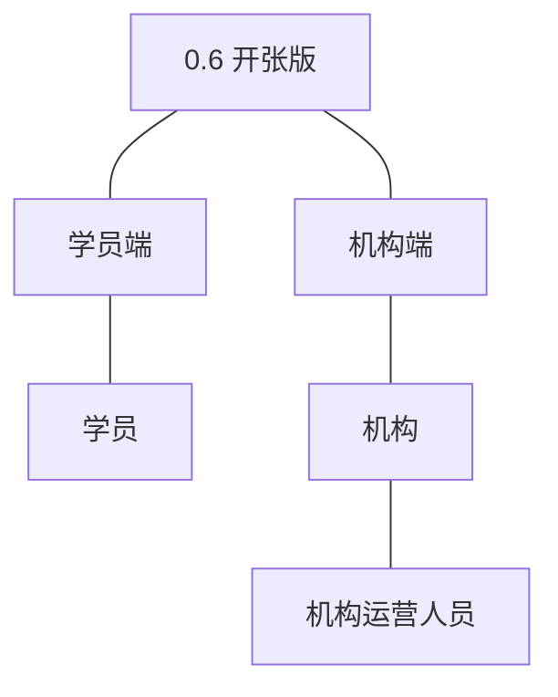
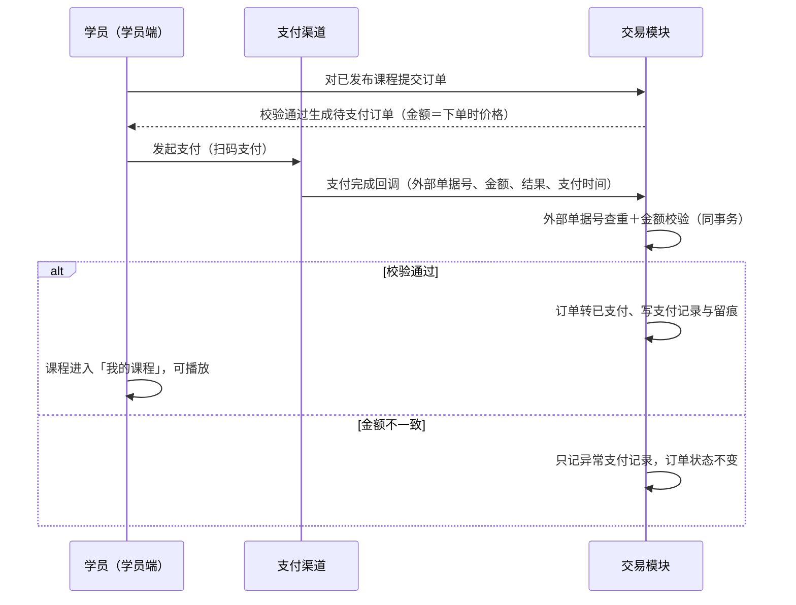
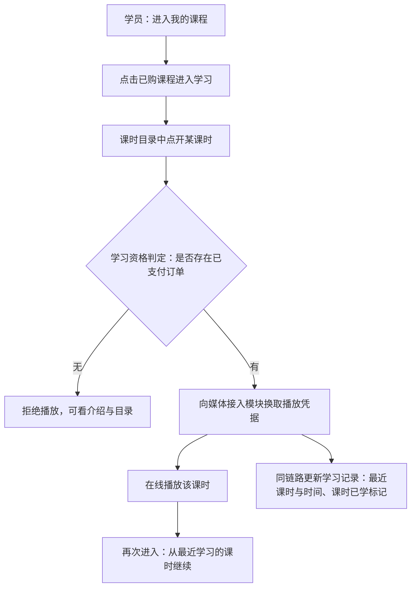
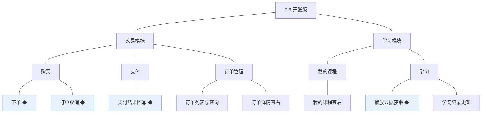
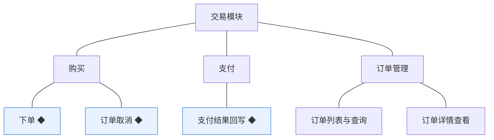
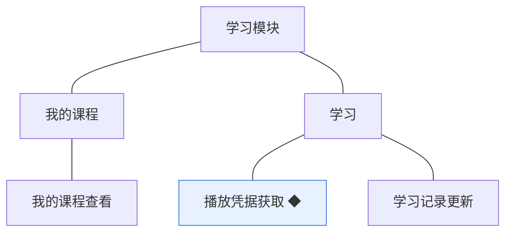
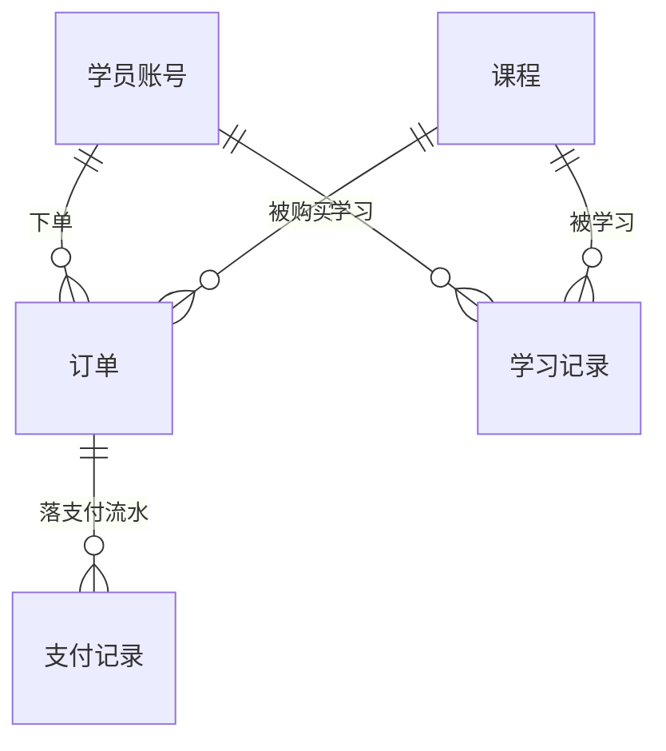
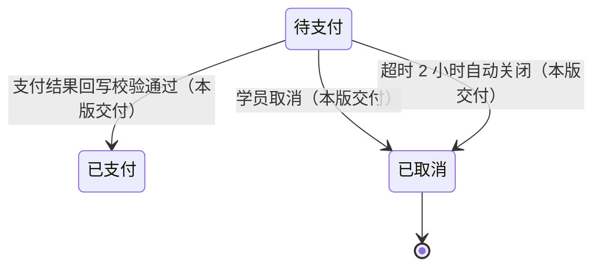
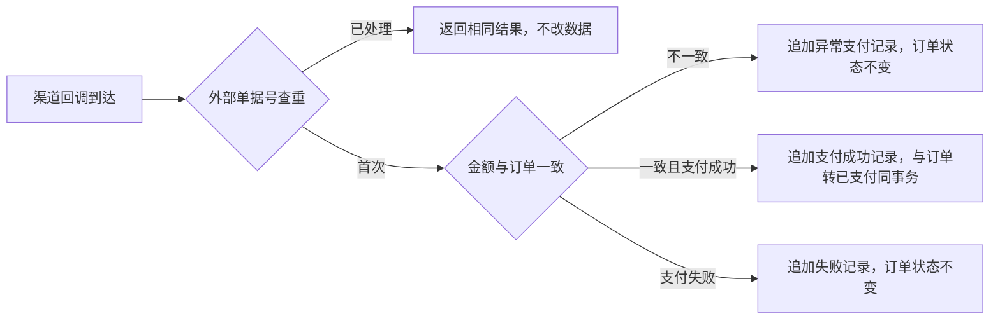
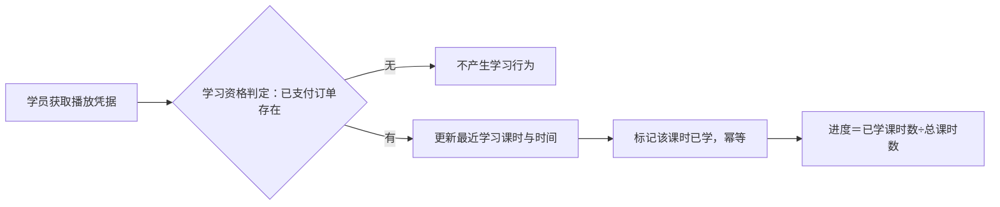

# PRD（大版本）：0.6 开张版

> 定位：本版立项说明书——承接《产品路线图（项目）》0.6 开张版条目与项目级基线，界定本版做什么、每个功能做到什么程度算完成，供需求拆解与小版本规划直接开工。上游为模拟案例材料，模拟性质保留；版本级默认值就地标注来源状态。

## 1. 版本概述

**承接与目标**：系统可以真实开张——学员在门户买课并在线学习，机构能看到订单（路线图 0.6 目标）。本版交付交易模块的成交侧能力（下单、订单取消、支付结果回写、订单列表与查询、订单详情查看）与学习模块的交付侧能力（我的课程查看、播放凭据获取、学习记录更新）；成交与交付同时到位构成最小可经营闭环，学习资格以订单状态为唯一依据即时判定、不落独立状态。

**成功标准与量化口径**：① 完成标志＝灰度台阶全部通过——环境联调通过 → 内部全流程演练（内部账号走完下单→支付→播放→学习记录）→ 小额真实单成功（真实支付完成、课程进入我的课程、可播放）→ 全量开放，四台阶全部通过并留证后本版视为完成（路线图口径）；② 支付回写幂等判定线 100%——同一外部单据号重复回调返回相同结果且不改任何数据（机制性）；③ 金额一致校验判定线 100%——回调金额与订单金额不一致时不得转已支付、只记异常支付记录；④ 可售判定线 100%——仅已发布课程可下单（非已发布课程下单一律拦截）；⑤ 学习资格判定以订单状态为唯一依据，判定线 100%（无独立资格对象、无缓存例外口径）；⑥ 验证假设（数据积累类、不阻塞立项）：学员真的会在线上完成买课与学习、机构能凭订单信息独立处理售后咨询，判定方式为小额真实单通过后首笔由外部真实学员完成的成交及其学习记录可查；灰度未过期间只冻结全量开放，不阻塞 0.7 开发立项。

**范围一句话**：做——交易模块五项（下单 ◆、订单取消 ◆、支付结果回写 ◆、订单列表与查询、订单详情查看〔机构端〕）＋学习模块三项（我的课程查看、播放凭据获取 ◆、学习记录更新〔由播放行为触发〕）；不做——退款与售后、发票、优惠券与组合购买、购物车、人工推荐位（暂缓清单）；不做学员侧订单查询与学习记录查询入口（归 0.7）。能力真空期过渡：学员查订单回退人工——由机构用本版交付的「订单列表与查询」「订单详情查看」代查答复（过渡落点：订单管理组）；退款售后回退人工——机构凭本版交付的「订单详情查看」（含支付留痕）线下核实处理，不建售后对象、不走系统流程。**待定决策落定（路线图 0.6 依赖行，均本版拍板）**：① 订单支持超时自动关闭——待支付订单 2 小时未支付自动转已取消（行业惯例默认，超时时长即留版本级「支付超时时间」的定值）；② 学习进度的计算口径＝课时粒度——已学课时数（获取过播放凭据的课时去重计数）÷ 课程总课时数，最近学习位置＝最近一次获取凭据的课时（展示口径随 0.7）；③ 记录每个课时的明细进度——学习记录维护课时级已学标记（获取凭据即标记、幂等），支撑进度计算与 0.7 展示；④ 试看不提供——无资格时仅可查看课程介绍与目录（沿用 04C），试看能力建议回池评估。**留版本级细化项落定（均本版拍板）**：支付超时时间＝2 小时（同决策①）；订单的可查询条件与分页＝机构端按时间范围、课程、订单状态筛选，分页 10／20／50 条／页；支付渠道的类型清单＝以 0.1 定案渠道提供的支付方式为准、本版实现扫码支付一类（行业惯例默认）；机构端订单列表字段＝订单编号、课程名称、学员编号、金额、状态、下单时间、支付时间；播放凭据有效期＝2 小时、到期重新获取（自动续换，学员无感知）。

**沿用与前置**：前置＝0.5（已发布课程——可售依据与播放内容来源）、0.4（课时内容引用——播放对象）、0.2（对接参数——媒体接入与支付渠道参数来源）、0.1（学员账号与登录态——下单与学习主体）；外部依赖＝支付渠道商户开户已就绪（渠道定案与开户启动的唯一时点在 0.1，本版只消费不再定案；结算与对账不排期，见路线图暂缓清单）。订单、支付记录、学习记录对象与订单状态枚举、订单编号编码沿用术语表既有登记。

## 2. 主体与角色

| 主体／角色 | 端 | 怎么用系统 |
|---|---|---|
| 学员 | 学员端 | 对已发布课程下单并完成支付、取消待支付订单；在「我的课程」进入已购课程、获取播放凭据在线学习 |
| 机构运营人员 | 机构端 | 按条件查询与查看订单（含支付留痕）、代学员核对订单；支付异常记录的人工核对 |
| 支付渠道（外部系统） | 回调接口（非管理端） | 支付完成后向交易模块回调提交支付结果（外部单据号、金额、结果、支付时间） |

**裁剪说明**：学员端本版新增写操作（下单／取消）与学习入口，订单与学习记录的学员侧查询入口随 0.7；机构管理员本版无专属操作面（订单管理归机构运营人员，路线图口径）；讲师端无变更（课程内容沿用 0.4～0.5）；支付渠道为外部参与方、非管理主体（仅回调与参数配置，参数随站点配置）。

## 3. 核心业务流程

### 3.1 旅程：学员买课（学员端→支付渠道→交易模块）

学员在门户完成第一笔成交：下单生成待支付订单（金额以生成时点课程价格为准）、扫码支付、渠道回调回写——订单转已支付并写入支付记录，课程即时进入「我的课程」。操作步骤：① 学员在课程详情点「立即购买」→ ② 系统校验课程已发布与无未取消订单，生成待支付订单 → ③ 学员发起扫码支付 → ④ 渠道回调支付结果，系统以外部单据号幂等查重并校验金额 → ⑤ 通过则订单转已支付、写支付记录与留痕（同事务）；金额不一致只记异常记录不改状态 → ⑥ 学员在「我的课程」看到该课程。待支付订单 2 小时未支付自动关闭（转已取消），学员也可主动取消。

### 3.2 旅程：学员学课（学员端）

学员对已购课程的在线学习：资格以订单状态即时判定，换取凭据后播放，学习行为随凭据获取同链路写入学习记录。操作步骤：① 学员登录学员端进入「我的课程」（已支付未取消订单对应的课程清单）→ ② 点击课程进入学习页，课时目录按学习顺序展示（含已学标记）→ ③ 点开课时，系统判定学习资格并换取播放凭据（有效期 2 小时、到期自动续换）→ ④ 在线播放；获取凭据同链路更新学习记录（最近课时、最近时间、课时已学标记，幂等）→ ⑤ 再次进入从最近学习的课时继续。

## 4. 功能需求

### 4.1 交易模块

**购买组**：成交入口与撤回；订单金额以下单时点课程价格为准，改价不影响已生成订单（04C-交易 3.3）。

| 功能 | 用途 | 验收标准 |
|---|---|---|
| 下单 ◆ | 学员对心仪课程发起购买，形成成交凭据 | 学员对已发布课程提交订单，无未取消既有订单时生成待支付订单（金额＝下单时点课程价格）并进入支付；课程非已发布、已有待支付订单或已有已支付订单时下单被拒并分别提示（已有待支付时返回该订单）；订单编号按编码契约生成 |
| 订单取消 ◆ | 学员放弃未完成的购买，释放重新下单资格 | 学员对待支付订单执行取消，订单转为已取消并记录取消时间与留痕，该课程可重新下单；已支付订单不可取消（退款未纳入本期）并提示；非本人订单无法取消 |

**支付组**：成交结果的落库侧；幂等与金额校验为硬约束（D8）。

| 功能 | 用途 | 验收标准 |
|---|---|---|
| 支付结果回写 ◆ | 把渠道支付结果可靠落到订单与支付记录 | 支付渠道回调以外部单据号提交支付结果：首次且金额与订单一致时订单转已支付、写入支付记录与状态留痕（同事务）；重复回调返回相同结果且不改任何数据；金额不一致时不改订单状态、只记异常支付记录供人工核对；支付失败只记录不改订单状态 |

**订单管理组**：机构侧的订单视图；本版同时承担学员查订单回退人工的代查职责（过渡落点）。

| 功能 | 用途 | 验收标准 |
|---|---|---|
| 订单列表与查询 | 机构掌握成交情况并代学员核对订单 | 机构运营人员按时间范围、课程、订单状态筛选订单并分页查看（默认 10 条／页，可选 10／20／50），列表展示订单编号、课程名称、学员编号、金额、状态、下单时间、支付时间 |
| 订单详情查看 | 机构核对单笔订单的完整信息 | 机构运营人员查看订单详情：订单信息、课程与学员标识、金额、状态、下单与支付时间、支付留痕（支付记录流水）；学员侧订单详情入口随 0.7，本版由机构代查答复 |

### 4.2 学习模块

**我的课程组**：学习资格的呈现入口；资格以订单状态为唯一依据、不落独立状态。

| 功能 | 用途 | 验收标准 |
|---|---|---|
| 我的课程查看 | 学员进入自己已购课程的学习入口 | 学员查看「我的课程」列表，仅包含本人存在已支付未取消订单的课程（含课程名、课时总数、已学课时数与最近学习时间）；取消或关闭的订单不产生课程；列表只对本人开放 |

**学习组**：在线播放与学习行为落库；无资格仅可看介绍与目录（试看不提供）。

| 功能 | 用途 | 验收标准 |
|---|---|---|
| 播放凭据获取 ◆ | 学员换取已购课时的播放凭据以在线学习 | 学员请求播放课时，系统以订单状态判定学习资格：有资格则读取课时内容引用、向媒体接入模块换取播放凭据（有效期 2 小时、到期自动续换）并返回可播放；无资格拒绝发放凭据、课程介绍与目录仍可查看；凭据由媒体接入模块按站点配置参数换取，本模块不直连服务商 |
| 学习记录更新 | 把学习行为落为可续学的记录 | 播放行为触发学习记录更新：最近学习课时、最近学习时间与课时级已学标记随播放凭据获取同链路写入，更新幂等（重复请求不写乱进度）；学习进度＝已学课时数÷课程总课时数；学员侧学习记录查看入口随 0.7 |

**版本级默认值就地内联**：待支付订单超时 2 小时自动关闭（转已取消，系统触发，本版拍板）；下单金额＝下单时点课程价格（04C-交易）；播放凭据有效期 2 小时（本版拍板）；机构订单列表筛选与字段见订单管理组验收标准（本版拍板）；异常支付记录人工核对入口随订单详情（支付留痕区）呈现。

## 5. 业务对象

### 5.1 订单

定位：课程购买的成交凭据（落库名沿用术语表 `course_order`，编号 `OD`＋14 位时间戳＋4 位序号）。

说明：状态枚举沿用术语表（待支付／已支付／已取消）；本版交付全部流转——学员取消与超时关闭均落已取消并留痕（取消方式在留痕区分）；已支付为本版稳定态（退款未纳入本期）；一学员对同一课程同时仅一笔未取消订单（重复下单返回既有待支付订单）；金额以下单时点课程价格为准；学习资格不落库，由学习模块按订单状态即时判定。

### 5.2 支付记录

定位：订单支付过程与结果的记录（技术实体，落库名沿用术语表 `pay_record`）。

说明：无状态流转、以流水表达历史（每次结果一条新记录，不改旧记录）；以外部单据号为幂等键；支付完成时间以回调携带的支付时间为准（统计口径沿用 D8，统计消费随 0.7）。

### 5.3 学习记录

定位：学员在某课程上的学习行为记录（落库名沿用术语表 `study_record`）。

说明：无状态流转，以字段更新表达进度、只保留最近进度（历史不留多版本）；每学员每课程一条记录＋课时级已学标记（明细实现形态由开发阶段定）；资格判定不落库、不缓存过久；学习记录查看随 0.7。
