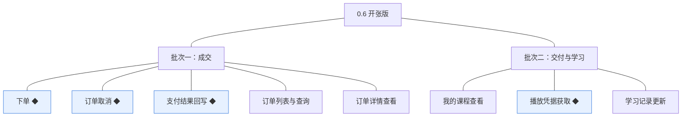
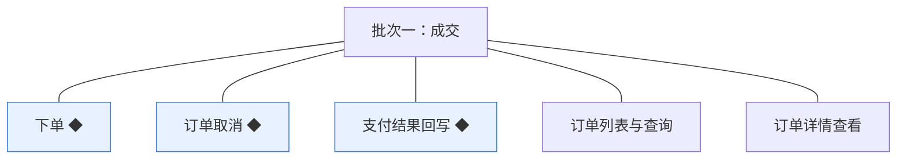
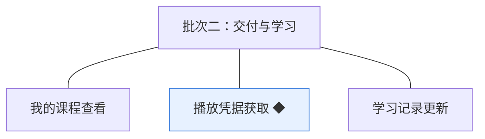

# 开发顺序与需求拆解（大版本）：0.6 开张版

> 定位：把《PRD（大版本）：0.6 开张版》转换为开发批次＋功能级需求条目；本文即该版本的完整需求清单，需求池据此直接入池、不另生成版本快照。上游为模拟案例材料，模拟性质保留。

## 1. 拆解说明

- **一一同构粒度口径**：一条需求（R 编号）＝一项 PRD 功能，需求名即 PRD 功能名；需求表的用途与验收标准**逐字引自 PRD 功能清单原文**，不压缩、不改写。按钮、字段、跳转级的原子拆解归小版本 PRD，不进本文。
- **本文即需求清单**：需求池批量入池直接读本文各批次需求表；池侧不生成版本快照，验收标准回溯本文（R 编号与 PRD 锚点随行可查）。
- **多入口口径**：本文是需求池的主入口但不是唯一入口——会议、沟通、临时反馈产生的需求从其他角度直接进入需求池（M01 起编号），不经本文；两类条目并存互不覆盖。
- **小版本规划的输入**＝本文开发顺序（批次建议，素材而非锁定）＋需求池实时状态，两者合并；唯一硬约束是本文声明的依赖与同事务契约不回退。

## 2. 开发顺序

**前置版本沿用面**：0.5 课程上线版（已发布课程——可售与播放前提）、0.4 课程创作版（课时内容引用）、0.2 站点与分类版（对接参数——媒体接入与支付渠道参数）、0.1 基座版（学员账号与登录态）；外部依赖——支付渠道商户开户已就绪（渠道定案与开户启动唯一时点在 0.1，本版只消费）。

**顺序依据与同事务契约**：成交先于交付——学习资格以订单状态为唯一依据，已支付订单由批次一回写产生，「我的课程」与凭据发放都消费该状态；同事务契约——支付结果回写中订单转已支付与支付记录写入同事务（事务内不调外部服务）、下单与状态留痕同事务、取消与留痕同事务、播放凭据获取与学习记录更新同链路且更新幂等（04C-交易 3.3／3.4／3.5、04C-学习 3.3），均不回退；外部联调点——支付渠道回调联调挂在批次一（环境联调属灰度台阶①，上线安排不占开发批次）；两批合成即可演示全流程（0.6 完成标志灰度台阶②的内部演练）。

### 2.1 批次一：成交

- **目标**：交易模块就绪——学员能下单、支付、取消，机构能看到订单；第一笔成交可完成。
- **依赖**：0.5（已发布课程）；0.1（学员账号与机构端权限）；支付渠道商户开户（外部，已就绪）。
- **可验收形态**：内部账号对一门已发布课程下单生成待支付订单 → 扫码支付、渠道回调 → 订单转已支付、支付留痕可查；机构运营人员按条件查到该订单并看详情（含支付流水）；重复回调与金额不符回调不改数据；学员取消与超时关闭路径可演示；重复下单与对非已发布课程下单被拦截。
- **判断注记**：交易五项并为一批——下单／取消／回写构成一次可演示的成交链路（拆开任一半都无可见终态），列表与详情是同一订单视图的两个面且承担学员查订单回退人工的代查职责（路线图过渡落点），并入同批演示。

条目与 PRD 4.1／4.2 功能清单一一同构，用途与验收标准逐字引自原文：

| 编号 | 需求名 | 用途 | 验收标准 |
|---|---|---|---|
| R44 | 下单 ◆ | 学员对心仪课程发起购买，形成成交凭据 | 学员对已发布课程提交订单，无未取消既有订单时生成待支付订单（金额＝下单时点课程价格）并进入支付；课程非已发布、已有待支付订单或已有已支付订单时下单被拒并分别提示（已有待支付时返回该订单）；订单编号按编码契约生成 |
| R45 | 订单取消 ◆ | 学员放弃未完成的购买，释放重新下单资格 | 学员对待支付订单执行取消，订单转为已取消并记录取消时间与留痕，该课程可重新下单；已支付订单不可取消（退款未纳入本期）并提示；非本人订单无法取消 |
| R46 | 支付结果回写 ◆ | 把渠道支付结果可靠落到订单与支付记录 | 支付渠道回调以外部单据号提交支付结果：首次且金额与订单一致时订单转已支付、写入支付记录与状态留痕（同事务）；重复回调返回相同结果且不改任何数据；金额不一致时不改订单状态、只记异常支付记录供人工核对；支付失败只记录不改订单状态 |
| R47 | 订单列表与查询 | 机构掌握成交情况并代学员核对订单 | 机构运营人员按时间范围、课程、订单状态筛选订单并分页查看（默认 10 条／页，可选 10／20／50），列表展示订单编号、课程名称、学员编号、金额、状态、下单时间、支付时间 |
| R48 | 订单详情查看 | 机构核对单笔订单的完整信息 | 机构运营人员查看订单详情：订单信息、课程与学员标识、金额、状态、下单与支付时间、支付留痕（支付记录流水）；学员侧订单详情入口随 0.7，本版由机构代查答复 |

### 2.2 批次二：交付与学习

- **目标**：学习模块就绪——已支付学员能在「我的课程」进入课程、获取凭据在线播放、学习记录可续学；与批次一合成最小可经营闭环。
- **依赖**：批次一（已支付订单——资格唯一依据）；0.4（课时内容引用）；0.2（对接参数——媒体接入）。
- **可验收形态**：已支付学员在「我的课程」看到该课程（含课时总数、已学数、最近学习时间）→ 点开课时获取凭据在线播放 → 学习记录更新（最近课时与时间、课时已学标记）→ 再次进入从最近课时继续；未支付学员请求播放被拒、仍可看介绍与目录；凭据到期自动续换——此批完成即可执行 0.6 完成标志的内部全流程演练（灰度台阶②）。
- **判断注记**：学习三项并为一批——「进入课程→换取凭据→记录更新」是一条可一次演示的学习链路（资格判定在凭据获取内、不独立成条）；与批次一合并即全流程闭环，无需第三批。

条目与 PRD 4.2 功能清单一一同构，用途与验收标准逐字引自原文：

| 编号 | 需求名 | 用途 | 验收标准 |
|---|---|---|---|
| R49 | 我的课程查看 | 学员进入自己已购课程的学习入口 | 学员查看「我的课程」列表，仅包含本人存在已支付未取消订单的课程（含课程名、课时总数、已学课时数与最近学习时间）；取消或关闭的订单不产生课程；列表只对本人开放 |
| R50 | 播放凭据获取 ◆ | 学员换取已购课时的播放凭据以在线学习 | 学员请求播放课时，系统以订单状态判定学习资格：有资格则读取课时内容引用、向媒体接入模块换取播放凭据（有效期 2 小时、到期自动续换）并返回可播放；无资格拒绝发放凭据、课程介绍与目录仍可查看；凭据由媒体接入模块按站点配置参数换取，本模块不直连服务商 |
| R51 | 学习记录更新 | 把学习行为落为可续学的记录 | 播放行为触发学习记录更新：最近学习课时、最近学习时间与课时级已学标记随播放凭据获取同链路写入，更新幂等（重复请求不写乱进度）；学习进度＝已学课时数÷课程总课时数；学员侧学习记录查看入口随 0.7 |

**批次判断与边界取舍**：两批已是最少批次——成交与交付分批因交付侧消费成交侧产生的已支付状态（资格唯一依据）；交易五项不逐功能拆批（成交链路一次演示）、学习三项同；8 条不逐功能拆批；退款、发票、优惠券、购物车、试看在围栏外、不入批（试看不提供已拍板，建议回池）。

**版本级验收安排**：按 PRD 1 的成功标准与量化口径验收（六条判定线）；灰度四台阶（环境联调→内部演练→小额真实单→全量开放）属上线安排、不占开发批次——本版有资金流转风险面，灰度冻结只限全量开放（路线图口径）。

## 3. 条目与 PRD 对应核对

- **一一同构声明**：条目数＝PRD 功能数＝8（R44～R51），逐行对应、无归并、无路径拆分、无 PRD 外内容。
- **批次构成**：批次一 5 条（购买组 2＋支付组 1＋订单管理组 2）；批次二 3 条（我的课程组 1＋学习组 2）。
- **◆ 清点**：4 个——R44 下单、R45 订单取消、R46 支付结果回写、R50 播放凭据获取（与 PRD 功能全景总图 ◆ 标注一致）。
- **过渡支撑清点**：0 个——订单列表与详情为正式能力（0.7 的学员侧入口是新增视角而非替代）；回退人工为运营安排、非系统能力。

## 4. 与需求池和小版本规划的衔接

- **入池路径**：需求池按「批量入池」直读本文第 2 章各批次需求表，条目编号沿用 R44～R51、批次随本文继承。
- **多入口口径**：会议、沟通、临时反馈类需求不经本文，直接单条入池（M01 起编号），与本批条目并存互不覆盖。
- **小版本规划的合并输入**：批次是建议而非锁定——确认小版本时以本文开发顺序＋需求池实时状态合并定范围；本文声明的依赖与同事务契约（0.5／0.4／0.2／0.1 前置、回写同事务与幂等、凭据与学习记录同链路）不回退。
- **认领与细化原则**：每条凭随行验收标准即可独立认领与验收；开发级细化（交互、字段、边界、用例）归小版本 PRD，本文任何位置不低于 PRD 功能级粒度。
