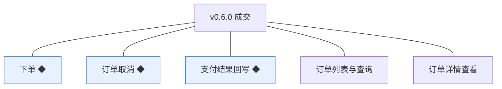
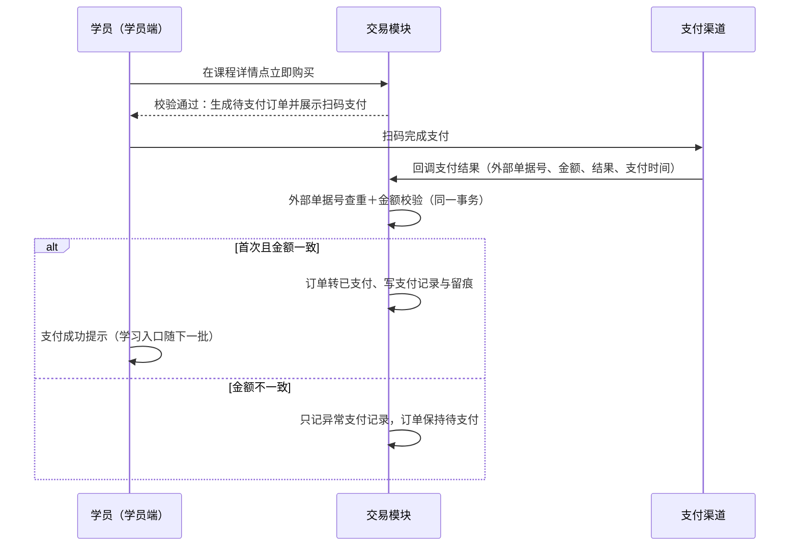
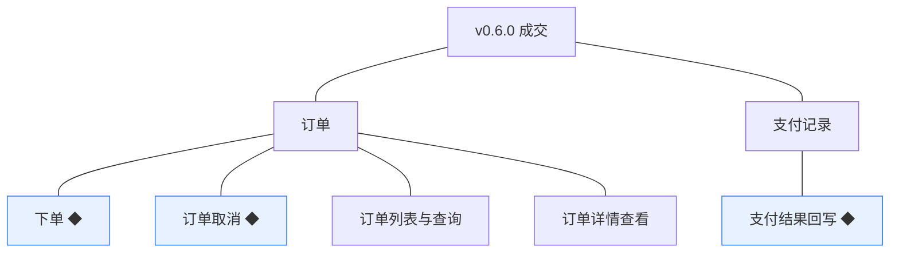
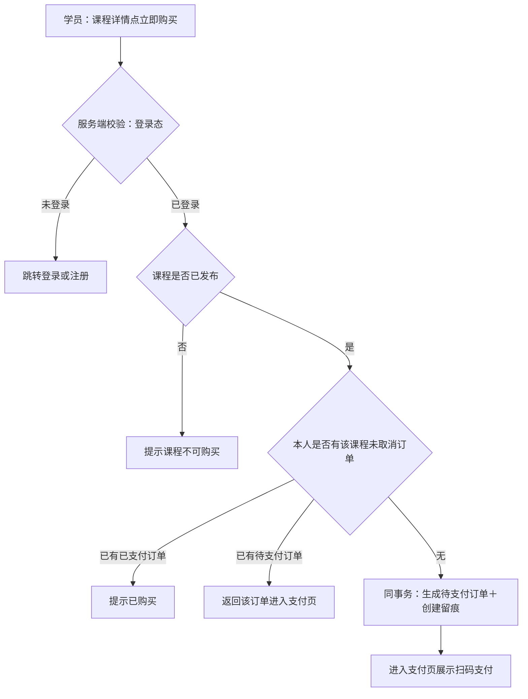
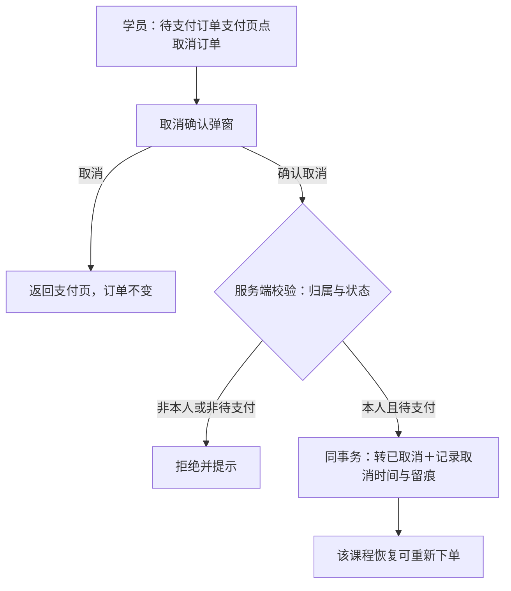
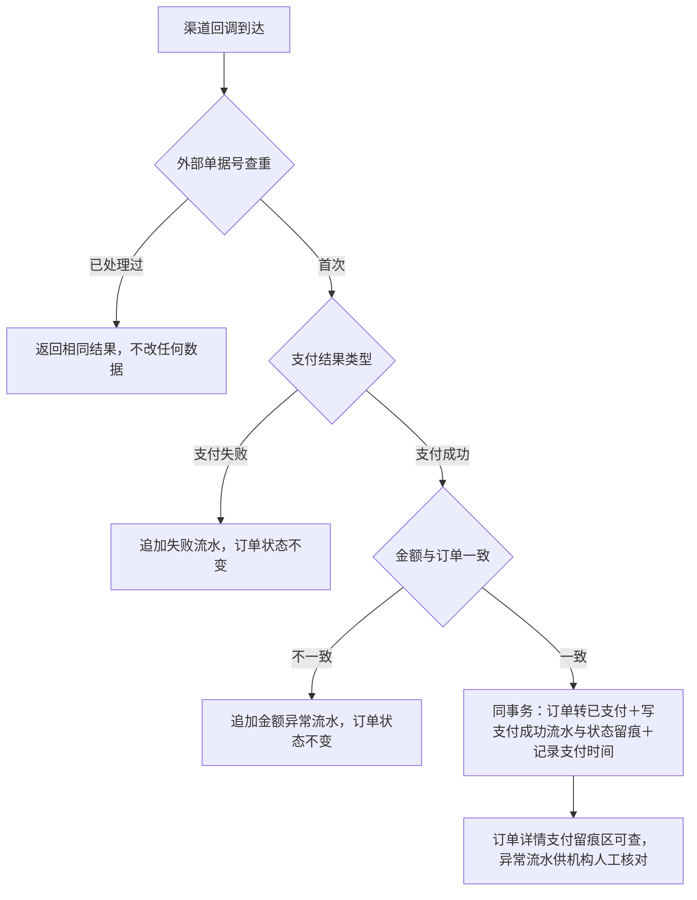
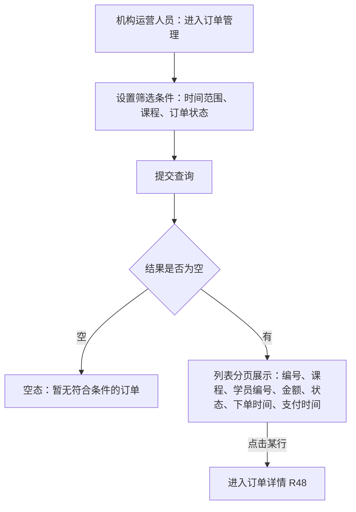
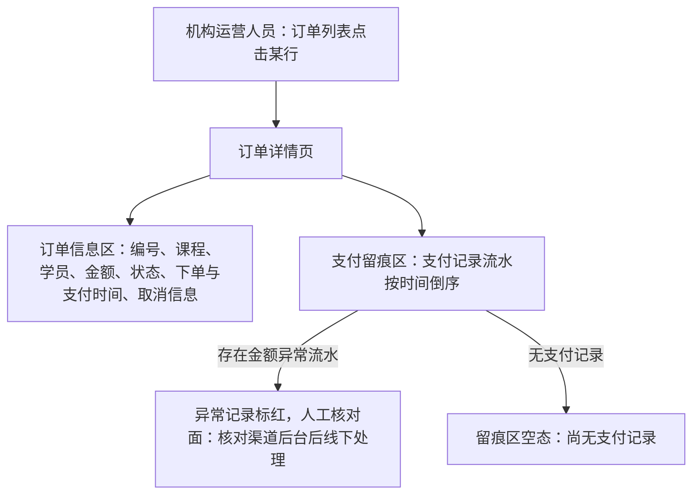

# PRD（小版本）：v0.6.0 成交

> 定位：开发级需求说明书——承接《PRD（大版本）：0.6 开张版》与《02-开发顺序与需求拆解（大版本）》批次一「成交」，认领自需求池（R44～R48）；把五条功能级条目细化到交互、字段、规则、异常与落库字段，开发与测试凭本文即可开工。上游为模拟案例材料，模拟性质保留。

## 1. 版本概述

**承接与目标**：本版认领 0.6 批次一「成交」整批（R44～R48）——02 批次建议与需求池实时状态合并采纳（批次一 5 条全部待规划）。可验收形态：内部账号对一门已发布课程下单生成待支付订单 → 扫码支付、渠道回调 → 订单转已支付、支付留痕可查；机构运营人员按条件查到该订单并看详情（含支付流水）；重复回调与金额不符回调不改数据；学员取消与超时关闭路径可演示；重复下单与对非已发布课程下单被拦截。

**范围外声明**：学习侧三项（我的课程查看、播放凭据获取、学习记录更新——随 v0.6.1 批次二交付；本版「课程进入我的课程」＝存在已支付未取消订单的状态口径）；学员侧订单列表与订单详情入口（随 0.7，本版学员经再下单提示进入待支付订单的支付页）；退款与售后、发票、优惠券与组合购买、购物车（大版本围栏，售后回退人工——机构凭本版 R48 订单详情线下核实）；试看（0.6 大版本拍板不提供）。

**条目内顺序与依赖**：R44 下单先行（订单产生）→ R46 支付结果回写（订单转已支付）→ R45 订单取消（含超时关闭，与 R46 竞争同一待支付态）；R47／R48 为订单视图、贯穿可用。前置＝0.5（已发布课程——可售唯一依据）、0.1（学员账号与机构端权限、支付渠道商户开户已就绪）。同事务契约不回退：回写中订单转已支付与支付记录写入同事务（事务内不调外部服务）、下单与创建留痕同事务、取消与留痕同事务、以外部单据号幂等。

**关键口径与来源状态**：仅已发布课程可下单（D4、04C-交易 3.3）；一学员对同一课程同时仅一笔未取消订单、重复下单返回既有待支付订单（04C-交易 3.3）；订单金额＝下单时点课程价格（04C-交易 3.3）；待支付订单 2 小时未支付自动关闭（0.6 大版本拍板）；支付渠道类型＝0.1 定案渠道的扫码支付一类（0.6 大版本拍板）；机构订单列表筛选与字段、分页 10／20／50（0.6 大版本拍板）；订单编号 `OD`＋14 位时间戳＋4 位序号（术语表编码契约）；订单状态枚举（待支付／已支付／已取消）沿用术语表。

## 2. 需求范围与验收锚

条目总览树（与上游批次一分支图同名同构）：

认领条目表（需求名／用途／验收标准逐字引自《02-开发顺序与需求拆解（大版本）》批次一需求表）：

| 编号 | 需求名 | 用途 | 验收标准 |
|---|---|---|---|
| R44 | 下单 ◆ | 学员对心仪课程发起购买，形成成交凭据 | 学员对已发布课程提交订单，无未取消既有订单时生成待支付订单（金额＝下单时点课程价格）并进入支付；课程非已发布、已有待支付订单或已有已支付订单时下单被拒并分别提示（已有待支付时返回该订单）；订单编号按编码契约生成 |
| R45 | 订单取消 ◆ | 学员放弃未完成的购买，释放重新下单资格 | 学员对待支付订单执行取消，订单转为已取消并记录取消时间与留痕，该课程可重新下单；已支付订单不可取消（退款未纳入本期）并提示；非本人订单无法取消 |
| R46 | 支付结果回写 ◆ | 把渠道支付结果可靠落到订单与支付记录 | 支付渠道回调以外部单据号提交支付结果：首次且金额与订单一致时订单转已支付、写入支付记录与状态留痕（同事务）；重复回调返回相同结果且不改任何数据；金额不一致时不改订单状态、只记异常支付记录供人工核对；支付失败只记录不改订单状态 |
| R47 | 订单列表与查询 | 机构掌握成交情况并代学员核对订单 | 机构运营人员按时间范围、课程、订单状态筛选订单并分页查看（默认 10 条／页，可选 10／20／50），列表展示订单编号、课程名称、学员编号、金额、状态、下单时间、支付时间 |
| R48 | 订单详情查看 | 机构核对单笔订单的完整信息 | 机构运营人员查看订单详情：订单信息、课程与学员标识、金额、状态、下单与支付时间、支付留痕（支付记录流水）；学员侧订单详情入口随 0.7，本版由机构代查答复 |

**锚定说明**：上表三要素逐字锚定上游，细化只加深行为描述、不收窄不放宽；本版 3 条 ◆ 复杂条目（R44／R45／R46，沿用大版本声明）；细化中发现的新想法按第 6 章回池，不进正文。

## 3. 核心用户旅程

旅程承接说明：承接上游大版本 PRD「学员买课（学员端→支付渠道→交易模块）」旅程落在本版认领范围内的链路段＝下单→支付→回写（订单转已支付与留痕）；排除段＝「课程进入我的课程、可播放」的学员端学习入口——随 v0.6.1 批次二交付，本版到达「存在已支付未取消订单」的状态口径。「学员学课」旅程整条随 v0.6.1。本版有跨主体、跨端交接（学员端↔支付渠道↔交易模块），旅程用时序图；「旅程：学员下单与支付」一条如下。

### 3.1 旅程：学员下单与支付（学员端→支付渠道→交易模块）

学员完成第一笔成交：从课程详情发起购买、扫码支付，渠道回调把结果可靠落库——订单转已支付并留下支付流水；未支付完成的订单可取消或 2 小时后自动关闭。操作步骤清单：

1. 学员登录学员端，在已发布课程详情页点击「立即购买」；
2. 系统校验课程已发布且本人无该课程未取消订单，通过后生成待支付订单（金额＝下单时点价格、编号按编码契约）并进入支付页展示扫码支付；
3. 学员扫码完成支付，渠道以外部单据号回调支付结果；
4. 系统在同一事务内查重与校验金额：首次且一致则订单转已支付、写入支付记录与留痕；学员端轮询到已支付即提示成功；
5. 未完成支付的学员可在支付页「取消订单」（订单转已取消、可重新下单），或等待 2 小时超时自动关闭；
6. 机构运营人员在机构端按条件查到订单并查看详情与支付流水（代学员核对，R47／R48）。

## 4. 功能需求

### 4.1 功能总览

对象归组树（版本→对象→条目）：

对象增删改查矩阵（本版认领条目以编号落位、围栏标注去向）：

| 业务对象 | 增 | 改 | 删 | 查 |
|---|---|---|---|---|
| 订单 | R44 | 状态流转：R45（待支付→已取消，含超时关闭系统触发）、R46（待支付→已支付） | 不做（订单不删除，终态以已取消表达；开发规范留痕要求） | R47（机构端列表与筛选）、R48（机构端详情）；学员侧查询随 0.7 |
| 支付记录 | R46（回写追加流水） | 不做（流水不改旧记录，04C-交易 第 4 节） | 不做（同左） | R48（订单详情支付留痕区，含异常记录人工核对） |

主体使用面：

| 主体／角色 | 端 | 使用条目 | 说明 |
|---|---|---|---|
| 学员 | 学员端 | R44、R45 | 对已发布课程下单与支付、取消本人待支付订单（入口＝支付页与再下单提示） |
| 机构运营人员 | 机构端 | R47、R48（含 R46 人工核对面） | 订单筛选与详情查看、异常支付记录人工核对、代学员核对订单（回退人工过渡） |
| 支付渠道（外部系统） | 回调接口 | R46（回调触发方） | 支付结果回调提交，非人工操作面 |

机制条目声明：R46 支付结果回写的主链路为渠道回调（系统间接口、无学员/机构人工触发面），界面仅为订单详情内支付留痕区（异常记录人工核对）；其余四条均有人工操作面。

### 4.2 R44 下单

**功能说明**：学员对心仪课程发起购买、形成成交凭据——订单的创建入口。触发：学员在已发布课程详情页点击「立即购买」（v0.5.1 的「购买功能即将开放」提示条随本版替换为购买按钮）。

**交互与流程**：

操作步骤清单：

1. 学员在课程详情页点击「立即购买」；未登录跳转登录／注册（0.1 路径），登录后返回继续；
2. 服务端校验课程状态＝已发布（下架、草稿等一律拦截）；
3. 校验本人对该课程是否存在未取消订单：已支付→提示「已购买」；待支付→不新建，直接返回该订单进入支付页（可继续支付或取消）；
4. 无未取消订单则同事务生成待支付订单：订单编号按 `OD`＋14 位时间戳＋4 位序号生成、金额＝下单时点课程价格、写入创建留痕；
5. 进入支付页展示扫码支付（渠道二维码），等待学员支付。

**字段与校验**：无表单输入字段——下单为对课程的单对象确认操作（购买数量固定 1，课程为数字内容不设数量）：

| 校验项 | 取值口径 | 失败反馈 |
|---|---|---|
| 登录态 | 学员端登录态（`side=student`） | 跳转登录页 |
| 课程可售 | 课程状态＝已发布 | 「课程不可购买」 |
| 重复购买 | 本人无该课程未取消订单 | 已支付：「你已购买该课程」；待支付：「你有一笔待支付订单」（并返回该订单） |

**规则与边界**：

1. 仅已发布课程可下单；课程下架后拒绝新订单（D4）；
2. 一学员对同一课程同时仅一笔未取消订单；重复下单返回既有待支付订单而非新建（04C-交易 3.3）；
3. 订单金额以下单时点课程价格为准（快照到订单），课程改价不影响已生成订单（04C-交易 3.3）；
4. 下单与库存无关（数字内容可复制），不设数量与扣减（04C-交易 3.3）；
5. 下单与创建留痕同事务（订单号、学员、课程、金额、时间）；免费课程（价格 0）处理：本版仍生成待支付订单、经渠道 0 元支付通道完成（本版拍板；若渠道不支持 0 元单，免费课直转已支付的优化建议回池）；
6. 超时关闭由系统定时任务在创建后 2 小时执行（0.6 大版本拍板），与学员取消同落已取消（方式在留痕区分）。

**异常与拦截**：

| 异常场景 | 系统行为 | 用户看到 |
|---|---|---|
| 未登录点击购买 | 拦截并引导 | 跳转登录／注册页 |
| 课程非已发布（含已下架） | 拒绝下单 | 「课程不可购买」 |
| 已有已支付订单 | 拒绝下单 | 「你已购买该课程」 |
| 已有待支付订单 | 不新建、返回该订单 | 「你有一笔待支付订单」＋进入支付页 |
| 会话缺失或非学员端登录态 | 拦截 | 跳转学员端登录页 |

### 4.3 R45 订单取消

**功能说明**：学员放弃未完成的购买——待支付订单的撤回出口，释放重新下单资格。触发：学员在待支付订单的支付页点击「取消订单」（或经再次下单提示进入该订单后取消）。

**交互与流程**：

操作步骤清单：

1. 学员在待支付订单的支付页点击「取消订单」，系统弹出二次确认（提示「取消后可重新下单」）；
2. 确认后服务端校验订单归属（本人）与状态（待支付）；
3. 通过则同事务：订单转「已取消」、记录取消时间与留痕（取消方式＝学员取消）；
4. 该课程恢复可重新下单（重新走 R44）。

**字段与校验**：无输入字段——确认型操作（唯一交互为二次确认弹窗）。

**规则与边界**：

1. 仅待支付订单可取消；已支付订单不可取消（退款未纳入本期）并提示（验收锚）；
2. 非本人订单无法取消（服务端归属校验，验收锚）；
3. 取消与留痕同事务；取消后不占用「未取消订单」唯一性，可重新下单（04C-交易 3.5）；
4. 超时自动关闭与学员取消竞争：订单已转已取消（任一方式）后再次取消按「状态不可取消」拒绝（本版拍板：后到者拒绝并提示刷新）。

**异常与拦截**：

| 异常场景 | 系统行为 | 用户看到 |
|---|---|---|
| 取消已支付订单 | 拒绝 | 「已支付订单不可取消（退款请联系机构）」 |
| 取消他人订单（越权请求） | 服务端归属校验拒绝 | 「订单不存在或无权操作」 |
| 重复取消（已取消，含超时已关闭） | 拒绝 | 「订单已取消」 |
| 并发（支付回调与取消同时到达） | 以先落库者为准：已转已支付则取消拒绝、已取消则回调只记流水不改状态（幂等口径，04C-交易 3.4／3.5） | 支付页刷新为最终状态 |

### 4.4 R46 支付结果回写

**功能说明**：把渠道支付结果可靠落到订单与支付记录——成交的落库侧，幂等与金额校验为硬约束。触发：支付渠道回调接口提交支付结果（外部单据号、金额、结果、支付时间）。

**交互与流程**：

操作步骤清单（系统间链路，无学员操作）：

1. 渠道在学员支付完成后回调提交：外部单据号、金额、结果（成功／失败）、支付时间；
2. 系统以外部单据号查重：已处理过直接返回相同结果（幂等，不改任何数据）；
3. 首次处理：支付失败→只追加失败流水、订单保持待支付；
4. 支付成功→校验金额与订单一致：不一致→只追加金额异常流水、订单状态不变（供 R48 人工核对）；一致→同一事务内订单转「已支付」、写入支付成功流水与状态留痕、记录支付时间；
5. 事务内不调用任何外部服务（开发规范）；
6. 学员端支付页轮询订单状态，转已支付后展示成功提示。

**字段与校验**：

| 校验项 | 取值口径 | 失败处理 |
|---|---|---|
| 外部单据号 | 渠道单号全局唯一（幂等键） | 重复到达返回相同结果 |
| 金额一致性 | 回调金额＝订单金额（分） | 不一致只记异常流水、不转已支付 |
| 回调签名 | 按渠道约定验签（0.1 定案渠道规范） | 验签失败拒绝受理（401，本版拍板） |

**规则与边界**：

1. 支付结果一律以外部单据号幂等处理，重复回调返回相同结果且不改数据（D8、开发规范）；
2. 金额不一致不得把订单转为已支付，只记异常支付记录供人工核对（04C-交易 3.4）；
3. 订单转已支付、支付记录写入、状态留痕在同一本地事务内完成，事务内不调外部服务（开发规范）；
4. 支付完成时间以回调携带的支付时间为准（统计口径，D8；统计消费随 0.7）；
5. 学习资格不在此处写入，由学习模块按订单状态判定（04C-交易 3.4，交付随 v0.6.1）。

**异常与拦截**：

| 异常场景 | 系统行为 | 渠道/机构看到 |
|---|---|---|
| 重复回调（同外部单据号） | 幂等返回相同结果、零数据变更 | 受理成功（幂等响应） |
| 金额不一致 | 订单状态不变、追加异常流水 | 受理成功；异常流水在订单详情支付留痕区标红呈现（机构人工核对） |
| 支付失败回调 | 订单保持待支付、追加失败流水 | 受理成功 |
| 验签失败 | 拒绝受理 | 401 拒绝（渠道重试或人工介入） |

### 4.5 R47 订单列表与查询

**功能说明**：机构掌握成交情况并代学员核对订单的列表视图。触发：机构运营人员进入机构端「订单管理」列表。

**交互与流程**：

操作步骤清单：

1. 机构运营人员进入机构端「订单管理」，默认展示全部订单（按下单时间倒序，本版拍板）；
2. 设置筛选条件（下单时间范围、课程、订单状态任一或组合）后提交查询；
3. 列表分页展示（默认 10 条／页，可选 10／20／50）：订单编号、课程名称、学员编号、金额、状态、下单时间、支付时间（未支付订单支付时间显示「——」）；
4. 点击某行进入订单详情（R48）；
5. 无数据时展示空态。

**字段与校验**：

| 信息项 | 说明 |
|---|---|
| 筛选条件 | 下单时间范围（起止）、课程（下拉选择）、订单状态（待支付／已支付／已取消），可组合（0.6 大版本拍板） |
| 列表列 | 订单编号、课程名称、学员编号、金额、状态、下单时间、支付时间（0.6 大版本拍板）；默认下单时间倒序、分页 10／20／50 |

**规则与边界**：

1. 列表返回全部学员订单（机构视角，无归属过滤——与学员侧本人过滤的 0.7 口径相区分）；
2. 筛选在服务端执行；金额以元展示（存储为分，展示口径沿用 0.4）；
3. 本版列表同时承担学员查订单回退人工的代查职责（路线图过渡落点）：学员咨询时机构按学员编号或课程代查答复——学员编号不为本版筛选项（筛选项为大版本拍板三项），代查用「课程＋时间」组合定位（本版拍板，学员编号筛选项建议回池）。

**异常与拦截**：

| 异常场景 | 系统行为 | 用户看到 |
|---|---|---|
| 无符合条件的订单 | 空态 | 「暂无符合条件的订单」 |
| 无任何订单（开张初期） | 空态 | 「暂无订单」 |

### 4.6 R48 订单详情查看

**功能说明**：机构核对单笔订单完整信息的详情视图——含支付留痕与异常人工核对面。触发：机构运营人员在订单列表点击某行。

**交互与流程**：

操作步骤清单：

1. 机构运营人员在订单列表点击目标订单进入详情；
2. 订单信息区展示：订单编号、课程名称与编号、学员编号、金额、当前状态、下单时间、支付时间（已支付）、取消时间与取消方式（已取消，学员取消／超时关闭）；
3. 支付留痕区按时间倒序展示该订单全部支付记录流水：外部单据号、金额、结果（成功／失败／金额异常）、支付时间；金额异常流水标红提示；
4. 异常流水的处置：机构核对渠道后台确认后线下处理（暂缓清单口径——不建售后对象、不走系统流程），本版不提供系统内处置操作（本版拍板）；
5. 学员来询时机构以本详情代查答复（回退人工过渡）。

**字段与校验**：

| 信息项 | 说明 |
|---|---|
| 订单信息 | 订单编号、课程名称／编号、学员编号、金额、状态、下单时间、支付时间、取消时间与取消方式（已取消时） |
| 支付留痕 | 支付记录流水：外部单据号、金额、结果（成功／失败／金额异常）、支付时间（时间倒序，本版拍板） |

**规则与边界**：

1. 详情为机构端只读视图（本版无任何写操作——异常处置线下进行）；
2. 支付留痕即支付记录的完整流水（含失败与异常），不改不删（04C-交易 第 4 节）；
3. 学员侧订单详情入口随 0.7；本版学员经机构代查获得订单信息（路线图过渡口径）；
4. 机构管理员可见同口径订单列表与详情（能力点授予时，本版拍板：订单管理能力点默认授予机构运营人员，机构管理员可授予）。

**异常与拦截**：

| 异常场景 | 系统行为 | 用户看到 |
|---|---|---|
| 访问不存在的订单 | 按「订单不存在」返回 | 「订单不存在」提示 |
| 无订单管理能力点的账号访问 | 服务端能力点校验拒绝 | 「无订单管理权限」 |

## 5. 业务对象与数据字段

数据主体清单：

| 业务对象 | 落库名 | 定位与关系 |
|---|---|---|
| 订单 | `course_order` | 本版新增数据对象：课程购买的成交凭据；归属唯一学员（`student_id`）与一门课程（`course_id`）；一学员对同一课程同时仅一笔未取消订单 |
| 支付记录 | `pay_record` | 本版新增数据对象（技术实体）：订单支付过程与结果的流水；每次结果一条新记录、以外部单据号为幂等键；归属订单（`order_id`） |
| 课程／学员账号 | `course`／`student_account` | 沿用对象：订单的两端引用（可售判定与学员标识） |
| 登录态（会话） | 会话存储（机制态） | 沿用登记（学员端 `side=student`、机构端 `side=admin`），本版无新增机制态对象 |

订单（`course_order`）字段表（业务级字段定义＋落库命名对照；列类型、主键、索引与建表 DDL 归开发阶段）：

| 字段 | 必填 | 业务类型 | 落库字段名 | 约束与取值 |
|---|---|---|---|---|
| 主键 | — | 标识 | `id` | 通用字段（术语表第 7 节） |
| 订单编号 | 是 | 编码 | `no` | `OD`＋14 位时间戳＋4 位序号，创建时生成、全局唯一（编码契约沿用） |
| 课程 | 是 | 外键 | `course_id` | 指向 `course.id`；下单时校验状态＝已发布 |
| 学员 | 是 | 外键 | `student_id` | 指向 `student_account.id`，创建时取当前登录学员 |
| 金额 | 是 | 金额 | `amount` | 非负整数、最小货币单位（分）；＝下单时点课程价格快照（本版新登记） |
| 状态 | 是 | 枚举 | `status` | 待支付（`pending`）／已支付（`paid`）／已取消（`canceled`），枚举沿用术语表 |
| 支付时间 | 已支付后必填 | 时间 | `paid_at` | 回写成功时同事务写入（取回调支付时间）（本版新登记） |
| 取消时间 | 已取消后必填 | 时间 | `canceled_at` | 学员取消或超时关闭时同事务写入（本版新登记） |
| 取消方式 | 已取消后必填 | 枚举 | `cancel_type` | 学员取消（`user`）／超时关闭（`timeout`）（本版新登记，本版拍板） |
| 创建时间／更新时间 | 是 | 时间 | `created_at`／`updated_at` | 通用字段；created_at 即下单时间 |

支付记录（`pay_record`）字段表：

| 字段 | 必填 | 业务类型 | 落库字段名 | 约束与取值 |
|---|---|---|---|---|
| 主键 | — | 标识 | `id` | 通用字段 |
| 所属订单 | 是 | 外键 | `order_id` | 指向 `course_order.id` |
| 外部单据号 | 是 | 编码 | `out_trade_no` | 渠道单号，全局唯一（幂等键）（本版新登记） |
| 金额 | 是 | 金额 | `amount` | 回调携带金额（分），用于一致性校验（本版新登记） |
| 结果 | 是 | 枚举 | `result` | 成功（`success`）／失败（`fail`）／金额异常（`mismatch`）（本版新登记，本版拍板） |
| 支付时间 | 成功时必填 | 时间 | `paid_at` | 回调携带的支付时间（统计口径，D8）（本版新登记） |
| 创建时间 | 是 | 时间 | `created_at` | 通用字段（流水到达时间） |

机制态对象：无新增（登录态沿用）；超时关闭任务为系统定时机制（开发规范「定时任务与手动触发共用业务逻辑」沿用），不落业务对象。

## 6. 待议与建议

**本版采用的推断与默认值汇总**：

1. 免费课程（价格 0）仍生成待支付订单、经渠道 0 元支付通道完成（本版拍板；0 元直转已支付的优化建议回池）；
2. 机构订单列表默认下单时间倒序（本版拍板）；支付留痕流水按时间倒序（本版拍板）；未支付订单支付时间显示「——」；
3. 订单管理能力点默认授予机构运营人员、机构管理员可授予（本版拍板）；
4. 学员取消与超时关闭竞争及取消与回调并发均以先落库者为准、后到者拒绝并提示刷新（本版拍板）；
5. 回调验签失败拒绝受理 401（按 0.1 定案渠道规范，本版拍板）；
6. 学员代查以「课程＋时间」组合定位（学员编号非本版筛选项，大版本拍板三项为准；学员编号筛选项建议回池）。

**建议回池与术语表待登记**：

- 建议回池：订单列表增加学员编号筛选项（代查效率）；免费课 0 元直转已支付；学员侧订单待支付提醒（短信／站内，随通知能力评估）——均一句话指引，单条入池（M01 起）评估。
- 术语表待登记行（随本文档回报、由主流程合入）：订单（`course_order`）新增 `amount`／`paid_at`／`canceled_at`／`cancel_type`；支付记录（`pay_record`）新增 `order_id`／`out_trade_no`／`amount`／`result`／`paid_at`；`no`／`status`／`created_at`／`updated_at`／`id` 按通用字段与既有登记沿用。
