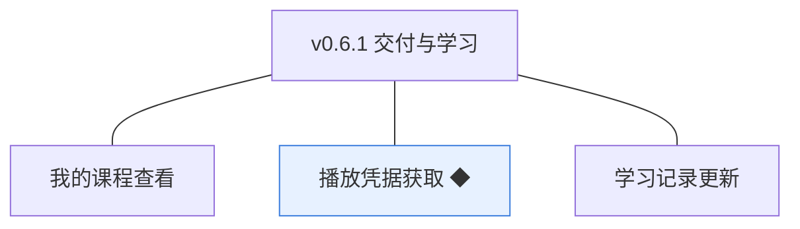
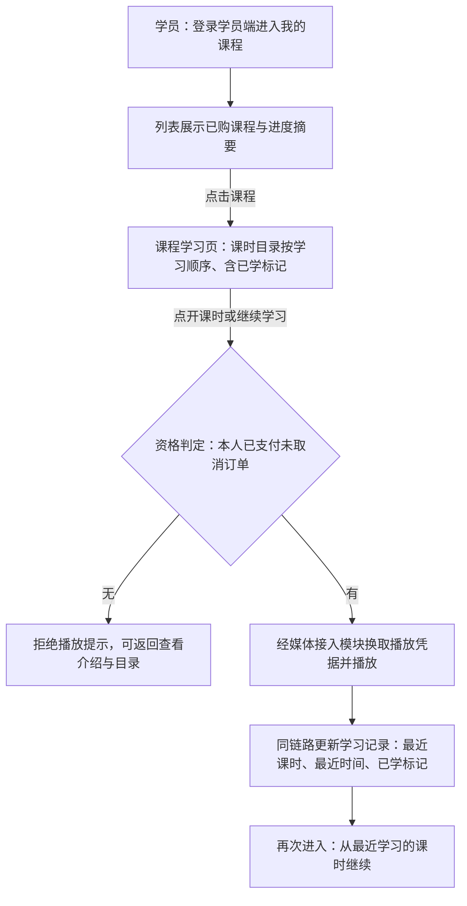
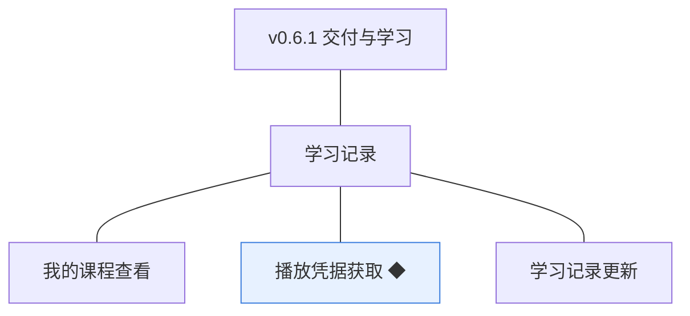
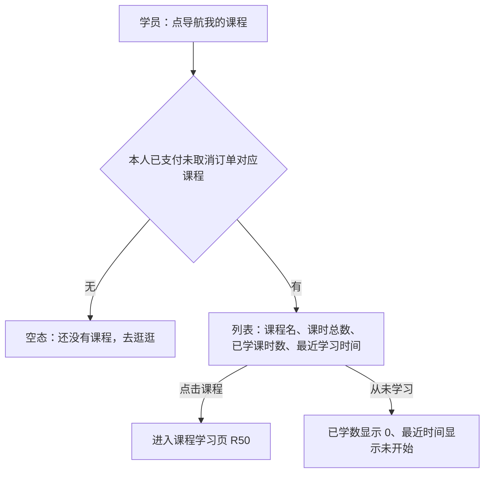
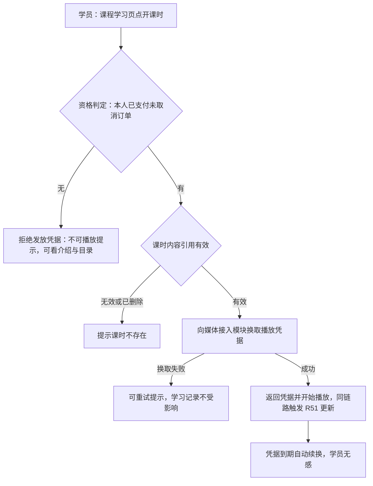
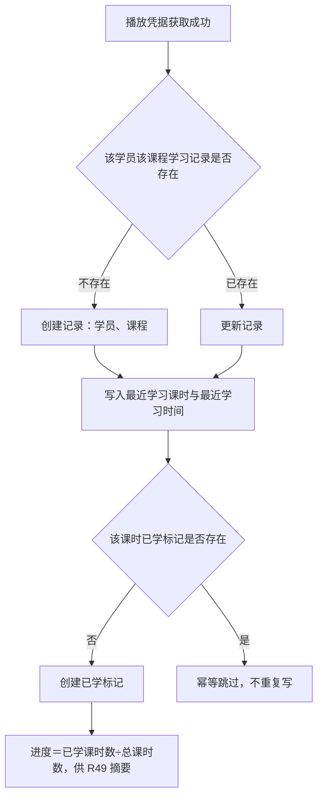

# PRD（小版本）：v0.6.1 交付与学习

> 定位：开发级需求说明书——承接《PRD（大版本）：0.6 开张版》与《02-开发顺序与需求拆解（大版本）》批次二「交付与学习」，认领自需求池（R49～R51）；把三条功能级条目细化到交互、字段、规则、异常与落库字段，开发与测试凭本文即可开工。上游为模拟案例材料，模拟性质保留。

## 1. 版本概述

**承接与目标**：本版认领 0.6 批次二「交付与学习」整批（R49～R51）——02 批次建议与需求池实时状态合并采纳（v0.6.0 发布后批次二 3 条全部待规划）。可验收形态：已支付学员在「我的课程」看到该课程（含课时总数、已学数、最近学习时间）→ 点开课时获取凭据在线播放 → 学习记录更新（最近课时与时间、课时已学标记）→ 再次进入从最近课时继续；未支付学员请求播放被拒、仍可看介绍与目录；凭据到期自动续换——此批完成即可执行 0.6 完成标志的内部全流程演练（灰度台阶②：内部账号走完下单→支付→播放→学习记录）。

**范围外声明**：学员侧学习记录查看入口（随 0.7——本版学习进度仅在「我的课程」列表以摘要呈现）；附件的学员获取（下载／预览，随后续版本）；试看（0.6 大版本拍板不提供——无资格时仅可看介绍与目录）；学员侧订单查询（随 0.7）；机构端与讲师端本版无新界面。

**条目内顺序与依赖**：R49 先行（学习入口与资格呈现）→ R50 播放凭据获取（资格判定＋凭据链路）→ R51 学习记录更新（随 R50 同链路写入，条目独立成条但实现同链路）。前置＝v0.6.0（已支付订单——资格唯一依据）、0.4（课时内容引用——播放对象）、0.2（对接参数——媒体接入）。同链路契约不回退：播放凭据获取与学习记录更新同链路且更新幂等；资格判定以订单状态为唯一依据、本模块不自建购买关系、不缓存过久。

**关键口径与来源状态**：学习资格＝本人存在该课程的已支付未取消订单（即时判定，04C-学习）；播放凭据由媒体接入模块按站点配置参数换取、有效期 2 小时、到期自动续换（0.6 大版本拍板）；学习进度＝已学课时数÷课程总课时数、已学标记＝获取过播放凭据的课时去重（0.6 大版本拍板）；无资格拒绝凭据、介绍与目录仍可查看（04C-学习）；学习记录对象与无状态流转沿用术语表；课时级已学明细为本版新登记（见第 5 章）。

## 2. 需求范围与验收锚

条目总览树（与上游批次二分支图同名同构）：

认领条目表（需求名／用途／验收标准逐字引自《02-开发顺序与需求拆解（大版本）》批次二需求表）：

| 编号 | 需求名 | 用途 | 验收标准 |
|---|---|---|---|
| R49 | 我的课程查看 | 学员进入自己已购课程的学习入口 | 学员查看「我的课程」列表，仅包含本人存在已支付未取消订单的课程（含课程名、课时总数、已学课时数与最近学习时间）；取消或关闭的订单不产生课程；列表只对本人开放 |
| R50 | 播放凭据获取 ◆ | 学员换取已购课时的播放凭据以在线学习 | 学员请求播放课时，系统以订单状态判定学习资格：有资格则读取课时内容引用、向媒体接入模块换取播放凭据（有效期 2 小时、到期自动续换）并返回可播放；无资格拒绝发放凭据、课程介绍与目录仍可查看；凭据由媒体接入模块按站点配置参数换取，本模块不直连服务商 |
| R51 | 学习记录更新 | 把学习行为落为可续学的记录 | 播放行为触发学习记录更新：最近学习课时、最近学习时间与课时级已学标记随播放凭据获取同链路写入，更新幂等（重复请求不写乱进度）；学习进度＝已学课时数÷课程总课时数；学员侧学习记录查看入口随 0.7 |

**锚定说明**：上表三要素逐字锚定上游，细化只加深行为描述、不收窄不放宽；本版 1 条 ◆ 复杂条目（R50，沿用大版本声明）；细化中发现的新想法按第 6 章回池，不进正文。

## 3. 核心用户旅程

旅程承接说明：承接上游大版本 PRD「学员学课（学员端）」旅程整条落在本版（进入我的课程→选课时→资格判定→换取凭据→播放→记录更新→续学）；「学员买课」旅程的「课程进入我的课程、可播放」段由本版补齐（与 v0.6.0 成交段合成完整闭环）。排除段：学习记录的明细查看页（随 0.7）、附件获取（随后续版本）。本版链路为学员端单端单主体（资格判定与凭据换取为系统内部链路，04C-学习 3.3 已画、不重复），旅程用流程图；「旅程：学员学课」一条如下。

### 3.1 旅程：学员学课（学员端）

学员对已购课程的在线学习闭环：从「我的课程」进入、按目录学习，凭据自动换取与续换，学习行为随播放同链路落为可续学的记录。操作步骤清单：

1. 学员登录学员端，进入「我的课程」（导航新增入口），列表展示本人已购课程与进度摘要；
2. 点击课程进入课程学习页：课时目录按学习顺序展示（序号＋标题＋已学标记），有学习记录时高亮「继续学习：第 N 课」；
3. 点开某课时（或点「继续学习」），系统以订单状态即时判定学习资格；
4. 有资格：自动向媒体接入模块换取播放凭据（有效期 2 小时，到期自动续换、学员无感）并开始播放；
5. 播放凭据获取同链路更新学习记录：最近学习课时、最近学习时间、该课时已学标记（幂等）；
6. 无资格（订单取消／超时关闭等）：提示不可播放，课程介绍与目录仍可查看；
7. 再次进入课程学习页，从最近学习的课时继续。

## 4. 功能需求

### 4.1 功能总览

对象归组树（版本→对象→条目）：

对象增删改查矩阵（本版认领条目以编号落位、围栏标注去向）：

| 业务对象 | 增 | 改 | 删 | 查 |
|---|---|---|---|---|
| 学习记录 | 随 R50 首次学习同链路自动创建（一学员一课程一条） | R51（最近课时、最近时间更新） | 不做（记录不删除） | R49（我的课程列表进度摘要——已学数与最近时间）；明细查看页随 0.7 |
| 学习记录明细（课时已学标记） | 随 R50 首次学习某课时创建 | 不做（标记只增不改，重复获取幂等跳过） | 不做 | R49／R50（已学数计算与目录标记） |
| 订单 | 不做（v0.6.0 已交付） | 不做（同左） | 不做（同左） | 只读引用（R49 资格判定、R50 资格校验——以订单状态为唯一依据） |
| 课时 | 不做（v0.4.1 已交付） | 不做（同左） | 不做（同左） | 只读引用（R50 内容引用与目录呈现） |

主体使用面：

| 主体／角色 | 端 | 使用条目 | 说明 |
|---|---|---|---|
| 学员 | 学员端 | R49、R50 | 已购课程的学习入口与在线播放（导航新增「我的课程」入口） |

机制条目声明：R51 学习记录更新为机制条目——由播放行为（R50 凭据获取）同链路触发、无人工操作面、不单独生成界面；其结果经 R49 的进度摘要与目录已学标记呈现。

### 4.2 R49 我的课程查看

**功能说明**：学员进入自己已购课程的学习入口——学习资格的列表呈现。触发：学员登录后在学员端导航点「我的课程」。

**交互与流程**：

操作步骤清单：

1. 学员登录学员端，点击导航「我的课程」（本版新增入口）；
2. 列表展示本人存在已支付未取消订单的课程：课程名、课时总数、已学课时数、最近学习时间（从未学习显示「未开始」）；
3. 点击课程进入课程学习页（R50 播放链路）；
4. 无已购课程时展示空态（引导去课程列表逛逛）；
5. 列表按最近学习时间倒序（从未学习的排后、按购买时间倒序，本版拍板）。

**字段与校验**：

| 信息项 | 说明 |
|---|---|
| 列表列 | 课程名、课时总数、已学课时数（明细标记去重计数）、最近学习时间（未开始标注） |
| 资格口径 | 仅本人「已支付且未取消」订单对应课程（取消／超时关闭订单不产生课程；课程已下架仍保留在列——既有学习资格保留，0.5 定案沿用） |

**规则与边界**：

1. 列表只对本人开放（服务端按登录学员过滤，验收锚）；
2. 资格以订单状态为唯一依据、即时判定（不落独立资格对象）；取消或关闭的订单不产生课程（验收锚）；
3. 已下架课程保留在「我的课程」并可继续学习（既有学习资格保留——0.5 课程下架定案沿用，本版拍板重申）；已下架课程在列表标注「已下架」状态角标（本版拍板）；
4. 进度摘要口径：已学课时数÷课时总数（R51 口径），仅摘要呈现；学习记录明细查看随 0.7。

**异常与拦截**：

| 异常场景 | 系统行为 | 用户看到 |
|---|---|---|
| 无已购课程 | 空态 | 「还没有课程，去逛逛」＋课程列表入口 |
| 未登录访问 | 拦截并引导 | 跳转登录页（0.1 路径） |
| 越权请求（非本人列表） | 服务端登录态过滤、无越权面 | 仅返回本人数据 |

### 4.3 R50 播放凭据获取

**功能说明**：学员换取已购课时的播放凭据以在线学习——资格判定与凭据链路的合一入口。触发：学员在课程学习页点开某课时或「继续学习」。

**交互与流程**：

操作步骤清单：

1. 学员在课程学习页点开某课时（或点「继续学习：第 N 课」）；
2. 系统以订单状态即时判定学习资格（查询交易模块：本人对该课程是否存在已支付未取消订单）；
3. 无资格：拒绝发放凭据、提示不可播放，课程介绍与目录仍可查看（试看不提供）；
4. 有资格：读取该课时内容引用，向媒体接入模块换取播放凭据（接入参数取站点配置，本模块不直连服务商）；
5. 换取成功：返回凭据、播放器开始播放；同链路触发学习记录更新（R51）；
6. 播放中凭据到期（2 小时）：自动续换、播放不中断（学员无感）；
7. 换取失败（外部服务异常）：提示可重试，学习记录不产生变更（失败不影响一致性）。

**字段与校验**：

| 校验项 | 取值口径 | 失败反馈 |
|---|---|---|
| 学习资格 | 本人该课程已支付未取消订单存在（以订单状态为唯一依据） | 「暂无学习资格，请先购买课程」＋课程详情入口 |
| 课时有效性 | 课时存在、未删除且属该课程 | 「课时不存在」 |
| 凭据有效期 | 2 小时，到期自动续换（0.6 大版本拍板） | 无感续换（不提示） |

**规则与边界**：

1. 资格以交易模块的订单状态为唯一依据，本模块不自建购买关系、不缓存过久（04C-学习 3.3）；
2. 无资格时不得发放播放凭据；课程介绍与目录仍可查看（验收锚）；
3. 凭据由媒体接入模块按站点配置参数换取，本模块不直接调用服务商接口（D7、04C-学习 3.3）；
4. 换取凭据成功即触发学习记录更新（R51 同链路）；凭据换取失败不影响学习记录一致性、按可重试处理（04C-学习 3.3）；
5. 课程已下架但存在已支付订单：资格仍成立、可继续学习（既有学习资格保留，0.5 定案沿用）；
6. 同一学员并发请求同一课时凭据：幂等返回、学习记录不重复写（R51 幂等口径覆盖）。

**异常与拦截**：

| 异常场景 | 系统行为 | 用户看到 |
|---|---|---|
| 无学习资格请求播放 | 拒绝发放凭据 | 「暂无学习资格，请先购买课程」；介绍与目录仍可看 |
| 课时不存在或已删除 | 拒绝并提示 | 「课时不存在」 |
| 媒体接入换取失败 | 不更新学习记录、可重试 | 「视频加载失败，请重试」 |
| 未登录请求 | 拦截并引导 | 跳转登录页 |

### 4.4 R51 学习记录更新

**功能说明**：把学习行为落为可续学的记录——由播放行为触发的机制链路，无人工操作面。触发：R50 播放凭据获取成功（同链路）。

**交互与流程**：

操作步骤清单（系统链路，无学员操作）：

1. R50 凭据获取成功后同链路进入更新：查本人本课程的学习记录，不存在则创建（一学员一课程一条）；
2. 更新最近学习课时（＝本次播放课时）与最近学习时间（＝本次凭据获取时间）；
3. 查该课时已学标记：不存在则创建（首次学习时间落值）；已存在则幂等跳过（不重复写、不更新时间）；
4. 进度由已学标记计数即时派生（已学课时数÷课程总课时数），供「我的课程」摘要与目录标记呈现；
5. 重复请求（并发或重试）整体幂等：同课时重复触发不写乱进度（最近时间以最新一次成功获取为准）。

**字段与校验**：无输入字段——机制链路（数据落位见第 5 章）。

**规则与边界**：

1. 更新随播放凭据获取同链路写入、必须幂等（重复请求不写乱进度，验收锚）；
2. 学习记录只保留最近进度（历史不留多版本，04C-学习 第 4 节）；已学标记只增不改（首次学习时间不刷新）；
3. 凭据换取失败不触发更新（失败不影响一致性，04C-学习 3.3）；
4. 进度口径＝已学课时数÷课程总课时数（0.6 大版本拍板）；课程课时总数变化（讲师增删课时并重新发布）：分母取当前未删除课时数，进度即时重算（本版拍板）；
5. 学员侧学习记录查看入口随 0.7（本版仅经 R49 摘要与目录标记呈现）。

**异常与拦截**：

| 异常场景 | 系统行为 | 呈现 |
|---|---|---|
| 并发重复触发（同课时） | 幂等跳过、数据不乱 | 无感知（进度正确） |
| 课程课时总数变化 | 进度即时按新分母重算 | 摘要与标记按新口径呈现 |
| 记录更新失败（本地异常） | 凭据照常发放、记录待下次学习补写（链路解耦，本版拍板） | 无感知；下次学习后记录恢复准确 |

## 5. 业务对象与数据字段

数据主体清单：

| 业务对象 | 落库名 | 定位与关系 |
|---|---|---|
| 学习记录 | `study_record` | 本版新增数据对象：学员在某课程上的学习行为记录（一学员一课程一条）；引用学员（`student_id`）与课程（`course_id`）；无状态流转、只保留最近进度 |
| 学习记录明细 | `study_record_detail` | 本版新增数据对象（机制性明细）：课时级已学标记，归属学习记录（`record_id`）与课时（`lesson_id`）；标记只增不改 |
| 订单 | `course_order` | 沿用对象（v0.6.0 交付）：资格判定的唯一依据（只读引用） |
| 课时 | `course_lesson` | 沿用对象（v0.4.1 交付）：内容引用与目录呈现来源（只读） |
| 播放凭据 | 不落业务库（机制态） | 由媒体接入模块签发与续换（有效期 2 小时），实现形态由开发阶段定 |
| 登录态（会话） | 会话存储（机制态） | 沿用登记（学员端 `side=student`），本版无新增机制态对象 |

学习记录（`study_record`）字段表（业务级字段定义＋落库命名对照；列类型、主键、索引与建表 DDL 归开发阶段）：

| 字段 | 必填 | 业务类型 | 落库字段名 | 约束与取值 |
|---|---|---|---|---|
| 主键 | — | 标识 | `id` | 通用字段（术语表第 7 节） |
| 学员 | 是 | 外键 | `student_id` | 指向 `student_account.id`；一学员一课程唯一 |
| 课程 | 是 | 外键 | `course_id` | 指向 `course.id` |
| 最近学习课时 | 首次学习后必填 | 外键 | `last_lesson_id` | 指向 `course_lesson.id`，最近一次凭据获取成功的课时（本版新登记） |
| 最近学习时间 | 首次学习后必填 | 时间 | `last_study_at` | 最近一次凭据获取成功时间（本版新登记） |
| 创建时间／更新时间 | 是 | 时间 | `created_at`／`updated_at` | 通用字段 |

学习记录明细（`study_record_detail`）字段表：

| 字段 | 必填 | 业务类型 | 落库字段名 | 约束与取值 |
|---|---|---|---|---|
| 主键 | — | 标识 | `id` | 通用字段 |
| 所属学习记录 | 是 | 外键 | `record_id` | 指向 `study_record.id` |
| 课时 | 是 | 外键 | `lesson_id` | 指向 `course_lesson.id`；同一记录下一课时唯一（本版新登记） |
| 首次学习时间 | 是 | 时间 | `first_studied_at` | 该课时首次凭据获取成功时间；标记只增不改（本版新登记） |

机制态对象：播放凭据（媒体接入模块签发，2 小时有效、自动续换）为机制态、不落业务库；学习资格不落库（订单状态即时判定）。

## 6. 待议与建议

**本版采用的推断与默认值汇总**：

1. 「我的课程」导航入口本版新增（v0.5.1 导航仅「首页／课程」，本版加第三项）；列表按最近学习时间倒序、从未学习者排后按购买时间倒序（本版拍板）；
2. 已下架课程保留在「我的课程」并可继续学习（既有学习资格保留，0.5 定案沿用），列表加「已下架」角标（本版拍板）；
3. 无资格提示文案「暂无学习资格，请先购买课程」＋课程详情入口；空态文案「还没有课程，去逛逛」（本版拍板）；
4. 记录更新失败与凭据发放解耦（凭据照常发、记录下次补写，本版拍板）；课时总数变化进度按新分母即时重算（本版拍板）；
5. 「继续学习：第 N 课」高亮入口基于最近学习课时（本版拍板）。

**建议回池与术语表待登记**：

- 建议回池：学习页手机形态适配（项目层覆盖要求仅列首页与详情的手机图，学习页适配建议随后续版本评估）；播放进度按观看时长的更细粒度（当前为课时粒度口径，细化建议随 0.7 展示需求评估）——均一句话指引，单条入池（M01 起）评估。
- 术语表待登记行（随本文档回报、由主流程合入）：新登记业务对象「学习记录明细」（落库名 `study_record_detail`，机制性明细：课时级已学标记）；学习记录（`study_record`）新增 `student_id`／`course_id`／`last_lesson_id`／`last_study_at`；学习记录明细新增 `record_id`／`lesson_id`／`first_studied_at`。
