# PRD（大版本）：0.7 记录与洞察版

> 定位：本版立项说明书——承接《产品路线图（项目）》0.7 记录与洞察版条目与项目级基线，界定本版做什么、每个功能做到什么程度算完成，供需求拆解与小版本规划直接开工。上游为模拟案例材料，模拟性质保留；版本级默认值就地标注来源状态。

## 1. 版本概述

**承接与目标**：开张之后把数据用起来——学员能查自己的购买记录与学习记录，机构与讲师能看到经营与收益结果（路线图 0.7 目标）。本版交付三方各自的记录与结果入口：学员侧「我的订单查看」与「学习记录查看」（补齐 0.6 显式后置的学员侧查询入口），机构侧「订单统计查看」与（管理员）「课程收益查看」，讲师侧「课程收益查看」；统计与收益由同一批订单数据派生、两侧口径一致（D8）。

**成功标准与量化口径**：① 完成标志（路线图口径）——学员能在个人中心查到本人订单与学习记录；机构能按时间范围看到订单统计结果；讲师能看到本人课程的收益，且讲师请求他人课程收益被拒绝；同一批订单在机构统计与讲师收益中的金额口径一致；② 同源判定线 100%——订单统计与课程收益均由交易模块「已支付且未取消」订单派生（订单取消后从结果中扣除），机构侧与讲师侧同一课程收益金额必须一致，出现不一致以订单数据为准并修正派生逻辑（04C-统计 3.3，机制性）；③ 越权拦截判定线 100%——学员与讲师的记录查询只对本人开放、讲师越权请求一律拒绝（D6）；④ 只读边界判定线 100%——统计模块零回写，视图中不出现学员的个人资料与联系方式（开发规范）；⑤ 验证假设（数据积累类、不阻塞立项）：机构与讲师会依据统计结果调整课程与招生，判定方式为开张后首个复盘周期内机构依据统计结果做出的至少一次课程或招生调整有据可查。

**范围一句话**：做——学员侧两项（我的订单查看、学习记录查看）＋统计模块两项（订单统计查看、课程收益查看）；不做——多机构对比与行业对标、经营预测、结算与对账流程（暂缓清单，收益只做呈现）、统计导出（**留版本级定案：本版拍板不排期，待业务确认后回池评估**）。无过渡支撑与能力真空期（0.6 的机构代查由本版学员侧入口正式承接——属新增视角而非替代，0.6 交付口径不变）。**留版本级细化项落定（路线图 0.7 依赖行，均本版拍板）**：统计的展示维度与默认时间范围＝订单统计按时间范围（按日汇总）＋课程维度汇总表格、默认近 30 天；课程收益按课程分组、默认近 30 天；图表形态＝订单量与成交金额按日折线＋课程维度表格；时间区间的最大跨度＝单次查询最长 1 年；学习进度的展示口径＝已学课时数÷课程总课时数、以百分比呈现（0.6 计算口径沿用）；最近学习时间的展示粒度＝精确到分钟。

**沿用与前置**：前置＝0.6 开张版（订单、支付记录与学习记录数据及学员端「我的课程」入口——本版只补记录与结果视角，不改 0.6 行为）；统计模块为首次交付（数据源只读交易模块，04C-统计 3.4）。订单状态、学习记录字段、课程收益（不落库派生视图）沿用术语表既有登记；本版无新落库对象与字段。

## 2. 主体与角色

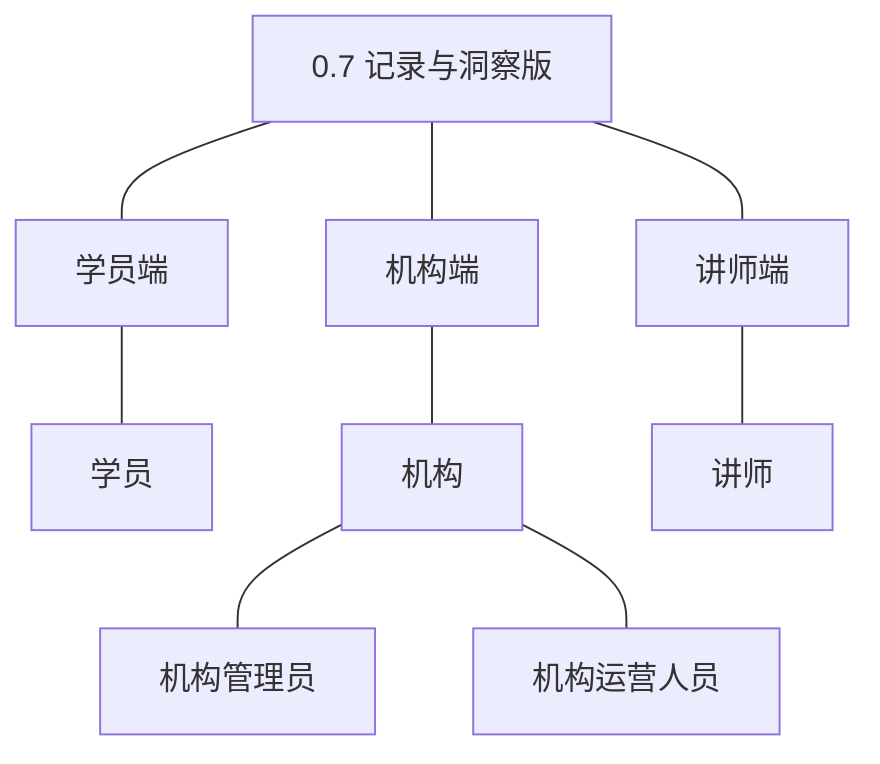

| 主体／角色 | 端 | 怎么用系统 |
|---|---|---|
| 学员 | 学员端 | 在个人中心查看本人订单（购买记录）与各课程学习记录（进度与最近学习时间） |
| 机构管理员 | 机构端 | 按时间范围与课程维度查看订单统计；查看全部课程收益 |
| 机构运营人员 | 机构端 | 按时间范围与课程维度查看订单统计 |
| 讲师 | 讲师端 | 查看本人课程的收益（按课程分组） |

**裁剪说明**：三端全部上场但均为只读查询视角（本版无写操作）；讲师端首次新增统计类界面（收益页）；机构管理员本版新增收益查看（0.6 订单管理归机构运营人员的分工不变）；学员侧新增个人中心的记录入口。

## 3. 核心业务流程

### 3.1 旅程：学员查阅自己的记录（学员端）

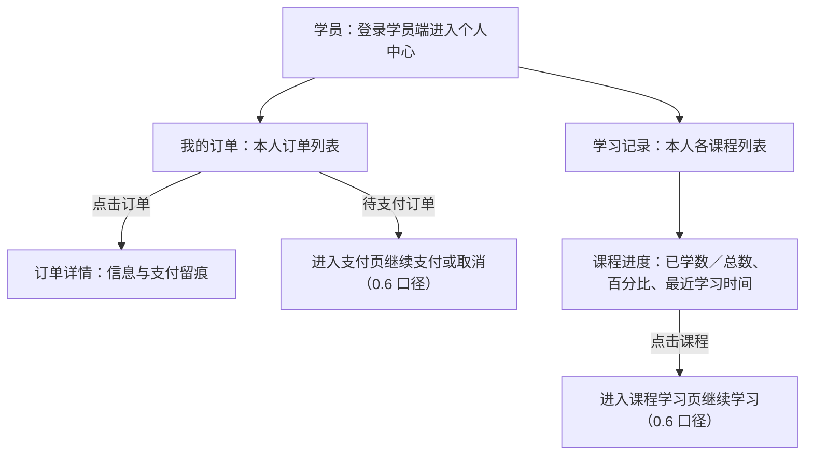

学员在个人中心把自己的两类记录查清楚：买了什么单（含待支付单的继续处理）、学到哪一课；查询入口只对本人开放。操作步骤清单：

1. 学员登录学员端，进入个人中心（0.1 交付的自助面）；
2. 打开「我的订单」：本人订单列表（订单编号、课程、金额、状态、下单与支付时间），点击查看订单详情（订单信息与支付留痕，口径与机构端一致）；待支付订单可进入支付页继续支付或取消；
3. 打开「学习记录」：本人各课程的学习记录列表（课程、已学课时数／总数、进度百分比、最近学习时间）；
4. 点击课程回到课程学习页继续学习。

### 3.2 旅程：机构经营复盘（机构端）

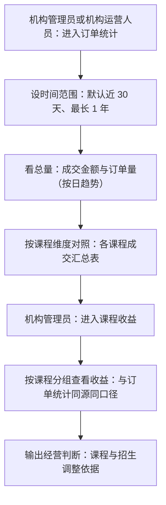

机构把开张后的成交数据用起来：先看总量趋势、再按课程定位贡献，收益视图与订单统计同源呈现，作为课程与招生调整的依据（验证假设的落点）。操作步骤清单：

1. 机构管理员或机构运营人员进入机构端「订单统计」；
2. 设置时间范围（默认近 30 天，单次最长 1 年），查看成交金额与订单量（按日汇总趋势线）；
3. 切换课程维度查看各课程成交汇总表（课程名称、成交金额、订单量）；
4. 机构管理员进入「课程收益」，按课程分组查看收益（时间范围口径与订单统计一致）；
5. 两侧金额对同一课程一致（同源派生），据此形成课程与招生调整判断。

## 4. 功能需求

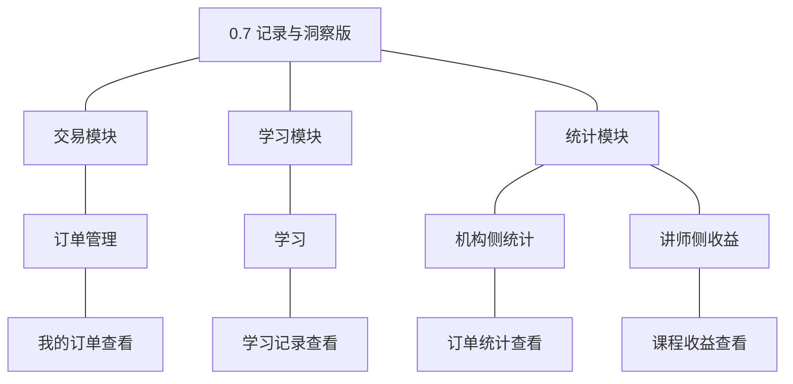

### 4.1 交易模块

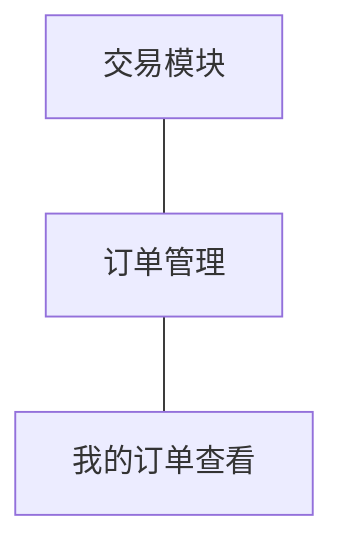

**订单管理组**：本版补齐学员侧视角（与 0.6 机构端订单管理同对象两视角）。

| 功能 | 用途 | 验收标准 |
|---|---|---|
| 我的订单查看 | 学员查自己的购买记录 | 学员查看本人订单列表与详情：订单编号、课程、金额、状态、下单与支付时间及支付留痕（口径与机构端一致）；待支付订单可进入支付页继续支付或取消；只对本人开放，无法查看他人订单 |

### 4.2 学习模块

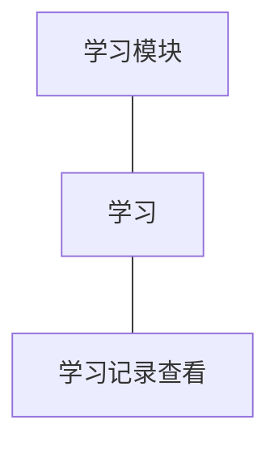

**学习组**：本版补齐学员侧记录视角（0.6 机制条目的呈现面）。

| 功能 | 用途 | 验收标准 |
|---|---|---|
| 学习记录查看 | 学员查自己的学习进度 | 学员查看本人各课程的学习记录：课程名、已学课时数／总数、进度百分比与最近学习时间（精确到分钟）；只对本人开放；从未学习的已购课程显示「未开始」 |

### 4.3 统计模块

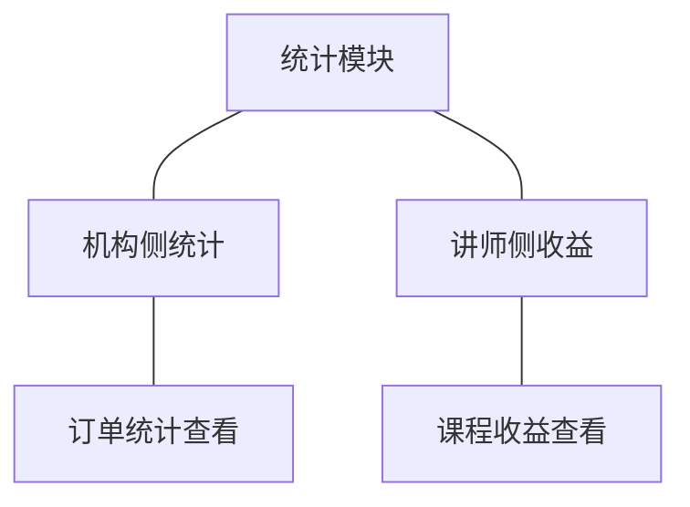

**机构侧统计组**与**讲师侧收益组**：派生查询视图（不落库），唯一数据来源为交易模块订单（只读）。

| 功能 | 用途 | 验收标准 |
|---|---|---|
| 订单统计查看 | 机构掌握经营结果 | 机构管理员或机构运营人员按时间范围（默认近 30 天、单次最长 1 年）查看订单统计：成交金额与订单量按日汇总趋势及课程维度汇总表；只统计已支付且未取消订单（以支付完成时间归属区间，订单取消后从结果中扣除）；只返回聚合结果，不出现学员个人资料 |
| 课程收益查看 | 讲师与机构掌握收益结果 | 讲师查看本人课程、机构管理员查看全部课程的收益：按课程分组（时间范围口径同订单统计、只统计已支付且未取消订单）；讲师越权请求他人课程收益被拒绝；机构侧与讲师侧同一课程的收益金额一致 |

**版本级默认值就地内联**：默认时间范围近 30 天、跨度上限 1 年（本版拍板）；按日汇总＋课程维度表格（本版拍板）；金额以元展示、统计以查询时点实时计算不做预聚合（04C-统计 2.5 沿用）；收益不区分结算状态（结算方式未定，暂缓清单）。

## 5. 业务对象

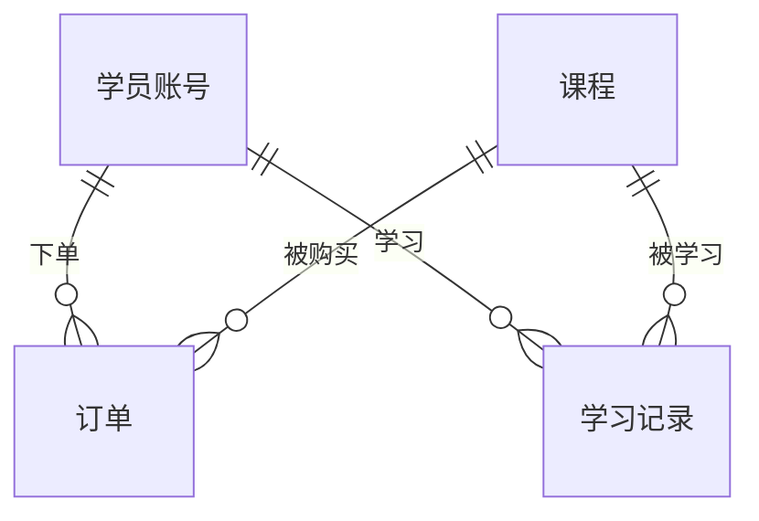

### 5.1 订单

定位：课程购买的成交凭据（沿用 0.6 交付，落库名 `course_order`）。

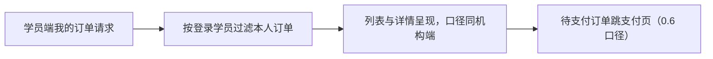

说明：沿用对象，本版只新增学员侧只读视角（个人中心入口）；订单字段与状态流转沿用 0.6 登记，无新增路径之外的变化。

### 5.2 学习记录

定位：学员在某课程上的学习行为记录（沿用 0.6 交付，落库名 `study_record`）。

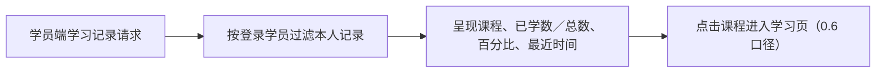

说明：沿用对象（含明细 `study_record_detail`），本版只新增学员侧只读视角；进度百分比＝已学课时数÷课程总课时数（0.6 口径），最近学习时间精确到分钟呈现。

### 5.3 订单统计视图

定位：按时间范围与课程维度的订单聚合结果（派生查询视图，不落库——统计模块按查询时点实时计算）。

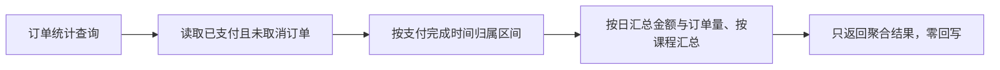

说明：无状态对象、不落库（派生随源数据变化）；只读交易模块、不得自建成交数据；取消订单即时从结果扣除（D8）。

### 5.4 课程收益视图

定位：由课程有效订单驱动的收益结果（派生查询视图，不落库——术语表既有登记口径，K7）。

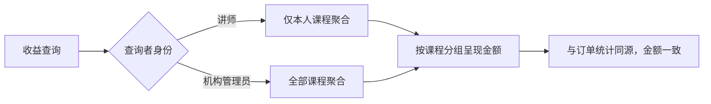

说明：无状态对象、不落库；与订单统计同批订单派生（已支付且未取消）、金额口径一致；讲师越权拒绝（D6）；收益只做呈现、不做结算（暂缓清单）。
