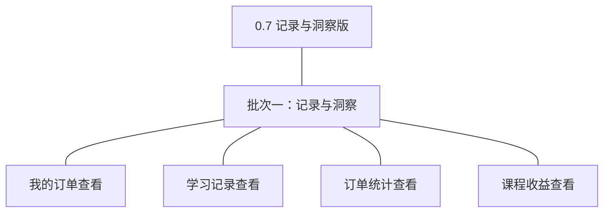
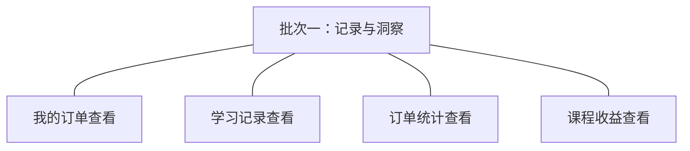

# 开发顺序与需求拆解（大版本）：0.7 记录与洞察版

> 定位：把《PRD（大版本）：0.7 记录与洞察版》转换为开发批次＋功能级需求条目；本文即该版本的完整需求清单，需求池据此直接入池、不另生成版本快照。上游为模拟案例材料，模拟性质保留。

## 1. 拆解说明

- **一一同构粒度口径**：一条需求（R 编号）＝一项 PRD 功能，需求名即 PRD 功能名；需求表的用途与验收标准**逐字引自 PRD 功能清单原文**，不压缩、不改写。按钮、字段、跳转级的原子拆解归小版本 PRD，不进本文。
- **本文即需求清单**：需求池批量入池直接读本文各批次需求表；池侧不生成版本快照，验收标准回溯本文（R 编号与 PRD 锚点随行可查）。
- **多入口口径**：本文是需求池的主入口但不是唯一入口——会议、沟通、临时反馈产生的需求从其他角度直接进入需求池（M01 起编号），不经本文；两类条目并存互不覆盖。
- **小版本规划的输入**＝本文开发顺序（批次建议，素材而非锁定）＋需求池实时状态，两者合并；唯一硬约束是本文声明的依赖与同事务契约不回退。

## 2. 开发顺序

**前置版本沿用面**：0.6 开张版（订单、支付记录、学习记录与明细——本版唯一数据来源与入口基础；学员端「我的课程」与机构端订单管理沿用）；统计模块首次交付（只读交易模块）。

**顺序依据与同源契约**：四条全部为只读查询、共同依赖 0.6 存量数据（无相互依赖、无外部联调点、无写路径与事务边界），一批交付即可一次演示「三方各自的记录与结果入口就位」与「两侧金额口径一致核对」——不构成拆批的依赖或联调强制，按批次从简合并为一批（判断注记：学员侧两条与统计侧两条若拆两批，后批无独立依赖来源、演示形态重合，属为流程美观多拆，违反从简纪律）。同源契约不回退：订单统计与课程收益由同一批「已支付且未取消」订单派生、以支付完成时间归属区间、订单取消后从结果中扣除、机构侧与讲师侧同一课程金额一致；统计模块零回写（04C-统计 3.3／3.4）。

### 2.1 批次一：记录与洞察

- **目标**：三方各自的记录与结果入口就位——学员查购买与学习记录、机构看订单统计、讲师与机构看收益。
- **依赖**：0.6（订单、支付记录、学习记录数据与既有入口）；账号与权限模块（查询者身份与越权拦截，D6）。
- **可验收形态**：学员在个人中心查到本人订单（含待支付续付）与学习记录（进度百分比、最近学习时间）；机构按时间范围（默认近 30 天）看到订单统计（按日趋势与课程汇总）；讲师看到本人课程收益且请求他人课程被拒；机构管理员看全部收益；同一课程在订单统计与两侧收益中金额一致；一名学员请求他人订单被拒——此批完成即路线图 0.7 完成标志。
- **判断注记**：单批收口全版——本版为路线图最后一个大版本、全部查询型能力一次交付即闭环（无需多批接力）；「我的订单查看」补齐 0.6 显式后置的学员侧入口（0.6 机构代查过渡由本版正式承接）。

条目与 PRD 4.1～4.3 功能清单一一同构，用途与验收标准逐字引自原文：

| 编号 | 需求名 | 用途 | 验收标准 |
|---|---|---|---|
| R52 | 我的订单查看 | 学员查自己的购买记录 | 学员查看本人订单列表与详情：订单编号、课程、金额、状态、下单与支付时间及支付留痕（口径与机构端一致）；待支付订单可进入支付页继续支付或取消；只对本人开放，无法查看他人订单 |
| R53 | 学习记录查看 | 学员查自己的学习进度 | 学员查看本人各课程的学习记录：课程名、已学课时数／总数、进度百分比与最近学习时间（精确到分钟）；只对本人开放；从未学习的已购课程显示「未开始」 |
| R54 | 订单统计查看 | 机构掌握经营结果 | 机构管理员或机构运营人员按时间范围（默认近 30 天、单次最长 1 年）查看订单统计：成交金额与订单量按日汇总趋势及课程维度汇总表；只统计已支付且未取消订单（以支付完成时间归属区间，订单取消后从结果中扣除）；只返回聚合结果，不出现学员个人资料 |
| R55 | 课程收益查看 | 讲师与机构掌握收益结果 | 讲师查看本人课程、机构管理员查看全部课程的收益：按课程分组（时间范围口径同订单统计、只统计已支付且未取消订单）；讲师越权请求他人课程收益被拒绝；机构侧与讲师侧同一课程的收益金额一致 |

**批次判断与边界取舍**：一批已是最少批次——四条查询型能力无依赖差异与联调点，合并演示即 0.7 完成标志；多机构对比、经营预测、结算与对账、统计导出在围栏外、不入批（导出本版拍板不排期，回池评估）。

**版本级验收安排**：按 PRD 1 的成功标准与量化口径验收（五条判定线，同源与越权为机制性 100%）；本版无资金流转与对外发布风险面（纯只读查询），路线图 0.7 完成标志即验收锚，无灰度台阶。

## 3. 条目与 PRD 对应核对

- **一一同构声明**：条目数＝PRD 功能数＝4（R52～R55），逐行对应、无归并、无路径拆分、无 PRD 外内容。
- **批次构成**：批次一 4 条（订单管理组 1＋学习组 1＋统计模块 2〔机构侧统计 1＋讲师侧收益 1〕）。
- **◆ 清点**：0 个——本版无复杂功能条目（全部只读查询，与 04C-统计「本模块无复杂功能」声明一致）。
- **过渡支撑清点**：0 个——学员侧订单入口为正式能力（0.6 的机构代查为运营安排而非系统能力，本版承接后该安排自然退出，无被替代的系统过渡件）。

## 4. 与需求池和小版本规划的衔接

- **入池路径**：需求池按「批量入池」直读本文第 2 章批次需求表，条目编号沿用 R52～R55、批次随本文继承。
- **多入口口径**：会议、沟通、临时反馈类需求不经本文，直接单条入池（M01 起编号），与本批条目并存互不覆盖。
- **小版本规划的合并输入**：批次是建议而非锁定——确认小版本时以本文开发顺序＋需求池实时状态合并定范围；本文声明的依赖与同源契约（0.6 前置、同批订单派生与金额一致、统计零回写、越权拦截）不回退。
- **认领与细化原则**：每条凭随行验收标准即可独立认领与验收；开发级细化（交互、字段、边界、用例）归小版本 PRD，本文任何位置不低于 PRD 功能级粒度。
