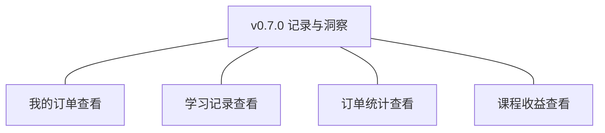
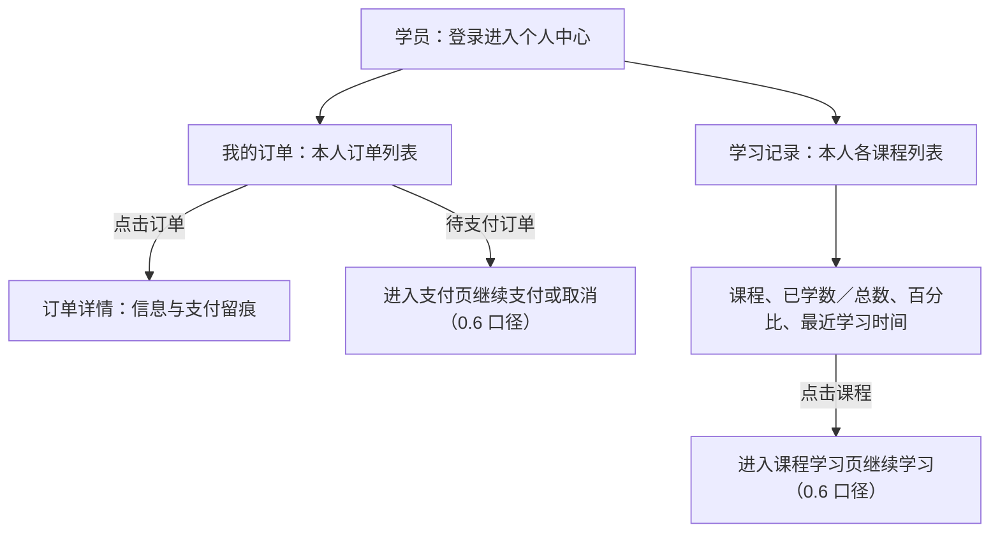
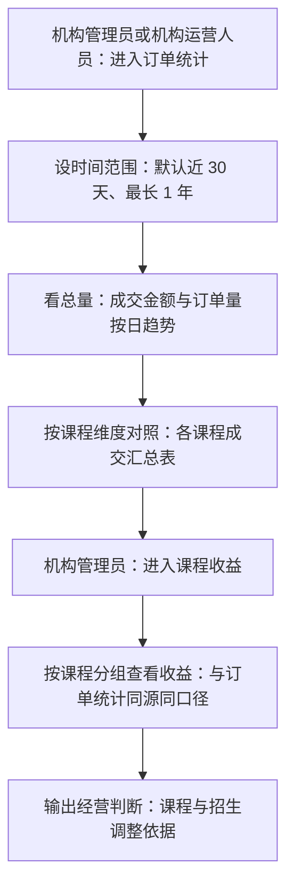
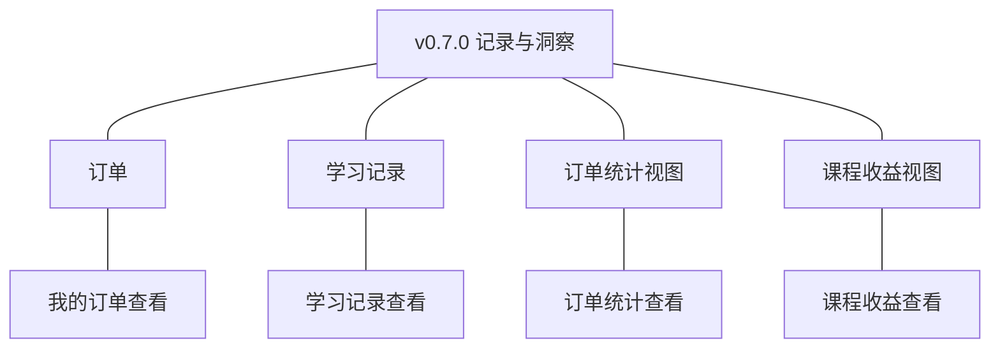
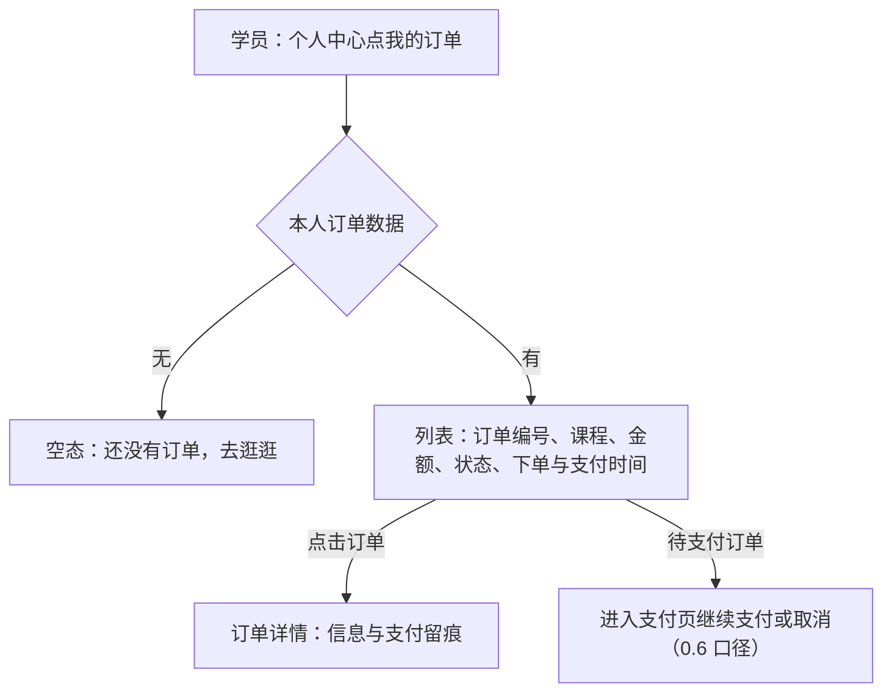
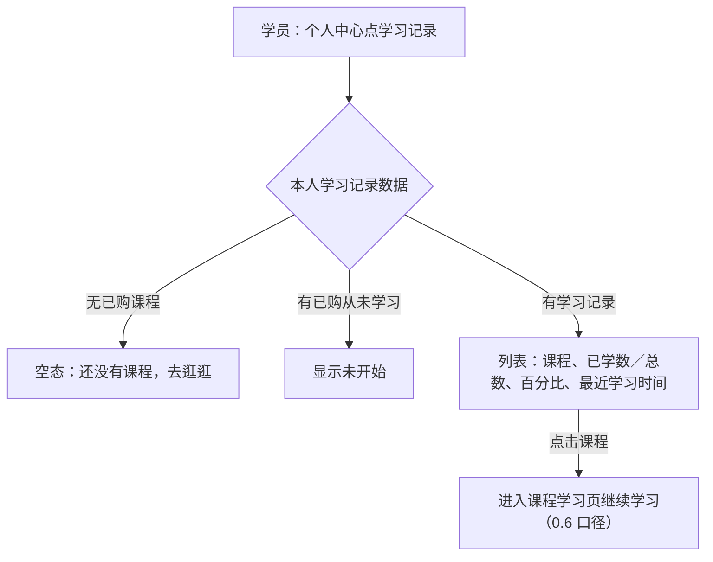
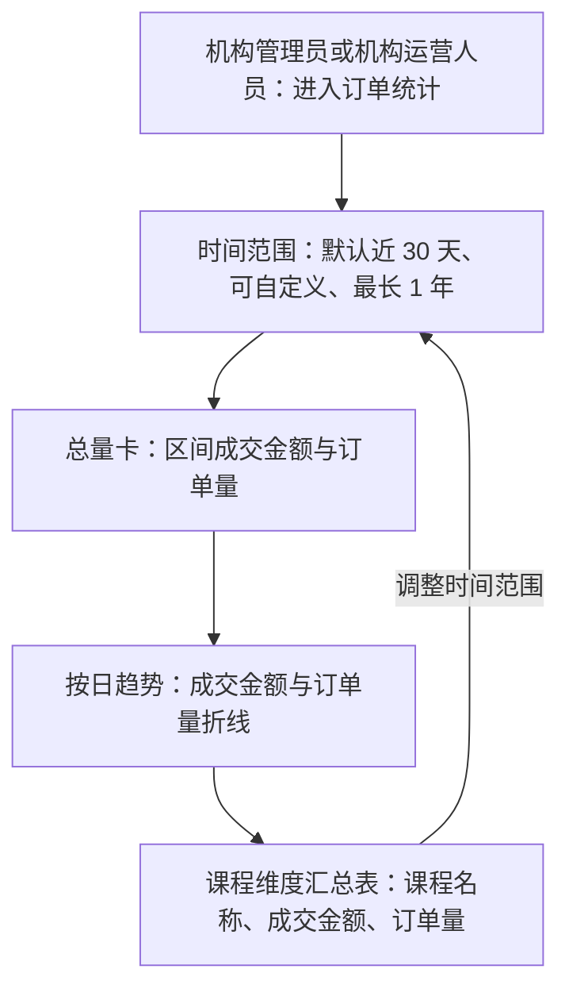
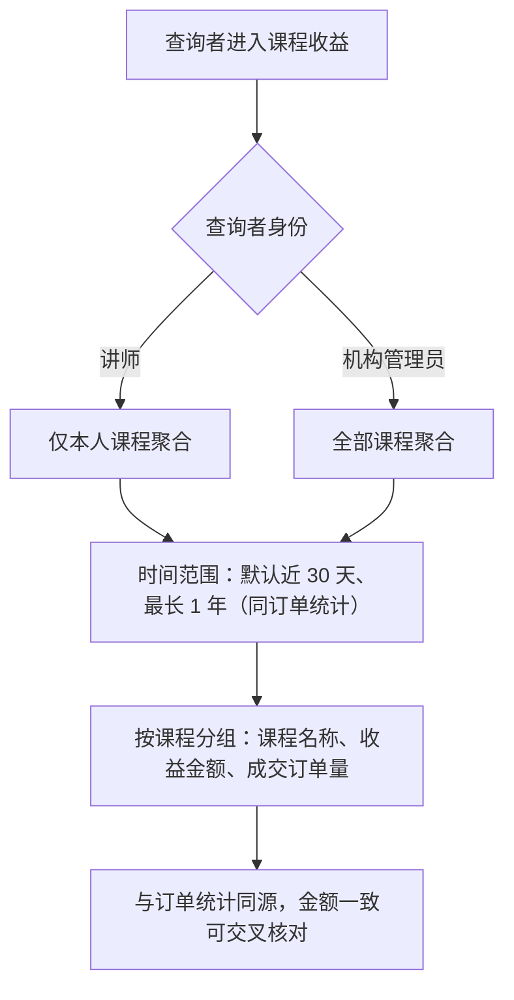

# PRD（小版本）：v0.7.0 记录与洞察

> 定位：开发级需求说明书——承接《PRD（大版本）：0.7 记录与洞察版》与《02-开发顺序与需求拆解（大版本）》批次一「记录与洞察」（本版单批收口全版），认领自需求池（R52～R55）；把四条功能级条目细化到交互、字段、规则、异常与落库字段，开发与测试凭本文即可开工。上游为模拟案例材料，模拟性质保留。

## 1. 版本概述

**承接与目标**：本版认领 0.7 批次一「记录与洞察」整批（R52～R55）——02 批次建议与需求池实时状态合并采纳（四条全部待规划，本版单批收口）。可验收形态：学员在个人中心查到本人订单（含待支付续付）与学习记录（进度百分比、最近学习时间）；机构按时间范围（默认近 30 天）看到订单统计（按日趋势与课程汇总）；讲师看到本人课程收益且请求他人课程被拒；机构管理员看全部收益；同一课程在订单统计与两侧收益中金额一致——此批完成即路线图 0.7 完成标志，0.1～0.7 全部收官。

**范围外声明**：统计导出（本版拍板不排期，回池评估）；结算与对账（暂缓清单，收益只做呈现）；多机构对比与行业对标、经营预测（大版本围栏）；0.6 的机构代查过渡由本版学员侧入口正式承接（运营安排自然退出，非系统能力变更）。

**条目内顺序与依赖**：学员侧两条（R52 我的订单、R53 学习记录）与统计侧两条（R54 订单统计、R55 课程收益）可并行——共同依赖 0.6 存量数据，无相互依赖；建议实现序 R52→R53→R54→R55（学员侧入口简单先行、统计侧派生随后，验收时 R54 与 R55 需交叉核对金额一致）。前置＝0.6（订单、支付记录、学习记录与明细）、账号与权限模块（查询者身份与越权拦截）。同源契约不回退：订单统计与课程收益由同一批「已支付且未取消」订单派生、以支付完成时间归属区间、订单取消后从结果中扣除、机构侧与讲师侧同一课程金额一致；统计模块零回写、视图中不出现学员个人资料。

**关键口径与来源状态**：只统计已支付且未取消订单（D8、04C-统计 3.3）；讲师侧只返回本人课程、越权一律拒绝（D6）；时间范围默认近 30 天、单次最长 1 年（大版本拍板）；按日汇总趋势＋课程维度汇总表（大版本拍板）；统计以查询时点实时计算、不做预聚合（04C-统计 2.5 沿用）；进度百分比＝已学课时数÷课程总课时数（0.6 口径沿用）；最近学习时间精确到分钟（大版本拍板）；金额以元展示（0.4 口径沿用）。

## 2. 需求范围与验收锚

条目总览树（与上游批次一分支图同名同构）：

认领条目表（需求名／用途／验收标准逐字引自《02-开发顺序与需求拆解（大版本）》批次一需求表）：

| 编号 | 需求名 | 用途 | 验收标准 |
|---|---|---|---|
| R52 | 我的订单查看 | 学员查自己的购买记录 | 学员查看本人订单列表与详情：订单编号、课程、金额、状态、下单与支付时间及支付留痕（口径与机构端一致）；待支付订单可进入支付页继续支付或取消；只对本人开放，无法查看他人订单 |
| R53 | 学习记录查看 | 学员查自己的学习进度 | 学员查看本人各课程的学习记录：课程名、已学课时数／总数、进度百分比与最近学习时间（精确到分钟）；只对本人开放；从未学习的已购课程显示「未开始」 |
| R54 | 订单统计查看 | 机构掌握经营结果 | 机构管理员或机构运营人员按时间范围（默认近 30 天、单次最长 1 年）查看订单统计：成交金额与订单量按日汇总趋势及课程维度汇总表；只统计已支付且未取消订单（以支付完成时间归属区间，订单取消后从结果中扣除）；只返回聚合结果，不出现学员个人资料 |
| R55 | 课程收益查看 | 讲师与机构掌握收益结果 | 讲师查看本人课程、机构管理员查看全部课程的收益：按课程分组（时间范围口径同订单统计、只统计已支付且未取消订单）；讲师越权请求他人课程收益被拒绝；机构侧与讲师侧同一课程的收益金额一致 |

**锚定说明**：上表三要素逐字锚定上游，细化只加深行为描述、不收窄不放宽；本版无 ◆ 复杂条目（沿用大版本「◆ 清点：0 个」声明——全部只读查询）；细化中发现的新想法按第 6 章回池，不进正文。

## 3. 核心用户旅程

旅程承接说明：承接上游大版本 PRD 两条旅程整条落在本版——「学员查阅自己的记录（学员端）」与「机构经营复盘（机构端）」均为单端流程（本版无跨端跨主体交互链路）；讲师收益查看为简单查询型操作、不成旅程（上游判据沿用，其界面随 R55 小节）。两条旅程如下。

### 3.1 旅程：学员查阅自己的记录（学员端）

学员在个人中心把两类记录查清楚：买了什么单（含待支付单的继续处理）、学到哪一课；全部入口只对本人开放。操作步骤清单：

1. 学员登录学员端，进入个人中心（导航「个人中心」，0.1 交付的自助面）；
2. 打开「我的订单」：本人订单列表按下单时间倒序分页展示，点击查看详情；待支付订单可进入支付页继续支付或取消；
3. 打开「学习记录」：本人各课程的学习记录列表（课程名、已学课时数／总数、进度百分比、最近学习时间精确到分钟）；
4. 点击课程回到课程学习页继续学习。

### 3.2 旅程：机构经营复盘（机构端）

机构把成交数据用起来：总量趋势→课程定位→收益对照，三个视图同源呈现，作为课程与招生调整的依据。操作步骤清单：

1. 机构管理员或机构运营人员进入机构端「订单统计」；
2. 设置时间范围（默认近 30 天、单次最长 1 年），查看成交金额与订单量按日趋势；
3. 查看课程维度汇总表（课程名称、成交金额、订单量）；
4. 机构管理员进入「课程收益」，按课程分组查看收益（时间范围口径与订单统计一致）；
5. 同一课程在订单统计与收益中金额一致（同源派生），据此形成经营判断。

## 4. 功能需求

### 4.1 功能总览

对象归组树（版本→对象→条目）：

对象增删改查矩阵（本版认领条目以编号落位、已交付与围栏标注去向）：

| 业务对象 | 增 | 改 | 删 | 查 |
|---|---|---|---|---|
| 订单 | 已交付（v0.6.0 R44） | 已交付（同左） | 不做（订单不删除，0.6 口径） | R52（学员侧列表与详情）；机构侧已交付（v0.6.0 R47／R48） |
| 学习记录 | 已交付（v0.6.1 随凭据链路） | 已交付（同左） | 不做（同左） | R53（学员侧列表） |
| 订单统计视图 | 不做（派生查询视图，不落库） | 不做（同左） | 不做（同左） | R54（机构端） |
| 课程收益视图 | 不做（派生查询视图，不落库——术语表既有登记） | 不做（同左） | 不做（同左） | R55（讲师端本人课程／机构端全部） |

主体使用面：

| 主体／角色 | 端 | 使用条目 | 说明 |
|---|---|---|---|
| 学员 | 学员端 | R52、R53 | 个人中心的记录入口（购买与学习记录，只对本人开放） |
| 机构管理员 | 机构端 | R54、R55 | 订单统计与全部课程收益 |
| 机构运营人员 | 机构端 | R54 | 订单统计（无收益视角，路线图口径） |
| 讲师 | 讲师端 | R55 | 本人课程收益（讲师端首次新增统计类界面） |

机制条目声明：本版无机制条目——四条均有操作面（三端查询界面）。

### 4.2 R52 我的订单查看

**功能说明**：学员查自己的购买记录——个人中心的订单视角，与机构端订单管理同对象两视角。触发：学员在学员端进入个人中心「我的订单」。

**交互与流程**：

操作步骤清单：

1. 学员登录后进入个人中心，点击「我的订单」；
2. 列表按下单时间倒序分页展示本人订单（默认 10 条／页，可选 10／20／50，本版拍板）：订单编号、课程名称、金额、状态（待支付／已支付／已取消）、下单时间、支付时间（未支付显示「——」）；
3. 点击订单进入详情：订单信息（与机构端 R48 同口径）＋支付留痕（支付记录流水：外部单据号、金额、结果、支付时间）；
4. 待支付订单行内提供「继续支付」入口进入 0.6 交付的支付页（可支付或取消）；
5. 无订单时展示空态引导。

**字段与校验**：

| 信息项 | 说明 |
|---|---|
| 列表列 | 订单编号、课程名称、金额、状态、下单时间、支付时间（未支付「——」）；下单时间倒序、分页 10／20／50（本版拍板） |
| 详情 | 订单信息（编号、课程与学员标识、金额、状态、下单与支付时间、取消时间与方式〔已取消时〕）＋支付留痕流水——口径与机构端一致 |

**规则与边界**：

1. 列表与详情只对本人开放（服务端按登录学员过滤，验收锚）；访问他人订单返回「订单不存在」；
2. 支付留痕口径与机构端 R48 完全一致（同一数据、同一展示字段）；
3. 待支付续付与取消走 0.6 交付的支付页路径（本版零新增写操作）；
4. 本版承接 0.6 的机构代查过渡：学员可自助查单，机构代查安排自然退出（运营安排，非系统能力变更）。

**异常与拦截**：

| 异常场景 | 系统行为 | 用户看到 |
|---|---|---|
| 越权请求他人订单详情 | 服务端归属校验拒绝 | 「订单不存在」 |
| 无订单 | 空态 | 「还没有订单，去逛逛」＋课程列表入口 |
| 未登录访问 | 拦截并引导 | 跳转登录页 |

### 4.3 R53 学习记录查看

**功能说明**：学员查自己的学习进度——个人中心的学习记录视角（0.6 机制条目的呈现面）。触发：学员在学员端进入个人中心「学习记录」。

**交互与流程**：

操作步骤清单：

1. 学员进入个人中心，点击「学习记录」；
2. 列表按最近学习时间倒序展示本人各已购课程（从未学习者排后按购买时间倒序，本版拍板）：课程名、已学课时数／总数（如 2／4）、进度百分比（如 50%，0.6 口径）、最近学习时间（精确到分钟，如 2026-09-20 15:40）；
3. 从未学习的已购课程显示「未开始」（百分比 0%）；
4. 点击课程进入课程学习页继续学习（0.6 口径）；
5. 无已购课程时展示空态引导。

**字段与校验**：

| 信息项 | 说明 |
|---|---|
| 列表列 | 课程名、已学课时数／总数、进度百分比（已学÷总数）、最近学习时间（精确到分钟，「未开始」标注）；最近学习时间倒序（本版拍板） |

**规则与边界**：

1. 列表只对本人开放（登录学员过滤，验收锚）；
2. 进度口径沿用 0.6（已学课时数÷课程总课时数，按当前未删除课时数即时计算）；「我的课程」摘要（0.6）与本列表数据同源一致；
3. 已下架课程保留在列、可继续学习（既有资格保留，0.6 口径沿用）。

**异常与拦截**：

| 异常场景 | 系统行为 | 用户看到 |
|---|---|---|
| 无已购课程 | 空态 | 「还没有课程，去逛逛」 |
| 未登录访问 | 拦截并引导 | 跳转登录页 |

### 4.4 R54 订单统计查看

**功能说明**：机构掌握经营结果——订单的聚合统计视图（派生查询，不落库）。触发：机构管理员或机构运营人员在机构端进入「订单统计」。

**交互与流程**：

操作步骤清单：

1. 机构管理员或机构运营人员进入机构端「订单统计」；
2. 时间范围默认近 30 天，可切换快捷项（近 7 天／近 30 天／自定义起止，本版拍板），单次跨度最长 1 年、超限拦截提示；
3. 查看区间总量卡（成交金额合计、订单量合计）与按日汇总趋势（成交金额与订单量双折线，点缀色呈现，04B 令牌口径）；
4. 查看课程维度汇总表：课程名称、成交金额、订单量（按成交金额倒序，本版拍板）；
5. 区间内无成交时展示空态。

**字段与校验**：

| 信息项 | 说明 |
|---|---|
| 时间范围 | 默认近 30 天；快捷项近 7 天／近 30 天／自定义；单次最长 1 年（超限拦截「时间范围最长 1 年」，本版拍板） |
| 统计口径 | 只统计已支付且未取消订单；以支付完成时间归属区间；订单取消后从结果中即时扣除（同源契约） |
| 呈现 | 总量卡（成交金额、订单量）＋按日趋势折线＋课程维度汇总表（课程名称、成交金额、订单量，金额倒序）；金额以元展示 |

**规则与边界**：

1. 只返回聚合结果，不出现学员个人资料与联系方式（验收锚；明细回溯走 0.6 订单管理）；
2. 统计以查询时点实时计算、不做预聚合（04C-统计 2.5）；统计模块零回写；
3. 订单统计能力点授予机构管理员与机构运营人员（服务端校验，前端显隐不作安全边界）；
4. 无成交区间展示空态「该时间范围内暂无成交」（本版拍板）。

**异常与拦截**：

| 异常场景 | 系统行为 | 用户看到 |
|---|---|---|
| 时间跨度超 1 年 | 拦截查询 | 「时间范围最长 1 年」 |
| 区间内无成交订单 | 空态 | 「该时间范围内暂无成交」 |
| 无订单统计能力点的账号访问 | 服务端能力点校验拒绝 | 「无统计查看权限」 |

### 4.5 R55 课程收益查看

**功能说明**：讲师与机构掌握收益结果——课程有效订单驱动的收益视图（派生查询，不落库，术语表既有登记口径）。触发：讲师在讲师端进入「课程收益」；机构管理员在机构端进入「课程收益」。

**交互与流程**：

操作步骤清单：

1. 讲师登录讲师端进入「课程收益」（讲师端导航新增入口，本版拍板）；或机构管理员在机构端进入「课程收益」；
2. 时间范围默认近 30 天、口径与订单统计一致（单次最长 1 年）；
3. 按课程分组展示：课程名称、收益金额、成交订单量（按收益金额倒序，本版拍板）；讲师只见本人课程、机构管理员见全部课程；
4. 同一课程收益金额与订单统计中的成交金额一致（同源派生，可交叉核对）；
5. 区间内无收益时展示空态。

**字段与校验**：

| 信息项 | 说明 |
|---|---|
| 分组呈现 | 课程名称、收益金额、成交订单量；收益金额倒序（本版拍板） |
| 身份口径 | 讲师＝本人课程（归属过滤）；机构管理员＝全部课程；机构运营人员无收益视角（路线图口径，服务端校验） |
| 时间口径 | 与订单统计一致（默认近 30 天、最长 1 年、支付完成时间归属、只统计已支付且未取消） |

**规则与边界**：

1. 讲师越权请求他人课程收益被拒绝（验收锚，D6）；
2. 机构侧与讲师侧同一课程收益金额一致（验收锚，同源契约）；出现不一致以订单数据为准并修正派生逻辑（04C-统计 3.3）；
3. 收益不区分结算状态、只做呈现（结算与对账在暂缓清单）；
4. 讲师端收益入口能力随讲师身份自带（`side=teacher` 归属过滤即权限边界，无需能力点配置，本版拍板）。

**异常与拦截**：

| 异常场景 | 系统行为 | 用户看到 |
|---|---|---|
| 讲师请求他人课程收益 | 服务端归属校验拒绝 | 「无权查看该课程收益」 |
| 机构运营人员请求收益视角 | 服务端角色校验拒绝 | 「无收益查看权限」 |
| 区间内无收益 | 空态 | 「该时间范围内暂无收益」 |

## 5. 业务对象与数据字段

数据主体清单：

| 业务对象 | 落库名 | 定位与关系 |
|---|---|---|
| 订单 | `course_order` | 沿用对象（v0.6.0 交付）：本版新增学员侧只读视角（R52），零结构变更 |
| 支付记录 | `pay_record` | 沿用对象（v0.6.0 交付）：订单详情支付留痕的只读呈现（随 R52） |
| 学习记录 | `study_record` | 沿用对象（v0.6.1 交付）：本版新增学员侧只读视角（R53），零结构变更 |
| 学习记录明细 | `study_record_detail` | 沿用对象（v0.6.1 交付）：已学数计算的只读来源（随 R53） |
| 订单统计视图 | 不落库（派生查询视图） | 统计模块按查询时点实时计算：成交金额与订单量按日／按课程聚合（本版新登记术语表，见第 6 章） |
| 课程收益视图 | 不落库（派生查询视图） | 术语表既有登记（K7）：由课程有效订单驱动、按课程分组聚合 |

字段对照：本版全部沿用既有登记字段（订单、支付记录、学习记录、学习记录明细的字段见 v0.6.0／v0.6.1 交付的登记），**无新增落库字段**；两派生视图为查询口径组合（时间范围×课程维度×已支付未取消过滤），不承载字段登记。

机制态对象：无新增（登录态沿用；派生视图实时计算、无缓存对象）。

## 6. 待议与建议

**本版采用的推断与默认值汇总**：

1. 学员订单列表与学习记录列表均按时间倒序（下单时间／最近学习时间，从未学习者排后按购买时间倒序）、分页 10／20／50（本版拍板）；
2. 统计时间快捷项：近 7 天／近 30 天／自定义（本版拍板）；汇总表按金额倒序（本版拍板）；
3. 空态文案：「还没有订单，去逛逛」「还没有课程，去逛逛」「该时间范围内暂无成交」「该时间范围内暂无收益」（本版拍板）；
4. 拦截文案：「时间范围最长 1 年」「无统计查看权限」「无收益查看权限」「无权查看该课程收益」（本版拍板）；
5. 讲师端导航新增「课程收益」入口、权限随讲师身份自带（本版拍板）；
6. 机构代查过渡自本版自然退出（学员自助查单承接，运营安排变更）。

**建议回池与术语表待登记**：

- 建议回池：统计导出（本版拍板不排期，待业务确认）；统计维度扩展（按讲师、按周／月汇总）；学习记录页进入课程学习时按最近课时直达（当前进入学习页由 0.6「继续学习」高亮承接）——均一句话指引，单条入池（M01 起）评估。
- 术语表待登记行（随本文档回报、由主流程合入）：新登记「订单统计视图」（不落库，统计模块派生查询视图：按时间范围与课程维度的订单聚合结果）；课程收益视图为既有登记（K7）沿用、无需新增；全部落库字段沿用既有登记、无新增。
