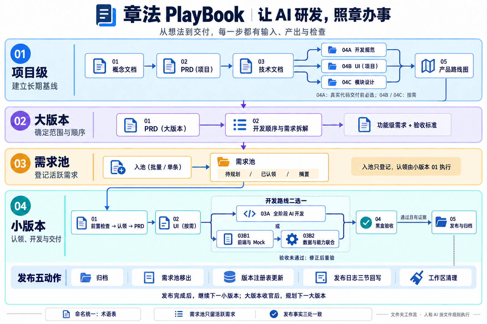

# 章法（PlayBook）

**让 AI 研发，照章办事。**



图中阶段编号表示执行顺序；目录编号用于稳定命名。详细规则见[项目总览](./项目总览.md)。

章法是一套以 Markdown 文件、分层提示词、项目目录和台账为载体的 AI 软件项目工作流。它把“下一步做什么、需要什么材料、产出放哪里、怎样算完成”写下来，帮助人和 AI 从零散想法走到需求、开发、验收与归档。

**现阶段，章法以文件夹形式维护和使用。** 获取文件后，用你习惯的编辑器和 AI 工具按步骤推进即可。当前交付内容是工作流、提示词和示范文档；完整管理软件暂不作为当前交付目标。

[项目介绍](https://www.xiaozhifly.cn/projects/zhangfa/) · [GitHub 仓库](https://github.com/Hai-kaizhi/zhangfa) · [使用指南](./docs/使用指南.md) · [初衷与当前形态](./docs/初衷与当前形态.md)

## 为什么做章法

用 AI 做项目，生成内容越来越容易，持续把项目管清楚却仍然费力：文档散落在不同对话里，业务名称前后不一致，需求是否完成靠记忆，换一个对话又要重新交代规则。

我最初希望把这套方法做成软件来管理。实际使用后，发现软件管理的效果没有达到自己的预期，而流程和提示词本身仍在频繁调整。于是，我逐渐把它优化成现在的文件夹形式，继续维护和迭代。

开源章法，是希望把这套正在使用的方法分享出来：让其他人可以直接尝试，也可以根据自己的项目改进它。关于这次形态调整的完整说明，见[初衷与当前形态](./docs/初衷与当前形态.md)。

## 你能拿到什么

| 内容 | 用途 |
|---|---|
| 16 份分层提示词 | 按项目级、大版本、需求池、小版本推进工作，明确输入、约束、产出与检查标准 |
| 开发路径与节点清单 | 查执行顺序、必选与按需节点、每一步的产出位置 |
| 项目文件夹模板 | 分开保存长期基线、需求台账、版本归档与开发中材料 |
| 命名与台账约定 | 用术语表统一业务名称，用明确入口执行入池、认领和发布 |
| 三个模拟示范项目 | 观察文档结构和上下游承接方式：商城系统、巡云轻论坛、领课教育 |
| AI 工作约定 | 在 `AGENTS.md` 中说明输入边界、生成方式、审核与缺陷回流要求 |

当前文档链已经做过模拟示范演练；开发、联通和真实发布环节仍需在真实项目中验证。示范中的交付、验收与发布记录属于模拟材料，不能作为真实软件运行或上线的证明。

## 适合怎样使用

- 个人开发者或小团队，希望用 AI 辅助研发，并保留可交接、可追溯的项目材料。
- 产品经理，希望先说清需求和验收标准，再推进原型或实际实现。
- 已有 AI 编码工具，但希望补上项目定义、需求承接、版本记录与发布归档的人。
- 愿意阅读、检查和修订 AI 产出，并根据项目复杂度选择必要文档的人。

使用者需要自行执行或安排检查和台账更新。文件里的规则需要落实到工作中；完整的自动状态校验、任务调度和可视化管理界面尚未作为软件提供。

## 从哪里开始

1. 获取本仓库文件，为自己的项目复制一份独立工作区，用 Markdown 编辑器打开。
2. 阅读[使用指南](./docs/使用指南.md)和[开发路径与节点清单](./99-shared/prompts/00-开发路径与节点清单.md)，了解执行顺序。
3. 写下真实的项目想法和需求材料，从[概念文档提示词](./99-shared/prompts/01-project/01-提示词-概念文档（项目）.md)开始，只提供当前节点需要的输入。
4. 检查产出，确认方向，再按“项目级 → 大版本 → 需求池 → 小版本”继续推进。

只想先理解方法，可以先读[项目总览](./项目总览.md)，再自行浏览[示范项目导航](./99-shared/prompts/references/README.md)。让 AI 生成自己项目的文档时，示范正文默认不作为输入。

## 工作流怎样组织

```text
项目级：概念 → PRD → 技术文档 → 开发规范 / UI / 模块设计 → 产品路线图
大版本：PRD → 开发顺序与需求拆解
需求池：批量或单条入池
小版本：前置检查与认领 → PRD → UI（按需）→ 开发 → 黑盒验收 → 发布与归档
```

项目级 `04A / 04B / 04C` 可以在技术文档之后并行；开发规范在真实代码交付前必选，UI 和模块设计按项目需要选择。小版本开发在 `03A 全阶段 AI 开发` 与 `03B1 前端与 Mock → 03B2 数据与能力联合` 两条路线中二选一。

目录编号用于稳定命名，**实际执行顺序是项目级 → 大版本 → 需求池 → 小版本**。术语表随各节点定名同步维护；黑盒验收按小版本 PRD 的验收锚执行，结论和证据记入交付说明。

## 目录导航

| 位置 | 职责 |
|---|---|
| [docs](./docs/使用指南.md) | 对外说明：初衷、使用方法、维护与贡献 |
| [项目总览.md](./项目总览.md) | 工作流详解、台账规则与版本归档关系 |
| [AGENTS.md](./AGENTS.md) | 给 AI 助手的工作约定 |
| [00-code](./00-code/README.md) | 使用者项目的代码，目录结构由项目技术文档确定 |
| [01-project-docs](./01-project-docs/README.md) | 项目长期基线、原始输入与术语表 |
| [02-requirement-pool](./02-requirement-pool/README.md) | 需求池、版本注册表、发布日志 |
| [03-versions](./03-versions/README.md) | 大版本文档与所属小版本的发布归档 |
| [04-workspace](./04-workspace/README.md) | 小版本开发中的文档与交付材料 |
| [99-shared](./99-shared/README.md) | 可复用提示词、编写规范、节点清单与模拟示范 |

根目录 `00-code/` 至 `04-workspace/` 目前是供使用者启动项目的模板区，尚未放入真实业务项目。章法的方法资产位于 `99-shared/prompts/`；三个模拟示范单独放在其下的 `references/` 中。

## 使用时保留的约定

- **业务名称有统一出处**：主体、角色、对象、状态和编码沿用项目术语表，新名称定名时登记。
- **需求池只放活跃需求**：待规划／已认领／搁置；已发布需求移出池，历史明细和流水保存在发布日志。
- **认领和发布有固定入口**：认领由小版本 01 PRD 提示词执行；发布由小版本 05 执行五个动作，不分散更新。
- **生成与检查都要做**：按节点限定输入，检查结构、命名、编号和验收锚；发现共性问题时修提示词，再重新生成验证。
- **事实来自实际执行**：想法、建议、模拟材料与真实结果分清，开发完成和验收通过都要有相应依据。

完整操作约定以 [AGENTS.md](./AGENTS.md) 和各节点提示词为准。

## 持续维护与交流

章法会继续随实际使用调整。目前优先完善文件夹工作流、提示词和说明文档，软件形态的后续安排取决于真实需要，暂无固定发布时间。

遇到输入要求不清、上下游承接断裂、台账规则冲突或说明难懂的地方，可以通过 [GitHub Issues](https://github.com/Hai-kaizhi/zhangfa/issues) 反馈，也欢迎提交改进。反馈方式和修改要求见[维护与贡献](./docs/维护与贡献.md)。

## 许可证

沿用章法仓库的 [MIT License](./LICENSE)。复制和分发时请保留许可证中的版权声明和许可文本。
