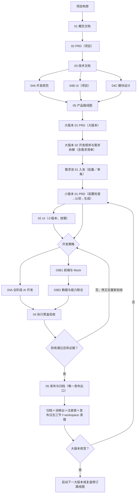

# 章法项目工作流总览

本文件详解文件夹形式的章法怎样组织项目。初次使用见[使用指南](./docs/使用指南.md)，形态调整背景见[初衷与当前形态](./docs/初衷与当前形态.md)。

## 1. 工作区模型

章法有两类内容：

- [99-shared/prompts](./99-shared/prompts/README.md)：可复用的方法层——16 份分层提示词、编写规范、节点清单，以及三个完整示范项目（references）。
- 根目录 `00`～`04` 编号目录：当前项目实际生成的基线、需求与版本（本项目尚未启动，均为初始模板态）。

README 与 AGENTS.md 是长期入口；`02-requirement-pool/` 下的需求池、版本注册表、发布日志是持续更新的三台账；带阶段编号的 PRD、UI、交付说明和归档记录是流程产物。

当前根项目处于空需求池、无活动版本、无活动 workspace 的初始化状态。

## 2. 总流程

测试不设独立文档节点：黑盒验收按小版本 PRD 的逐字验收锚执行，结论与证据记入交付说明，供 05 发布。

## 3. 项目级：01 → 02 → 03 → 04A/04B/04C 并行 → 05

| 阶段 | 提示词 | 主要产出 |
|---|---|---|
| 01 | `01-提示词-概念文档（项目）.md` | `01-概念文档（项目）.md` |
| 02 | `02-提示词-PRD（项目）.md` | `02-PRD（项目）.md`（项目级总纲：功能全景、核心闭环、关键设计决策；细节下沉版本级） |
| 03 | `03-提示词-技术文档（项目）.md` | `03-技术文档（项目）.md` |
| 04A | `04A-提示词-开发规范（项目）.md` | `04A-开发规范（项目）.md`（单文件按栈分节） |
| 04B | `04B-提示词-UI（项目）.md` | `04B-UI（项目）.md`（生图脚本：话术自足，提示词由 GPT 对话撰写） |
| 04C | `04C-提示词-模块设计（项目）.md` | `04C-00-模块总览.md`＋各模块 `04C-<模块名>.md` |
| 05 | `05-提示词-产品路线图（项目）.md` | `05-产品路线图（项目）.md`（大版本序列唯一来源） |

`04A/04B/04C` 都承接项目 PRD 与技术文档，可以并行；开发规范在真实代码交付前必选，UI 和模块设计按需，路线图在适用分支形成一致基线后收口。此外有**术语表**（无独立提示词）：`01-project-docs/术语表.md` 是全链业务命名的单一可信源，各层提示词按编写规范的"业务命名承接纪律"读写它。各节点的必选或按需划分见[开发路径与节点清单](./99-shared/prompts/00-开发路径与节点清单.md)。

## 4. 大版本：01 → 02

| 阶段 | 产出 | 说明 |
|---|---|---|
| 01 | `01-PRD（大版本）.md` | 选定本大版本的功能与边界（功能级粒度） |
| 02 | `02-开发顺序与需求拆解（大版本）.md` | 开发顺序＋小版本批次＋功能级需求条目一一同构（含逐字验收锚），即该版本完整需求清单 |

02 的需求条目由需求池提示词按「批量入池」导入需求池，条目编号（R1 起）沿用、内容不改写。

## 5. 需求池：入池入口（双模式）

`01-提示词-需求池运营（需求池）.md` 一个提示词两种模式：**批量入池**（直读大版本 02）与**单条入池**（会议/沟通等入口需求，M01 起编号）。需求池为**单表制**：一句定位＋活跃需求总表（待规划／已认领／搁置），结构逐字固定、跨项目一致；发布归档明细与台账流水在《发布日志.md》三节（只增）。

认领与发布不归池提示词：**认领**由小版本 01 PRD 提示词执行（前置检查→认领五件事→生成一体化）；**发布**由小版本 05 执行。入池不是状态变化；认领才是。

## 6. 小版本：01 → 02 → 03（二选一）→ 04 → 05

| 阶段 | 行为或产出 | 说明 |
|---|---|---|
| 01 | `01-PRD（小版本）.md`＋认领同步 | 前置检查（池/大版本材料/未认领过）→认领五件事（池总表状态迁移、发布日志池变更记录、workspace README、版本注册表）→六章 PRD（开发级深度、逐字锚定、五块结构、CRUD 矩阵、数据字段落库对照） |
| 02 | `02-UI（小版本）.md` | 按需：生图脚本，风格锚定沿用项目层附A、覆盖只圈本版认领条目 |
| 03A | 全阶段 AI 开发（可运行代码＋交付说明） | 与 03B 路线互斥 |
| 03B1→03B2 | 前端与 Mock → 数据与能力联合 | 03B2 严格依赖 03B1；Mock 结构按 PRD 第 5 章为替换而建 |
| 04 | 执行黑盒验收 | 无提示词、无独立文档：按 PRD 逐字验收锚执行，结论与证据记入交付说明 |
| 05 | 发布与归档 | 唯一发布出口：五动作一次做齐，三处口径一致 |

纯文档示范可跳过代码与 Mock，但只能使用"文档范本演练、模拟证据"口径，不得填写虚假的实际执行结果。

## 7. 05 发布事务

`05-提示词-发布与归档（小版本）.md` 前置检查（验收通过＋池状态就绪）通过后一次完成：

1. workspace 产出物归档至 `03-versions/major/<版本>-<名称>/v<X.Y.Z>/`，目录内补归档说明。
2. 需求池总表删除本版条目行（池内不留发布痕迹）。
3. 版本注册表本版行更新为已发布。
4. 发布日志三节回写：发布记录（一行一版）＋需求归档明细（逐条）＋池变更记录（一行）。
5. workspace 清理，README 留归档指路；项目 README 进度刷新。

任何一步缺失都不能宣称发布完成（半完成即停并逐一点名已成功动作）。

## 8. 状态不变量

- 需求状态集＝待规划／已认领／已发布／搁置；入池不是状态变化，状态只随认领与发布变化。
- 活动小版本必须同时存在于需求池总表"已认领（vX.Y.Z）"、workspace `v<X.Y.Z>/` 与版本注册表"开发中"行。
- 已发布小版本必须有大版本目录下的版本归档（PRD、UI〔如有〕、交付说明、归档说明）、注册表"已发布"行与发布日志三节记录，且 workspace 已清理并保留归档指路 README。
- 发布事实（归档位置/时点/条目数）在归档说明、版本注册表、发布日志三处口径完全一致。
- 文档范本演练（模拟证据）、真实测试与真实发布三种口径不能混用；模拟结果不得复制为项目事实。
- 历史不静默覆盖：台账只增；需求内容入池后不改写，变化走发布日志流水与上游文档。

## 9. 版本策略

- 版本号由范围、兼容性、节奏和历史共同决定，不由路线图阶段自动生成。
- 任意版本位都可以承载新功能、兼容调整或修复；允许跳号与并行维护。
- 大版本收官后按路线图做「完成标志＋验证假设」双复盘，复盘结论驱动路线图修订；新需求经需求池单条入池再排期。
- Git tag、CODE-REF、CI/CD 和 releases 快照是可选工程能力，不是文档流程门禁。
